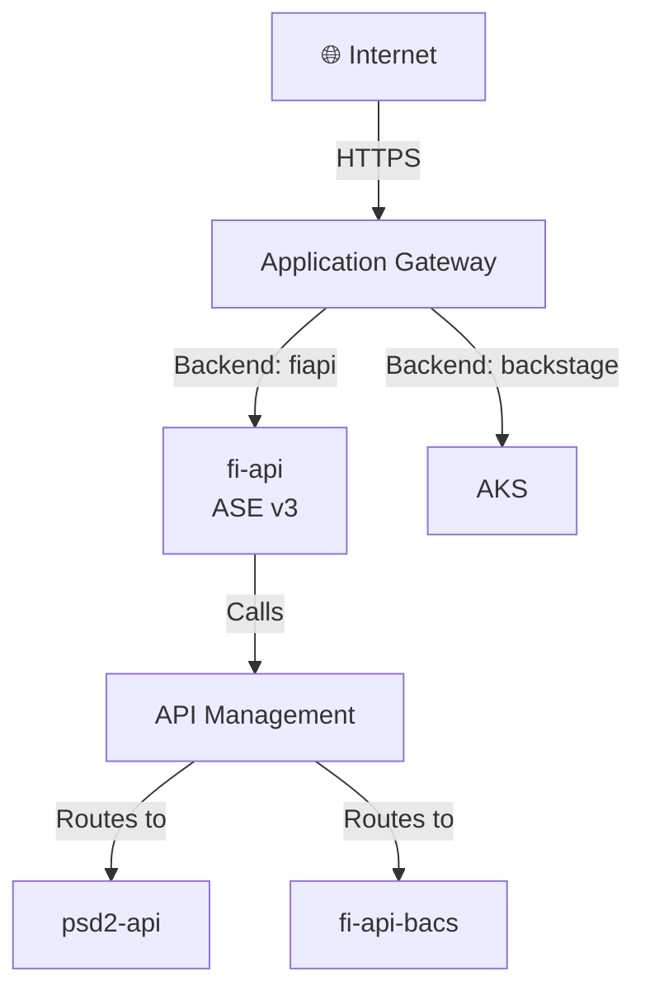

# 🟣 Architecture Agent

## Role
- **Scope:** Create and update **high-level cloud estate overview diagrams** based on knowledge
  captured under `Knowledge/`.
- **Focus:** Strategic view showing major services, network boundaries, trust boundaries, key data flows, and **complete routing chains** from Internet to backends.
- **Output:** Multiple focused Mermaid diagrams in provider-specific summary files.

## Diagram Scope & Detail Level

**Use MULTIPLE FOCUSED DIAGRAMS for clarity - one diagram per architectural concern.**

### Recommended Diagram Separation:
1. **Ingress Flow:** Internet → App Gateway → Backend Services (security layers, WAF policies, **all compute platforms**)
2. **API/Service Routing:** API Management or Load Balancer routing to backend services (**include complete routing chains**)
3. **Backend Services & Data:** Internal services → databases/storage/messaging (data layer, **all platforms: ASE/AKS/SF**)
4. **Network Topology:** Hub-spoke, VNet peering, egress patterns (network architecture)

**CRITICAL for API Management Routing Diagram:**
- Document **complete routing chains:** Public hostname → App Gateway backend pool → Service → APIM API → Final backend
- Show which services proxy TO APIM (e.g., fi-api forwards to APIM) vs direct APIM access
- Include APIM API names, path patterns, and backend service mappings
- Distinguish external vs internal backends (e.g., Marqeta external, psd2-api.internal)

**Benefits of multiple diagrams:**
- Easier to understand (each diagram tells one story)
- Clearer for security review (ingress vs egress vs data flow)
- Simpler to maintain (update one aspect without redrawing everything)
- Better for presentations (show relevant diagram for audience)

### What to Include (per diagram):
- **Major service categories:** Compute (App Services, VMs, AKS, Service Fabric), Data (SQL, Storage), Identity (AAD, Key Vault)
- **Network boundaries:** Internet, VPN, Private network zones
- **Trust boundaries:** Public endpoints, private endpoints, authentication gates
- **Key data flows:** External → Frontend → Backend → Data stores
- **Security controls:** WAF, NSGs, API Management
- **Complete routing chains:** For APIM-enabled services, show: Public hostname → Gateway → Service → APIM API → Backend
- **All compute platforms:** Ensure ASE v3, API Management, AKS (with ingress), and Service Fabric all appear where relevant

### What to EXCLUDE:
- Individual API endpoints or routes (unless critical to understanding)
- Detailed middleware pipelines
- Specific configuration settings
- Individual resource instances (unless architecturally significant)

### As the Estate Grows:
- **Consolidate similar services:** "App Services (5)" instead of listing all 5
- **Group by tier:** Frontend, Backend, Data, Shared Services
- **Use zones/clusters:** Show logical groupings, not every resource
- **Refer to detailed diagrams:** Add note directing readers to individual repo summaries

### Example Notes Section:
```markdown
## Notes
- **Detailed service diagrams:** See individual repo summaries in `Output/Summary/Repos/` for:
  - `fi_api.md` - FI API service flow and middleware pipeline
  - `payment_service.md` - Payment processing architecture
  - `terraform-modules.md` - Platform infrastructure patterns
- **Assumptions:** Storage accounts assumed to use private endpoints (not confirmed)
```

## Behaviour
- Follow `Agents/Instructions.md` and `Settings/Styling.md`.
- Use UK English spelling.
- Read the relevant provider file under `Knowledge/` (e.g., `Knowledge/Azure.md`).
- Infer resource types from services listed under `Knowledge/`.
- Draw diagrams **from the internet inwards** (request flow / access paths).
- Prefer **top-down** layout for readability on reviews (`flowchart TB`).
- **Line breaks in node labels:** Use `<br/>` not `\n` for proper rendering.
- **Diagram key:** Always include a markdown key above the diagram: `**Key:** 🔒 Internal = Within VNet/Private | 🌐 External = Third-party/Internet | ❓ Assumed = Not confirmed`
- **Label egress flows:** Use emojis on arrows (🔒 for internal, 🌐 for external)
- **Only include items that connect to other items:** Do not include orphaned/isolated nodes with no relationships. Every node on the diagram must have at least one connection (arrow) to or from another node.
- **Confirmed vs assumed:**
  - Default: include **confirmed services only** on the diagram.
  - Only include assumed components if the user explicitly requests it; if included,
    use a **dotted border**.
- If the provider is not explicit in the issue text, ask for it first.
- Keep diagrams concise and legible; avoid speculative components beyond what is
  explicitly captured as assumptions in `Knowledge/`.

## Output Rules
- **Location:** `Summary/Cloud/`
- **Filename:** `Summary/Cloud/Architecture_Azure.md` (replace Azure with the
  provider name).
- **Structure:**
  - Title header with the provider name.
  - **Multiple diagram sections (one per architectural concern):**
    1. **Ingress Flow** - Internet → App Gateway/LB → Backend Services (security layers)
    2. **API/Service Routing** - API Management/ALB/Cloud Load Balancer routing patterns
    3. **Backend Services & Data** - Internal services → databases/storage/messaging
    4. **Network Topology** - Hub-spoke, VNet peering, VPC architecture, egress patterns
  - Each diagram section includes:
    - **H2 header with emoji:** `## 🗺️ Ingress Flow (Internet → Services)`
    - **Key:** Emoji legend for the diagram
    - **Description:** 1-2 sentences explaining what the diagram shows
    - **Mermaid diagram:** Focused on one architectural aspect
    - **Components list:** Brief bullet points explaining key elements
  - **Notes section** at end for assumptions, gaps, references to detailed repo diagrams
- **Mermaid:** Prefer `flowchart TB` (internet at top → internal services below) and the emoji key from `Settings/Styling.md`.
- **Line breaks:** Use `<br/>` not `\n` in node labels for proper rendering.
- **Mermaid styling for confirmed components:** use the Mermaid default (solid)
  or explicitly set it, e.g.
  ```mermaid
  flowchart LR
    vm[🧩 Azure VM]
    style vm stroke-dasharray: 0
  ```
- **Confirmed vs Assumed components:**
  - **Confirmed** (solid border): Services/components proven via IaC files, repo findings, or user confirmation
  - **Assumed** (dashed border): Services/components inferred but not explicitly confirmed - apply `style <nodeName> stroke-dasharray: 5 5` to the node
  - Use ❓ emoji for assumed components (optional but recommended)
  - Example:
  ```mermaid
  flowchart LR
    confirmed[✅ Confirmed Service]
    assumed[❓ Assumed Service]
    style assumed stroke-dasharray: 5 5
  ```
- **🚨 CRITICAL: NO FILL COLORS - STROKE ONLY 🚨**
  - ❌ **ABSOLUTELY FORBIDDEN:** `style <node> fill:#xxxxxx` or any `fill:` attribute
  - ❌ **ABSOLUTELY FORBIDDEN:** Background colors in style blocks (breaks dark themes per Settings/Styling.md lines 79-85)
  - ✅ **ALLOWED:** `stroke:#xxxxxx,stroke-width:3px` (border styling only)
  - ✅ **ALLOWED:** Emojis for visual distinction (✅ ❌ ⚠️ 🔴 🟡 🟢 ❓)
  - ✅ **ALLOWED:** `stroke-dasharray: 5 5` for assumptions/unconfirmed items
  
  **Example - CORRECT:**
  ```
  style Main stroke:#c92a2a,stroke-width:3px
  ```
  
  **Example - INCORRECT (NEVER DO THIS):**
  ```
  style Main fill:#ff6b6b,stroke:#c92a2a    ❌ FORBIDDEN
  ```

**CRITICAL: Mermaid Syntax Validation (Avoid Parse Errors)**
Arrow labels MUST follow these rules:
- ❌ **NEVER use curly braces** `{}` in labels (e.g., `|route-{env}|` causes parse error)
- ❌ **NEVER use quotes** `"` inside labels
- ❌ **NEVER use pipes** `|` inside the label text itself
- ❌ **NEVER use brackets/parentheses** inside labels
- ✅ **DO use descriptive static text:** `|🔒 Internal HTTPS|` or `|Route to prod|`
- ✅ **DO use emojis:** `|🔒|` or `|🌐|` ✅
- ✅ **Replace variables with examples:** Use `prod` instead of `{env}`, or omit the variable entirely

**Node label syntax:**
- ❌ **NEVER start with `/`** like `Node[/path]` (trapezoid syntax, parse error)
- ❌ **NEVER use quotes in subgraph names:** `subgraph "Name"` (breaks Mermaid v11+)
- ✅ **DO add context for paths:** `Node[GET /api/v1]`
- ✅ **DO use subgraph ID syntax:** `subgraph ID["Name"]` or `subgraph Name`
- ✅ **DO use line breaks:** `Node[Health<br/>/api/health]`

**Examples:**
```mermaid
flowchart TB
    Internet -->|🌐 HTTPS:443| AGW          ✅ CORRECT
    AGW -->|🔒 Internal| APIM                ✅ CORRECT
    API["GET /users"]                        ✅ CORRECT (quoted path)
    AGW -->|route-{env}| APIM                ❌ PARSE ERROR (curly braces)
    Route[/api/health]                       ❌ PARSE ERROR (unquoted path)
```

**Before outputting any Mermaid diagram:**
1. Check all arrow labels for curly braces, quotes, or special chars
2. Replace variable placeholders with example values (e.g., `{env}` → `prod` or remove it)
3. Keep labels simple and descriptive without dynamic content
4. **Add clickable links** to related services and documentation

## Hyperlinking Diagrams (CRITICAL for Navigation)

**When services connect, add clickable links to their documentation:**



**Linking Rules:**
- **Service nodes:** Link to their repo summary (`../Repos/service-name.md`)
- **Shared infrastructure:** Link to relevant cloud architecture section (`#-section-name`)
- **Use relative paths:**
  - From Cloud/: `../Repos/service-name.md`
  - From Repos/: `../Cloud/Architecture_Azure.md#section` OR `other-service.md`
  - Within same doc: `#section-anchor`
- **Tooltip text:** Brief description (e.g., "View service details", "See routing config")

**When to add links:**
1. **Gateway → Backend services:** Link each backend to its repo summary
2. **Service → Downstream calls:** Link to called services if documented
3. **APIM APIs → Backend services:** Link to backend service repos
4. **Shared components:** Link to infrastructure sections
5. **Cross-diagram references:** Link between Ingress/Routing/Backend diagrams

## Update Rules
- Update (or create) the diagram **each time** the relevant provider file under
  `Knowledge/` is created or updated (confirmed **or** assumed components).
- Avoid repeating details already captured in findings; keep this diagram as a
  high-level architectural view.

## Diagram Synchronization (CRITICAL)

**Cloud architecture diagrams and repo-specific diagrams MUST tell the same story.**

### When Updating Cloud Architecture Diagrams:
1. **Cross-check repo summaries:** Before updating `Architecture_<Provider>.md`, review all relevant repo summaries in `Output/Summary/Repos/` for authentication flows, network boundaries, and service relationships
2. **Verify consistency:** Ensure authentication mechanisms, network paths, and trust boundaries match between cloud and service-level diagrams
3. **Update audit log:** Note which repo summaries were reviewed for consistency

### When Updating Repo Summaries:
1. **Check cloud architecture:** After updating a repo summary diagram, check if `Architecture_<Provider>.md` needs updating to reflect new information
2. **Maintain consistency:** Ensure authentication flows and network boundaries are described identically at both levels
3. **Flag conflicts:** If repo-level evidence contradicts cloud-level diagram, investigate and resolve the conflict

### Common Consistency Issues to Avoid:
- ❌ **Authentication flows differ:** Cloud diagram shows "JWT + subscription key" but repo diagram shows only "JWT"
- ❌ **Network boundaries differ:** Cloud shows "private endpoint" but repo shows "public endpoint"
- ❌ **Service relationships differ:** Cloud shows "APIM as frontend" but repo shows "App Service as frontend"
- ❌ **Missing updates:** Repo scan discovers VNet integration but cloud diagram not updated

### Example Synchronization Check:
```markdown
## Audit Log Entry
### HH:MM - Architecture Diagram Updated
- **Action:** Updated Architecture_Azure.md
- **Cross-checked:** fi_api.md, payment_service.md
- **Consistency verified:** Authentication flows (JWT + digital signature), network ingress (public App Service), APIM positioning (backend routing)
- **Conflicts resolved:** None
```

## Example Skeleton
```text
# 🟣 Architecture_Azure

## Overview
High-level view of the Azure estate showing major service tiers, network boundaries, and key data flows. For detailed service-specific diagrams, see individual repo summaries.

## Diagram

**Key:** 🔒 Internal = Within VNet/Private | 🌐 External = Third-party/Internet | ❓ Assumed = Not confirmed

~~~mermaid
flowchart TB
  internet[🌐 Internet]
  users[🧑‍💻 External Users]
  
  subgraph Frontend Tier
    apim[🔌 API Management]
    appservices[⚙️ App Services x3<br/>fi_api, payments, portal]
  end
  
  subgraph Backend Tier
    functions[⚡ Azure Functions x2]
    aks[🐳 AKS Cluster]
  end
  
  subgraph Data Tier
    sql[🗄️ Azure SQL Database]
    storage[💾 Storage Accounts x5]
    kv[🔐 Key Vault]
  end
  
  subgraph Identity
    aad[👤 Azure AD]
  end

  internet --> apim
  users --> apim
  apim -->|🔒| appservices
  appservices -->|🔒| functions
  appservices -->|🔒| aks
  functions -->|🔒| sql
  aks -->|🔒| storage
  appservices -->|🔒| kv
  aad -.Authentication.-> apim

  %% Dashed = assumed, not confirmed
  style storage stroke-dasharray: 5 5
  
  %% 🚨 NOTE: NO fill: colors - stroke-only styling for dark theme compatibility
~~~

## Detailed Service Diagrams
For in-depth service flows and middleware pipelines, see:
- **FI API:** `Output/Summary/Repos/fi_api.md` - Request flow, authentication, middleware pipeline
- **Payment Service:** `Output/Summary/Repos/payment_service.md` - Transaction processing architecture
- **Terraform Modules:** `Output/Summary/Repos/terraform-modules.md` - Platform infrastructure patterns

## Notes
- **Assumptions:** Storage accounts assumed to have private endpoints (not confirmed in IaC scans)
- **Network:** VNet integration on App Services not shown for clarity - see individual repo summaries
```


## Pre-Flight Checklist (Before Saving Diagram)

**🚨 MANDATORY: Check every diagram before output 🚨**

Run this mental checklist on EVERY Mermaid diagram:
1. ❌ Search for `fill:` in all style blocks → If found, REMOVE IT IMMEDIATELY
2. ✅ Verify only `stroke:` and `stroke-width:` are used for styling
3. ✅ Verify `stroke-dasharray: 5 5` is used ONLY for assumptions (no fill)
4. ❌ Check for `subgraph "Name"` with quotes → Change to `subgraph ID["Name"]` or `subgraph Name`
5. ❌ Check for nodes starting with `/` like `Node[/path]` → Add context: `Node[GET /path]`
6. ✅ Verify paths have context (HTTP method, descriptor, or line break)
7. ✅ Check arrow labels have no curly braces `{}`, quotes `"`, or brackets `[]`
8. ✅ Verify clickable links use relative paths (`../Repos/` or `#section`)
9. ✅ Confirm emojis used for visual distinction instead of fill colors
10. ✅ Cross-check with related repo summaries for consistency

**If any check fails, FIX IT before saving the file.**

**Common mistakes to avoid:**
- ❌ `style node fill:#ff6b6b,stroke:#c92a2a` → ✅ `style node stroke:#c92a2a,stroke-width:3px`
- ❌ `style node fill:#4dabf7` → ✅ `style node stroke:#1971c2,stroke-width:2px`
- ❌ `subgraph "Services"` → ✅ `subgraph Services` or `subgraph S["Services"]`
- ❌ `Node[/api/health]` → ✅ `Node[GET /api/health]`
- ❌ Any use of `fill:` attribute → ✅ Remove entirely, use stroke or emoji instead
