# 🟣 Architecture Agent

## Role
- **Scope:** Create and update **high-level cloud estate overview diagrams** based on knowledge
  captured under `Knowledge/`.
- **Focus:** Strategic view showing major services, network boundaries, trust boundaries, key data flows, and **complete routing chains** from Internet to backends.
- **Output:** Multiple focused Mermaid diagrams in provider-specific summary files.

**🚨 CRITICAL SCOPE RULE:**
- `Architecture_<Provider>.md` (e.g., `Architecture_Azure.md`, `Architecture_AWS.md`) is **ALWAYS comprehensive and platform-wide**
- Shows **ALL discovered services, infrastructure modules, and architecture patterns** for that cloud provider
- Is **NEVER scoped to a single service, repo, or application**
- When new services/repos are scanned, **UPDATE the existing file** to add them - do not replace with single-service content
- Structure: Multiple focused diagrams (Overview, Ingress, Network, Data, Compute, Identity, IaC) rather than one monolithic diagram

**Scope Examples:**
- ✅ **CORRECT:** `Architecture_Azure.md` contains diagrams showing AKS, App Services, Storage, SQL, Cosmos DB, Key Vault, networking, firewall, Service Fabric, all terraform modules, etc.
- ❌ **WRONG:** `Architecture_Azure.md` only shows one service like "my_api" - this loses the platform view and violates the comprehensive scope requirement

## Diagram Scope & Detail Level

**Use MULTIPLE FOCUSED DIAGRAMS for clarity - one diagram per architectural concern.**

### Recommended Diagram Separation:
1. **Ingress Flow:** Internet → App Gateway → Backend Services (security layers, WAF policies, **all compute platforms**)
2. **API/Service Routing:** API Management or Load Balancer routing to backend services (**include complete routing chains**)
3. **Backend Services & Data:** Internal services → databases/storage/messaging (data layer, **all platforms: ASE/AKS/SF**)
4. **Network Topology:** Hub-spoke, VNet peering, egress patterns (network architecture)

**CRITICAL for API Management Routing Diagram:**
- Document **complete routing chains:** Public hostname → App Gateway backend pool → Service → APIM API → Final backend
- Show which services proxy TO APIM (e.g., my-api forwards to APIM) vs direct APIM access
- Include APIM API names, path patterns, and backend service mappings
- Distinguish external vs internal backends (e.g., Marqeta external, psd2-api.internal)

**Benefits of multiple diagrams:**
- Easier to understand (each diagram tells one story)
- Clearer for security review (ingress vs egress vs data flow)
- Simpler to maintain (update one aspect without redrawing everything)
- Better for presentations (show relevant diagram for audience)

### What to Include (per diagram):
- **Major service categories:** Compute (App Services, VMs, AKS, Service Fabric), Data (SQL, Storage), Identity (AAD, Key Vault)
- **ALL service dependencies:** Check the repo summary's "Dependencies" or "External Dependencies" section and ensure ALL are represented (databases, storage, queues, monitoring, logging)
- **Network boundaries:** Internet, VPN, Private network zones
- **Trust boundaries:** Public endpoints, private endpoints, authentication gates
- **Key data flows:** External → Frontend → Backend → Data stores
- **Security controls:** WAF, NSGs, API Management
- **Complete routing chains:** For APIM-enabled services, show: Public hostname → Gateway → Service → APIM API → Backend
- **All compute platforms:** Ensure ASE v3, API Management, AKS (with ingress), and Service Fabric all appear where relevant
- **Monitoring/observability:** Application Insights, Log Analytics, Prometheus, Grafana (if present)

**CRITICAL:** Don't just show request flow - show the COMPLETE service architecture including:
- Where data is stored (Storage Accounts, SQL, Cosmos DB, etc.)
- Where logs/metrics go (Application Insights, Log Analytics)
- What the service connects to (all dependencies, not just routing)

### What to EXCLUDE:
- Individual API endpoints or routes (unless critical to understanding)
- Detailed middleware pipelines
- Specific configuration settings
- Individual resource instances (unless architecturally significant)

### As the Estate Grows:
- **Consolidate similar services:** "App Services (5)" instead of listing all 5
- **Group by tier:** Frontend, Backend, Data, Shared Services
- **Use zones/clusters:** Show logical groupings, not every resource
- **Refer to detailed diagrams:** Add note directing readers to individual repo summaries

### Example Notes Section:
```markdown
## Notes
- **Detailed service diagrams:** See individual repo summaries in `Output/Summary/Repos/` for:
  - `my_api.md` - My API service flow and middleware pipeline
  - `payment_service.md` - Payment processing architecture
  - `terraform-modules.md` - Platform infrastructure patterns
- **Assumptions:** Storage accounts assumed to use private endpoints (not confirmed)
```

## Behaviour
- Follow `Agents/Instructions.md` and `Settings/Styling.md`.
- Use UK English spelling.
- Read the relevant provider file under `Knowledge/` (e.g., `Knowledge/Azure.md`).
- Infer resource types from services listed under `Knowledge/`.
- Draw diagrams **from the internet inwards** (request flow / access paths).
- Prefer **top-down** layout for readability on reviews (`flowchart TB`).
- **Line breaks in node labels:** Use `<br/>` not `\n` for proper rendering.

## Key Accuracy Rules (from Experiment 001 feedback)

### Be Precise About Evidence
- ✅ **Correct:** "VNet integration configured for outbound traffic (`vnet_route_all_enabled = true`)"
- ❌ **Wrong:** "VNet integration means only VNet traffic can reach the service" (conflates inbound/outbound)

### Mark Assumptions Clearly
- Use ❓ prefix for unconfirmed components in diagrams and prose
- Use dashed borders (`stroke-dasharray: 5 5`) for assumed components in Mermaid
- Explicitly state what's NOT confirmed, don't just omit it

### Overview Must Be Descriptive
- ❌ **Don't:** "High-level view of the Azure estate"
- ✅ **Do:** Explain WHY each component is detected, whether it's confirmed or assumed, and what needs verification

### Evidence References Table
- Include a table mapping claims to source files
- This removes the need for inline links in prose (cleaner reading)
- Mark unconfirmed items with ❓ in the table

### Security Findings & Questions
- Always include "Recommended Security Findings to Investigate" table (prioritized: 🔴 High, 🟠 Medium, 🟡 Low)
- Always include "Questions to Confirm" grouped by stakeholder (Platform, Dev, Security teams)
- **Diagram key:** Always include a markdown key above the diagram using standard emoji from Settings/Styling.md: `**Key:** ✅ Confirmed = Verified in IaC/code | ❓ Assumed = Not confirmed | 🔒 Internal = Within VNet/Private | 🌐 External = Third-party/Internet`
- **Label egress flows:** Use standard emoji on arrows (🔒 for internal, 🌐 for external)
- **Only include items that connect to other items:** Do not include orphaned/isolated nodes with no relationships. Every node on the diagram must have at least one connection (arrow) to or from another node.
- **Confirmed vs assumed:**
  - Default: include **confirmed services only** on the diagram.
  - Only include assumed components if the user explicitly requests it; if included,
    use a **dotted border**.
- If the provider is not explicit in the issue text, ask for it first.
- Keep diagrams concise and legible; avoid speculative components beyond what is
  explicitly captured as assumptions in `Knowledge/`.

## Output Rules
- **Location:** `Summary/Cloud/`
- **Filename:** `Summary/Cloud/Architecture_Azure.md` (replace Azure with the
  provider name).
- **Structure:** **MANDATORY SECTION ORDER**
  1. **Title header** with map emoji and space: `# 🗺️ Architecture Azure` (not Architecture_Azure)
  2. **Main architecture diagram** (starts immediately after title, no subheading needed):
     - High-level overview showing all major components
     - Key legend with emoji (place immediately under the Mermaid block)
     - 2-3 sentence description of the overall pattern
  3. **Overview section** with evidence table
  4. **TL;DR - Executive Summary:** `## 📊 TL;DR - Executive Summary`
     - Services scanned/referenced table
     - Key architecture pattern
     - Top 3 gaps
  5. **Multiple focused diagrams** (one per architectural concern):
     - **Ingress Flow** - Internet → App Gateway/LB → Backend Services (security layers)
     - **API/Service Routing** - API Management/ALB/Cloud Load Balancer routing patterns
     - **Backend Services & Data** - Internal services → databases/storage/messaging
     - **Network Topology** - Hub-spoke, VNet peering, VPC architecture, egress patterns
  6. **Notes section** at end for assumptions, gaps, references
  
  **CRITICAL:** The main architecture diagram MUST appear immediately after the title. This gives readers an immediate visual understanding before reading details.
  
- Each diagram section includes:
  - **H2 header with emoji:** `## 🗺️ Ingress Flow (Internet → Services)`
  - **Key:** Emoji legend using standard emoji from Settings/Styling.md
  - **Description:** 1-2 sentences explaining what the diagram shows
  - **Mermaid diagram:** Focused on one architectural aspect
  - **Components list:** Brief bullet points explaining key elements
- **Mermaid:** Prefer `flowchart TB` (internet at top → internal services below) and standard emoji from Settings/Styling.md.
- **Line breaks:** Use `<br/>` not `\n` in node labels for proper rendering.
- **Colored borders (RECOMMENDED):** Use colored stroke styling to visually distinguish component types:
  - **Security components** (red): `style Security stroke:#ff6b6b,stroke-width:3px` - Firewalls, WAF, DDoS, security groups
  - **Network components** (blue): `style Network stroke:#1971c2,stroke-width:2px` - VNets, subnets, routing, load balancers
  - **Identity/secrets** (orange): `style Identity stroke:#f59f00,stroke-width:2px` - Key Vault, managed identities, AAD, secrets
  - **Platform/core** (orange bold): `style Platform stroke:#f59f00,stroke-width:3px` - Critical infrastructure, hub resources
  - Use `stroke-width:3px` for critical/primary components, `stroke-width:2px` for secondary
- **Mermaid styling for confirmed components:** use the Mermaid default (solid)
  or explicitly set it, e.g.
  ```mermaid
  flowchart LR
    vm[🧩 Azure VM]
    style vm stroke-dasharray: 0
  ```
- **Confirmed vs Assumed components:**
  - **Confirmed** (solid border): Services/components proven via IaC files, repo findings, or user confirmation
  - **Assumed** (dashed border): Services/components inferred but not explicitly confirmed - apply `style <nodeName> stroke-dasharray: 5 5` to the node
  - Use ❓ emoji for assumed components (optional but recommended)
  - Example:
  ```mermaid
  flowchart LR
    confirmed[✅ Confirmed Service]
    assumed[❓ Assumed Service]
    style assumed stroke-dasharray: 5 5
  ```
- **🚨 CRITICAL: NO FILL COLORS - STROKE ONLY 🚨**
  - ❌ **ABSOLUTELY FORBIDDEN:** `style <node> fill:#xxxxxx` or any `fill:` attribute
  - ❌ **ABSOLUTELY FORBIDDEN:** Background colors in style blocks (breaks dark themes per Settings/Styling.md lines 79-85)
  - ✅ **ALLOWED:** `stroke:#xxxxxx,stroke-width:3px` (border styling only)
  - ✅ **ALLOWED:** Emojis for visual distinction (✅ ❌ ⚠️ 🔴 🟡 🟢 ❓)
  - ✅ **ALLOWED:** `stroke-dasharray: 5 5` for assumptions/unconfirmed items
  
  **Example - CORRECT:**
  ```
  style Main stroke:#c92a2a,stroke-width:3px
  ```
  
  **Example - INCORRECT (NEVER DO THIS):**
  ```
  style Main fill:#ff6b6b,stroke:#c92a2a    ❌ FORBIDDEN
  ```

**CRITICAL: Mermaid Syntax Validation (Avoid Parse Errors)**
Arrow labels MUST follow these rules:
- ❌ **NEVER use curly braces** `{}` in labels (e.g., `|route-{env}|` causes parse error)
- ❌ **NEVER use quotes** `"` inside labels
- ❌ **NEVER use pipes** `|` inside the label text itself
- ❌ **NEVER use brackets/parentheses** inside labels
- ✅ **DO use descriptive static text:** `|🔒 Internal HTTPS|` or `|Route to prod|`
- ✅ **DO use emojis:** `|🔒|` or `|🌐|` ✅
- ✅ **Replace variables with examples:** Use `prod` instead of `{env}`, or omit the variable entirely

**Node label syntax:**
- ❌ **NEVER start with `/`** like `Node[/path]` (trapezoid syntax, parse error)
- ❌ **NEVER use quotes in subgraph names:** `subgraph "Name"` (breaks Mermaid v11+)
- ✅ **DO add context for paths:** `Node[GET /api/v1]`
- ✅ **DO use subgraph ID syntax:** `subgraph ID["Name"]` or `subgraph Name`
- ✅ **DO use line breaks:** `Node[Health<br/>/api/health]`

**Examples:**
```mermaid
flowchart TB
    Internet -->|🌐 HTTPS:443| AGW          ✅ CORRECT
    AGW -->|🔒 Internal| APIM                ✅ CORRECT
    API["GET /users"]                        ✅ CORRECT (quoted path)
    AGW -->|route-{env}| APIM                ❌ PARSE ERROR (curly braces)
    Route[/api/health]                       ❌ PARSE ERROR (unquoted path)
```

**Before outputting any Mermaid diagram:**
1. Check all arrow labels for curly braces, quotes, or special chars
2. Replace variable placeholders with example values (e.g., `{env}` → `prod` or remove it)
3. Keep labels simple and descriptive without dynamic content
4. **Add clickable links** to related services and documentation

## Hyperlinking Diagrams (CRITICAL for Navigation)

**When services connect, add clickable links to their documentation:**

```mermaid
flowchart TB
    Internet[🌐 Internet] -->|HTTPS| AGW[Application Gateway]
    AGW -->|Backend: myapi| MYAPI[my-api<br/>ASE v3]
    AGW -->|Backend: backstage| AKS[AKS]
    
    MYAPI -->|Calls| APIM[API Management]
    APIM -->|Routes to| PSD2[psd2-api]
    APIM -->|Routes to| BACS[my-api-bacs]
    
    click AGW "../Repos/terraform-app_gateway.md" "View App Gateway config"
    click MYAPI "../Repos/my_api.md" "View my-api service"
    click AKS "../Repos/terraform-aks.md" "View AKS cluster"
    click APIM "#-api-management-routing" "View APIM routing section"
    click PSD2 "../Repos/psd2-api.md" "View PSD2 API service"
    click BACS "../Repos/my-api-bacs.md" "View BACS service"
```



**Linking Rules:**
- **Service nodes:** Link to their repo summary (`../Repos/service-name.md`)
- **Shared infrastructure:** Link to relevant cloud architecture section (`#-section-name`)
- **Use relative paths:**
  - From Cloud/: `../Repos/service-name.md`
  - From Repos/: `../Cloud/Architecture_Azure.md#section` OR `other-service.md`
  - Within same doc: `#section-anchor`
- **Tooltip text:** Brief description (e.g., "View service details", "See routing config")

**When to add links:**
1. **Gateway → Backend services:** Link each backend to its repo summary
2. **Service → Downstream calls:** Link to called services if documented
3. **APIM APIs → Backend services:** Link to backend service repos
4. **Shared components:** Link to infrastructure sections
5. **Cross-diagram references:** Link between Ingress/Routing/Backend diagrams

## Update Rules
- Update (or create) the diagram **each time** the relevant provider file under
  `Knowledge/` is created or updated (confirmed **or** assumed components).
- Avoid repeating details already captured in findings; keep this diagram as a
  high-level architectural view.

## Diagram Synchronization (CRITICAL)

**Cloud architecture diagrams and repo-specific diagrams MUST tell the same story.**

### When Updating Cloud Architecture Diagrams:
1. **Cross-check repo summaries:** Before updating `Architecture_<Provider>.md`, review all relevant repo summaries in `Output/Summary/Repos/` for authentication flows, network boundaries, and service relationships
2. **Verify consistency:** Ensure authentication mechanisms, network paths, and trust boundaries match between cloud and service-level diagrams
3. **Update audit log:** Note which repo summaries were reviewed for consistency

### When Updating Repo Summaries:
1. **Check cloud architecture:** After updating a repo summary diagram, check if `Architecture_<Provider>.md` needs updating to reflect new information
2. **Maintain consistency:** Ensure authentication flows and network boundaries are described identically at both levels
3. **Flag conflicts:** If repo-level evidence contradicts cloud-level diagram, investigate and resolve the conflict

### Common Consistency Issues to Avoid:
- ❌ **Authentication flows differ:** Cloud diagram shows "JWT + subscription key" but repo diagram shows only "JWT"
- ❌ **Network boundaries differ:** Cloud shows "private endpoint" but repo shows "public endpoint"
- ❌ **Service relationships differ:** Cloud shows "APIM as frontend" but repo shows "App Service as frontend"
- ❌ **Missing updates:** Repo scan discovers VNet integration but cloud diagram not updated

### Example Synchronization Check:
```markdown
## Audit Log Entry
### HH:MM - Architecture Diagram Updated
- **Action:** Updated Architecture_Azure.md
- **Cross-checked:** my_api.md, payment_service.md
- **Consistency verified:** Authentication flows (JWT + digital signature), network ingress (public App Service), APIM positioning (backend routing)
- **Conflicts resolved:** None
```

## Example Skeleton
```text
# 🗺️ Architecture Azure

**Key:** ✅ Confirmed = Verified in IaC/code | ❓ Assumed = Not confirmed | 🔒 Internal = Within VNet/Private | 🌐 External = Third-party/Internet

**Description:** Brief 2-3 sentence overview of the overall architecture pattern.

~~~mermaid
flowchart TB
  %% High-level overview diagram here
~~~

---

## 📊 TL;DR - Executive Summary

| Aspect | Value |
|--------|-------|
| **Services Scanned** | N |
| **Services Referenced** | N (not yet scanned) |
| **Confirmed Defenses** | List key security controls proven in IaC |
| **Assumed Components** | List components inferred but not confirmed |
| **Coverage** | Partial/Complete - note gaps |

**Key Architecture Pattern:** 
Brief description of the overall architecture pattern.

**Top 3 Gaps:**
1. Gap 1 - action needed
2. Gap 2 - action needed
3. Gap 3 - action needed

---

## Overview

**Descriptive prose explaining the architecture - NOT just "high-level view".**

For each major component, explain:
- **WHY it's detected** (what evidence led to this conclusion)
- **Whether it's confirmed or assumed** (use ❓ for assumptions)
- **What needs verification** (call out gaps explicitly)

Example format:
> **Azure is the detected cloud provider** based on Terraform resource types (`azurerm_*`).
> 
> **Ingress appears to be via Application Gateway** (❓ Assumed) - the codebase references X header suggesting a WAF, but no IaC found. **Requires scanning terraform-app_gateway to confirm.**
> 
> **Service X is hosted on App Service** with VNet integration. Outbound traffic routes through VNet. **Inbound access restrictions not confirmed.**

**Last Updated:** DD/MM/YYYY
**Sources:** List repos scanned

### Evidence References
| Claim | Source | File | Notes |
|-------|--------|------|-------|
| Azure provider | Terraform | `repo/terraform/*.tf` | `azurerm_*` resources |
| Component X assumed | Code pattern | `file.cs` | Pattern description |
| Setting Y confirmed | Terraform | `file.tf:20` | Setting value |
| Setting Z | ❓ Not confirmed | - | What evidence needed |

### 🔴 Recommended Security Findings to Investigate

| Priority | Finding | Risk | Action |
|----------|---------|------|--------|
| 🔴 High | Finding 1 | Risk if not addressed | Scan X, check Y |
| 🟠 Medium | Finding 2 | Risk description | Action needed |
| 🟡 Low | Finding 3 | Risk description | Action needed |

### ❓ Questions to Confirm

**With Platform/Infra Team:**
1. Question about infrastructure
2. Question about networking

**With Development Team:**
1. Question about code behavior
2. Question about auth flow

**With Security Team:**
1. Question about monitoring
2. Question about policies

---

## 🚪 Ingress Flow (Internet → Services)

**Key:** ✅ Confirmed = Verified in IaC/code | ❓ Assumed = Not confirmed | 🔒 Internal = Within VNet/Private | 🌐 External = Third-party/Internet

**Description:** Shows how external traffic reaches internal services.

~~~mermaid
flowchart TB
  %% Ingress diagram
~~~

---

## 🔌 API/Service Routing

**Description:** Shows routing between services.

~~~mermaid
flowchart TB
  %% Routing diagram
~~~

---

## 🔐 Network & Security Topology

**Description:** Shows network isolation and security boundaries.

~~~mermaid
flowchart TB
  %% Network diagram
~~~

---

## 📊 Services Inventory

| Service | Type | Status | Repo Summary |
|---------|------|--------|--------------|
| service-1 | App Service | ✅ Scanned | [link](../Repos/service.md) |
| service-2 | Backend | 🔗 Referenced | Not yet scanned |
| service-3 | Unknown | ❓ Assumed | Needs investigation |

---

## ⚠️ Validation Required

1. **Component 1** - What needs confirming and where
2. **Component 2** - What needs confirming and where

---

## Notes

- Links to detailed repo summaries
- IaC repos to scan for completeness
- Assumptions with dashed borders in diagrams
```


## Pre-Flight Checklist (Before Saving Diagram)

**🚨 MANDATORY: Check every diagram before output 🚨**

Run this mental checklist on EVERY Mermaid diagram:
1. ❌ Search for `fill:` in all style blocks → If found, REMOVE IT IMMEDIATELY
2. ✅ Verify only `stroke:` and `stroke-width:` are used for styling
3. ✅ Verify `stroke-dasharray: 5 5` is used ONLY for assumptions (no fill)
4. ❌ Check for `subgraph "Name"` with quotes → Change to `subgraph ID["Name"]` or `subgraph Name`
5. ❌ Check for nodes starting with `/` like `Node[/path]` → Add context: `Node[GET /path]`
6. ✅ Verify paths have context (HTTP method, descriptor, or line break)
7. ✅ Check arrow labels have no curly braces `{}`, quotes `"`, or brackets `[]`
8. ✅ Verify clickable links use relative paths (`../Repos/` or `#section`)
9. ✅ Emojis are acceptable for visual distinction (node labels AND subgraph labels)
10. ✅ Cross-check with related repo summaries for consistency

**If any check fails, FIX IT before saving the file.**

**After saving, ALWAYS run validation:**
```bash
python3 Scripts/validate_markdown.py --path <path-to-file>
```
This ensures no `fill:` attributes slipped through and Mermaid syntax is valid.

**🚨 CRITICAL: File Creation for UTF-8 Content**
- ✅ **ALWAYS use edit/create tools** when creating files with emojis or Unicode
- ❌ **NEVER use bash heredocs** (`cat << 'EOF'` or `cat > file << 'EOF'`) for UTF-8 content
- **Why:** Heredocs cause Unicode corruption (e.g., `🔗` becomes `��`)
- **Safe workflow:** Use `create` tool for new files, `edit` tool for updates

**Common mistakes to avoid:**
- ❌ `style node fill:#ff6b6b,stroke:#c92a2a` → ✅ `style node stroke:#c92a2a,stroke-width:3px`
- ❌ `style node fill:#4dabf7` → ✅ `style node stroke:#1971c2,stroke-width:2px`
- ❌ `subgraph "Services"` → ✅ `subgraph Services` or `subgraph S["Services"]`
- ❌ `Node[/api/health]` → ✅ `Node[GET /api/health]`
- ❌ Any use of `fill:` attribute → ✅ Remove entirely, use stroke styling instead

**Good patterns (colored borders for visual hierarchy):**
- ✅ Security: `style Security stroke:#ff6b6b,stroke-width:3px` (red, bold)
- ✅ Network: `style Network stroke:#1971c2,stroke-width:2px` (blue)
- ✅ Identity: `style Identity stroke:#f59f00,stroke-width:2px` (orange)
- ✅ Platform: `style Platform stroke:#f59f00,stroke-width:3px` (orange, bold)
- ✅ Assumptions: `style Assumed stroke:#999,stroke-dasharray:5 5` (gray, dashed)
