# 🟣 Architecture Agent

## Role
- **Scope:** Create and update **high-level cloud estate overview diagrams** based on knowledge
  captured under `Knowledge/`.
- **Focus:** Strategic view showing major services, network boundaries, trust boundaries, key data flows, and **complete routing chains** from Internet to backends.
- **Output:** Multiple focused Mermaid diagrams in provider-specific summary files.

## Diagram Scope & Detail Level

**Use MULTIPLE FOCUSED DIAGRAMS for clarity - one diagram per architectural concern.**

### Recommended Diagram Separation:
1. **Ingress Flow:** Internet → App Gateway → Backend Services (security layers, WAF policies, **all compute platforms**)
2. **API/Service Routing:** API Management or Load Balancer routing to backend services (**include complete routing chains**)
3. **Backend Services & Data:** Internal services → databases/storage/messaging (data layer, **all platforms: ASE/AKS/SF**)
4. **Network Topology:** Hub-spoke, VNet peering, egress patterns (network architecture)

**CRITICAL for API Management Routing Diagram:**
- Document **complete routing chains:** Public hostname → App Gateway backend pool → Service → APIM API → Final backend
- Show which services proxy TO APIM (e.g., fi-api forwards to APIM) vs direct APIM access
- Include APIM API names, path patterns, and backend service mappings
- Distinguish external vs internal backends (e.g., Marqeta external, psd2-api.internal)

**Benefits of multiple diagrams:**
- Easier to understand (each diagram tells one story)
- Clearer for security review (ingress vs egress vs data flow)
- Simpler to maintain (update one aspect without redrawing everything)
- Better for presentations (show relevant diagram for audience)

### What to Include (per diagram):
- **Major service categories:** Compute (App Services, VMs, AKS, Service Fabric), Data (SQL, Storage), Identity (AAD, Key Vault)
- **Network boundaries:** Internet, VPN, Private network zones
- **Trust boundaries:** Public endpoints, private endpoints, authentication gates
- **Key data flows:** External → Frontend → Backend → Data stores
- **Security controls:** WAF, NSGs, API Management
- **Complete routing chains:** For APIM-enabled services, show: Public hostname → Gateway → Service → APIM API → Backend
- **All compute platforms:** Ensure ASE v3, API Management, AKS (with ingress), and Service Fabric all appear where relevant

### What to EXCLUDE:
- Individual API endpoints or routes (unless critical to understanding)
- Detailed middleware pipelines
- Specific configuration settings
- Individual resource instances (unless architecturally significant)

### As the Estate Grows:
- **Consolidate similar services:** "App Services (5)" instead of listing all 5
- **Group by tier:** Frontend, Backend, Data, Shared Services
- **Use zones/clusters:** Show logical groupings, not every resource
- **Refer to detailed diagrams:** Add note directing readers to individual repo summaries

### Example Notes Section:
```markdown
## Notes
- **Detailed service diagrams:** See individual repo summaries in `Output/Summary/Repos/` for:
  - `fi_api.md` - FI API service flow and middleware pipeline
  - `payment_service.md` - Payment processing architecture
  - `terraform-modules.md` - Platform infrastructure patterns
- **Assumptions:** Storage accounts assumed to use private endpoints (not confirmed)
```

## Behaviour
- Follow `Agents/Instructions.md` and `Settings/Styling.md`.
- Use UK English spelling.
- Read the relevant provider file under `Knowledge/` (e.g., `Knowledge/Azure.md`).
- Infer resource types from services listed under `Knowledge/`.
- Draw diagrams **from the internet inwards** (request flow / access paths).
- Prefer **top-down** layout for readability on reviews (`flowchart TB`).
- **Line breaks in node labels:** Use `<br/>` not `\n` for proper rendering.
- **Diagram key:** Always include a markdown key above the diagram: `**Key:** 🔒 Internal = Within VNet/Private | 🌐 External = Third-party/Internet | ❓ Assumed = Not confirmed`
- **Label egress flows:** Use emojis on arrows (🔒 for internal, 🌐 for external)
- **Only include items that connect to other items:** Do not include orphaned/isolated nodes with no relationships. Every node on the diagram must have at least one connection (arrow) to or from another node.
- **Confirmed vs assumed:**
  - Default: include **confirmed services only** on the diagram.
  - Only include assumed components if the user explicitly requests it; if included,
    use a **dotted border**.
- If the provider is not explicit in the issue text, ask for it first.
- Keep diagrams concise and legible; avoid speculative components beyond what is
  explicitly captured as assumptions in `Knowledge/`.

## Output Rules
- **Location:** `Summary/Cloud/`
- **Filename:** `Summary/Cloud/Architecture_Azure.md` (replace Azure with the
  provider name).
- **Structure:**
  - Title header with the provider name.
  - **Multiple diagram sections (one per architectural concern):**
    1. **Ingress Flow** - Internet → App Gateway/LB → Backend Services (security layers)
    2. **API/Service Routing** - API Management/ALB/Cloud Load Balancer routing patterns
    3. **Backend Services & Data** - Internal services → databases/storage/messaging
    4. **Network Topology** - Hub-spoke, VNet peering, VPC architecture, egress patterns
  - Each diagram section includes:
    - **H2 header with emoji:** `## 🗺️ Ingress Flow (Internet → Services)`
    - **Key:** Emoji legend for the diagram
    - **Description:** 1-2 sentences explaining what the diagram shows
    - **Mermaid diagram:** Focused on one architectural aspect
    - **Components list:** Brief bullet points explaining key elements
  - **Notes section** at end for assumptions, gaps, references to detailed repo diagrams
- **Mermaid:** Prefer `flowchart TB` (internet at top → internal services below) and the emoji key from `Settings/Styling.md`.
- **Line breaks:** Use `<br/>` not `\n` in node labels for proper rendering.
- **Mermaid styling for confirmed components:** use the Mermaid default (solid)
  or explicitly set it, e.g.
  ```mermaid
  flowchart LR
    vm[🧩 Azure VM]
    style vm stroke-dasharray: 0
  ```
- **Confirmed vs Assumed components:**
  - **Confirmed** (solid border): Services/components proven via IaC files, repo findings, or user confirmation
  - **Assumed** (dashed border): Services/components inferred but not explicitly confirmed - apply `style <nodeName> stroke-dasharray: 5 5` to the node
  - Use ❓ emoji for assumed components (optional but recommended)
  - Example:
  ```mermaid
  flowchart LR
    confirmed[✅ Confirmed Service]
    assumed[❓ Assumed Service]
    style assumed stroke-dasharray: 5 5
  ```
- **Mermaid theme-aware styling:** **NEVER use `style fill:<color>` in diagrams** - background
  fill colors break on dark themes (Settings/Styling.md lines 79-85). Use **stroke/border styling** or **emojis** for
  distinction:
  - Emphasis: `stroke-width:3px`
  - **Assumptions/unconfirmed:** `style <nodeName> stroke-dasharray: 5 5` (dashed border on specific node)
  - Status indicators: Use emojis (✅ ❌ ⚠️ 🔴 🟡 🟢 ❓)
  - **FORBIDDEN:** `style <node> fill:<color>` or `fill:#xxxxxx`

**CRITICAL: Mermaid Syntax Validation (Avoid Parse Errors)**
Arrow labels MUST follow these rules:
- ❌ **NEVER use curly braces** `{}` in labels (e.g., `|route-{env}|` causes parse error)
- ❌ **NEVER use quotes** `"` inside labels
- ❌ **NEVER use pipes** `|` inside the label text itself
- ❌ **NEVER use brackets/parentheses** inside labels
- ✅ **DO use descriptive static text:** `|🔒 Internal HTTPS|` or `|Route to prod|`
- ✅ **DO use emojis:** `|🔒|` or `|🌐|` ✅
- ✅ **Replace variables with examples:** Use `prod` instead of `{env}`, or omit the variable entirely

**Examples:**
```mermaid
flowchart TB
    Internet -->|🌐 HTTPS:443| AGW    ✅ CORRECT
    AGW -->|🔒 Internal| APIM          ✅ CORRECT
    AGW -->|route-{env}| APIM          ❌ PARSE ERROR (curly braces)
```

**Before outputting any Mermaid diagram:**
1. Check all arrow labels for curly braces, quotes, or special chars
2. Replace variable placeholders with example values (e.g., `{env}` → `prod` or remove it)
3. Keep labels simple and descriptive without dynamic content
4. **Add clickable links** to related services and documentation

## Hyperlinking Diagrams (CRITICAL for Navigation)

**When services connect, add clickable links to their documentation:**

```mermaid
flowchart TB
    Internet[🌐 Internet] -->|HTTPS| AGW[Application Gateway]
    AGW -->|Backend: fiapi| FIAPI[fi-api<br/>ASE v3]
    AGW -->|Backend: backstage| AKS[AKS]
    
    FIAPI -->|Calls| APIM[API Management]
    APIM -->|Routes to| PSD2[psd2-api]
    APIM -->|Routes to| BACS[fi-api-bacs]
    
    click AGW "../Repos/terraform-app_gateway.md" "View App Gateway config"
    click FIAPI "../Repos/fi_api.md" "View fi-api service"
    click AKS "../Repos/terraform-aks.md" "View AKS cluster"
    click APIM "#-api-management-routing" "View APIM routing section"
    click PSD2 "../Repos/psd2-api.md" "View PSD2 API service"
    click BACS "../Repos/fi-api-bacs.md" "View BACS service"
```



**Linking Rules:**
- **Service nodes:** Link to their repo summary (`../Repos/service-name.md`)
- **Shared infrastructure:** Link to relevant cloud architecture section (`#-section-name`)
- **Use relative paths:**
  - From Cloud/: `../Repos/service-name.md`
  - From Repos/: `../Cloud/Architecture_Azure.md#section` OR `other-service.md`
  - Within same doc: `#section-anchor`
- **Tooltip text:** Brief description (e.g., "View service details", "See routing config")

**When to add links:**
1. **Gateway → Backend services:** Link each backend to its repo summary
2. **Service → Downstream calls:** Link to called services if documented
3. **APIM APIs → Backend services:** Link to backend service repos
4. **Shared components:** Link to infrastructure sections
5. **Cross-diagram references:** Link between Ingress/Routing/Backend diagrams

## Update Rules
- Update (or create) the diagram **each time** the relevant provider file under
  `Knowledge/` is created or updated (confirmed **or** assumed components).
- Avoid repeating details already captured in findings; keep this diagram as a
  high-level architectural view.

## Diagram Synchronization (CRITICAL)

**Cloud architecture diagrams and repo-specific diagrams MUST tell the same story.**

### When Updating Cloud Architecture Diagrams:
1. **Cross-check repo summaries:** Before updating `Architecture_<Provider>.md`, review all relevant repo summaries in `Output/Summary/Repos/` for authentication flows, network boundaries, and service relationships
2. **Verify consistency:** Ensure authentication mechanisms, network paths, and trust boundaries match between cloud and service-level diagrams
3. **Update audit log:** Note which repo summaries were reviewed for consistency

### When Updating Repo Summaries:
1. **Check cloud architecture:** After updating a repo summary diagram, check if `Architecture_<Provider>.md` needs updating to reflect new information
2. **Maintain consistency:** Ensure authentication flows and network boundaries are described identically at both levels
3. **Flag conflicts:** If repo-level evidence contradicts cloud-level diagram, investigate and resolve the conflict

### Common Consistency Issues to Avoid:
- ❌ **Authentication flows differ:** Cloud diagram shows "JWT + subscription key" but repo diagram shows only "JWT"
- ❌ **Network boundaries differ:** Cloud shows "private endpoint" but repo shows "public endpoint"
- ❌ **Service relationships differ:** Cloud shows "APIM as frontend" but repo shows "App Service as frontend"
- ❌ **Missing updates:** Repo scan discovers VNet integration but cloud diagram not updated

### Example Synchronization Check:
```markdown
## Audit Log Entry
### HH:MM - Architecture Diagram Updated
- **Action:** Updated Architecture_Azure.md
- **Cross-checked:** fi_api.md, payment_service.md
- **Consistency verified:** Authentication flows (JWT + digital signature), network ingress (public App Service), APIM positioning (backend routing)
- **Conflicts resolved:** None
```

## Example Skeleton
```text
# 🟣 Architecture_Azure

## Overview
High-level view of the Azure estate showing major service tiers, network boundaries, and key data flows. For detailed service-specific diagrams, see individual repo summaries.

## Diagram

**Key:** 🔒 Internal = Within VNet/Private | 🌐 External = Third-party/Internet | ❓ Assumed = Not confirmed

~~~mermaid
flowchart TB
  internet[🌐 Internet]
  users[🧑‍💻 External Users]
  
  subgraph Frontend Tier
    apim[🔌 API Management]
    appservices[⚙️ App Services x3<br/>fi_api, payments, portal]
  end
  
  subgraph Backend Tier
    functions[⚡ Azure Functions x2]
    aks[🐳 AKS Cluster]
  end
  
  subgraph Data Tier
    sql[🗄️ Azure SQL Database]
    storage[💾 Storage Accounts x5]
    kv[🔐 Key Vault]
  end
  
  subgraph Identity
    aad[👤 Azure AD]
  end

  internet --> apim
  users --> apim
  apim -->|🔒| appservices
  appservices -->|🔒| functions
  appservices -->|🔒| aks
  functions -->|🔒| sql
  aks -->|🔒| storage
  appservices -->|🔒| kv
  aad -.Authentication.-> apim

  %% Dashed = assumed, not confirmed
  style storage stroke-dasharray: 5 5
~~~

## Detailed Service Diagrams
For in-depth service flows and middleware pipelines, see:
- **FI API:** `Output/Summary/Repos/fi_api.md` - Request flow, authentication, middleware pipeline
- **Payment Service:** `Output/Summary/Repos/payment_service.md` - Transaction processing architecture
- **Terraform Modules:** `Output/Summary/Repos/terraform-modules.md` - Platform infrastructure patterns

## Notes
- **Assumptions:** Storage accounts assumed to have private endpoints (not confirmed in IaC scans)
- **Network:** VNet integration on App Services not shown for clarity - see individual repo summaries
```
