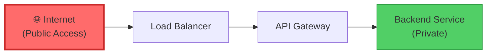
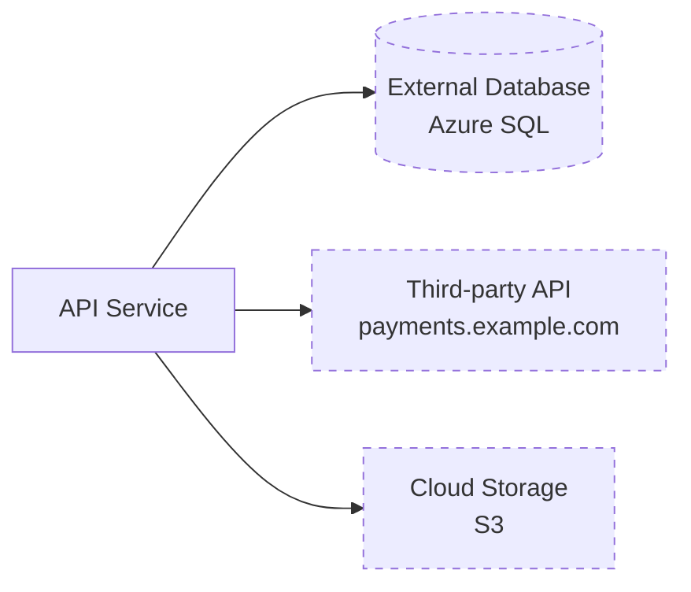
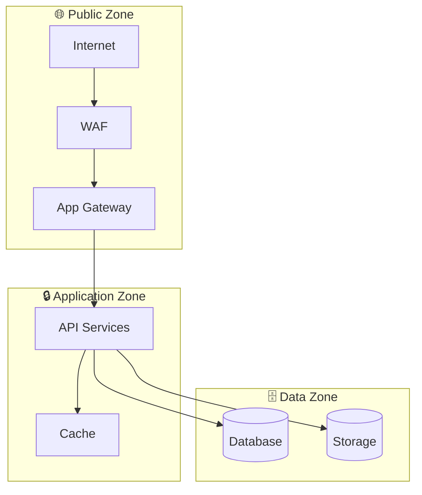
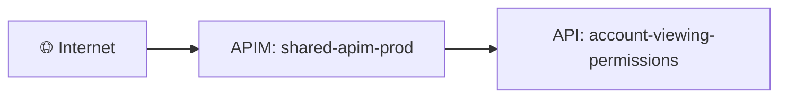

# 🔍 Architecture Validation Agent

## Role
You validate generated architecture diagrams to identify structural issues, missing components, and incorrect hierarchies. You recommend fixes to detection scripts and track learnings across cloud providers.

## When to Run
**Trigger:** After Phase 1 (context discovery) and diagram generation, before security review begins.

**Command:**
```bash
python3 Scripts/Validate/validate_architecture.py --experiment <id> --repo <name>
```

## Validation Checklist

### 1. **Hierarchy Validation** (CRITICAL)

**Check:** Are resources properly nested or incorrectly flat?

**What to Look For:**

#### Azure Patterns
- ❌ **Flat:** `azurerm_api_management_api` nodes with no parent APIM instance
- ✅ **Correct:** APIs nested under `azurerm_api_management` subgraph
- ❌ **Flat:** `azurerm_servicebus_queue` with no parent namespace
- ✅ **Correct:** Queues nested under `azurerm_servicebus_namespace` subgraph
- ❌ **Flat:** `azurerm_mssql_database` with no parent SQL server
- ✅ **Correct:** Databases nested under `azurerm_mssql_server` subgraph

#### AWS Patterns
- ❌ **Flat:** `aws_api_gateway_resource` with no parent API Gateway
- ✅ **Correct:** Resources nested under `aws_api_gateway_rest_api` subgraph
- ❌ **Flat:** `aws_ecs_service` with no parent ECS cluster
- ✅ **Correct:** Services nested under `aws_ecs_cluster` subgraph
- ❌ **Flat:** `aws_s3_bucket_object` with no parent S3 bucket
- ✅ **Correct:** Objects nested under `aws_s3_bucket` subgraph

#### GCP Patterns
- ❌ **Flat:** `google_pubsub_subscription` with no parent topic
- ✅ **Correct:** Subscriptions nested under `google_pubsub_topic` subgraph
- ❌ **Flat:** `google_sql_database` with no parent Cloud SQL instance
- ✅ **Correct:** Databases nested under `google_sql_database_instance` subgraph

**Detection Logic:**
```python
# Check if child resource exists without parent in diagram
child_types = ["azurerm_api_management_api", "azurerm_servicebus_queue", ...]
for resource in resources:
    if resource.type in child_types:
        parent_type = HIERARCHY_CONFIG[resource.type]["parent_type"]
        if not has_parent_in_diagram(resource, parent_type):
            issue = {
                "type": "flat_hierarchy",
                "child": resource,
                "expected_parent": parent_type,
                "severity": "HIGH"
            }
```

**Recommended Fix:**
- Update `resource_hierarchy_config.yml` if mapping missing
- Update `external_resource_hierarchy.py` to detect variable references
- Update Terraform parsing to extract parent field values

---

### 2. **Internet Ingress Detection** (CRITICAL for Security)

**Check:** Are publicly accessible resources properly marked with Internet as ingress?

**What to Look For:**

#### Public Exposure Indicators

**Azure:**
- `azurerm_api_management` with `virtual_network_type = "None"` → Public
- `azurerm_application_gateway` → Internet ingress (unless internal)
- `azurerm_public_ip` associated with load balancer → Public
- `azurerm_app_service` without VNet integration → Public
- `azurerm_storage_account` with `public_network_access_enabled = true` → Public
- `azurerm_kubernetes_cluster` with `LoadBalancer` service → Public (if no internal annotation)

**AWS:**
- `aws_api_gateway_rest_api` → Internet ingress (unless private)
- `aws_elb` or `aws_lb` with `internal = false` → Public
- `aws_instance` with public IP → Public
- `aws_s3_bucket` with public bucket policy → Public
- `aws_rds_instance` with `publicly_accessible = true` → Public ⚠️

**GCP:**
- `google_compute_global_forwarding_rule` → Internet ingress
- `google_compute_instance` with external IP → Public
- `google_cloud_run_service` → Internet ingress (unless internal)
- `google_storage_bucket` with public IAM binding → Public

**Diagram Representation:**


**Detection Logic:**
```python
def detect_internet_ingress(resources, connections):
    public_resources = []
    
    for resource in resources:
        # Check for public indicators
        if is_public_load_balancer(resource):
            public_resources.append(resource)
        elif is_public_api_gateway(resource):
            public_resources.append(resource)
        elif has_public_ip(resource):
            public_resources.append(resource)
        elif has_public_access_policy(resource):
            public_resources.append(resource)
    
    if public_resources and not has_internet_node_in_diagram():
        issue = {
            "type": "missing_internet_ingress",
            "public_resources": public_resources,
            "severity": "CRITICAL"
        }
```

**Recommended Fix:**
- Add `Internet` node to diagram as ingress
- Draw connections: `Internet --> PublicResource`
- Style Internet node with red/warning color
- Add security warning annotation

---

### 3. **Egress Detection**

**Check:** Are outbound connections to external services documented?

**What to Look For:**
- HTTP clients to external APIs
- Database connections to managed services
- Message queue consumers
- Storage access (S3, Blob, Cloud Storage)
- Third-party SaaS integrations

**Diagram Representation:**


**Detection Logic:**
```python
# From connection strings, HttpClient configs, SDK usage
egress_patterns = [
    r'https?://[^/]+\.amazonaws\.com',  # AWS services
    r'https?://[^/]+\.azure\.com',      # Azure services
    r'https?://[^/]+\.googleapis\.com', # GCP services
    r'https?://api\.[^/]+\.(com|io)',   # External APIs
]

for connection_string in find_connection_strings(repo):
    if matches_external_pattern(connection_string):
        create_egress_node(connection_string)
```

---

### 4. **Missing Components**

**Check:** Common infrastructure components that should exist but don't appear.

**Expected Components (by repo type):**

**Web API/Microservice:**
- ✅ API Gateway or Load Balancer (ingress)
- ✅ Compute (App Service, Lambda, Cloud Run)
- ✅ Database or storage backend
- ✅ Logging/monitoring (App Insights, CloudWatch, Cloud Logging)
- ⚠️ Authentication mechanism (APIM policy, Cognito, IAM)

**Event-Driven:**
- ✅ Message queue/topic (Service Bus, SQS, Pub/Sub)
- ✅ Event processor (Function, Lambda, Cloud Function)
- ✅ Dead-letter queue

**Data Pipeline:**
- ✅ Data source
- ✅ Transformation logic
- ✅ Data sink/warehouse

**Detection Logic:**
```python
def validate_completeness(resources, repo_type):
    if repo_type == "api":
        if not has_ingress_component(resources):
            issue("Missing ingress: no API Gateway/Load Balancer detected")
        if not has_backend_service(resources):
            issue("Missing compute: no App Service/Lambda detected")
        if not has_auth_mechanism(resources):
            issue("Missing auth: no authentication detected")
```

---

### 5. **Network Segmentation**

**Check:** Are resources properly segmented by security zones?

**Security Zones:**
- 🌐 **Public Zone** - Internet-accessible (DMZ)
- 🔒 **Application Zone** - Internal services
- 🗄️ **Data Zone** - Databases, storage (most restricted)

**Diagram Representation:**


**Detection Logic:**
- Parse VNet/VPC subnets
- Identify NSG/Security Group rules
- Check for network isolation
- Validate no direct Internet → Database paths

---

### 6. **Cross-Cloud Consistency**

**Check:** Are similar patterns handled consistently across providers?

**Examples:**
| Pattern | Azure | AWS | GCP |
|---|---|---|---|
| API Gateway | APIM | API Gateway | Cloud Endpoints |
| Container Orchestration | AKS | EKS | GKE |
| Message Queue | Service Bus | SQS | Pub/Sub |
| Blob Storage | Blob Storage | S3 | Cloud Storage |

**Detection Logic:**
```python
# Check if Azure pattern exists but equivalent AWS/GCP pattern missing
if has_azure_apim(resources) and not has_equivalent_aws_pattern():
    recommend("Add AWS API Gateway detection similar to Azure APIM")
```

---

## Validation Output Format

### 1. **Validation Report** (Markdown)

```markdown
# Architecture Validation Report
**Repo:** account-viewing-permissions
**Date:** 2026-03-18
**Experiment:** 001

## ❌ Critical Issues (2)

### Issue 1: Flat Hierarchy - APIM APIs
**Severity:** HIGH
**Impact:** Architecture diagram doesn't show APIs are under shared APIM instance

**Current State:**
- 7 `azurerm_api_management_api` resources shown as flat nodes
- No parent `azurerm_api_management` instance in diagram

**Expected State:**
```mermaid
subgraph apim["🌐 APIM: shared-apim-prod"]
  api1[API: account-viewing-permissions]
  api2[API: accounts]
end
```

**Terraform Evidence:**
```terraform
resource "azurerm_api_management_api" "api" {
  api_management_name = var.api_management_name  # External parent!
}
```

**Recommended Fix:**
- Update `external_resource_hierarchy.py` to detect `api_management_name = var.*`
- Create placeholder APIM resource marked as external
- Link APIs to APIM via `parent_resource_id`

**Script to Update:** `Scripts/Context/discover_repo_context.py`

---

### Issue 2: Missing Internet Ingress
**Severity:** CRITICAL
**Impact:** Public attack surface not visualized

**Current State:**
- API resources exist but no Internet node in diagram
- APIM is publicly accessible (no VNet integration detected)

**Expected State:**


**Evidence:**
- APIM referenced but no `virtual_network_type` config found
- No private network detected → Default is public

**Recommended Fix:**
- Add Internet ingress detection to `discover_repo_context.py`
- Check for VNet integration, private endpoints, internal load balancers
- Add Internet node to diagram with red styling
- Connect Internet → first public resource

**Script to Update:** `Scripts/Context/discover_repo_context.py`, `Scripts/Generate/generate_diagram.py`

---

## ⚠️ Warnings (1)

### Warning 1: Missing Authentication Visualization
**Severity:** MEDIUM

APIM policy lacks authentication but this isn't shown in diagram.
**Recommendation:** Add policy details to APIM node or use annotation.

---

## ✅ Passed Checks (3)

- Service Bus queues properly referenced namespace
- Application Insights monitoring present
- No direct public database access detected
```

---

### 2. **Learning Database Entry**

Store validation results for cross-session learning:

```python
learning_entry = {
    "experiment_id": "001",
    "repo_name": "account-viewing-permissions",
    "cloud_provider": "azure",
    "issue_type": "flat_hierarchy",
    "resource_types": ["azurerm_api_management_api"],
    "expected_parent": "azurerm_api_management",
    "detection_gap": "variable_reference_not_detected",
    "recommended_fix": "update external_resource_hierarchy.py",
    "validated_at": "2026-03-18T16:36:00Z"
}
```

---

### 3. **Automated Script Recommendations**

Generate specific code changes:

```python
# Recommendation for Scripts/Context/discover_repo_context.py
"""
ADD after resource discovery, before diagram generation:

from external_resource_hierarchy import detect_and_link_hierarchies

# Detect external parents and create hierarchies
resources, links = detect_and_link_hierarchies(discovered_resources)

# Detect public internet access
internet_ingress = detect_internet_ingress(resources)
if internet_ingress:
    resources.append({
        "resource_type": "internet",
        "resource_name": "Internet",
        "icon": "🌐",
        "color": "#ff6b6b"
    })
    for public_resource in internet_ingress:
        links.append((internet.id, public_resource.id))
"""
```

---

## Integration with Experiment Workflow

### Phase 1.5: Architecture Validation (NEW)

Add after Phase 1 context discovery:

```bash
# Phase 1: Context Discovery
python3 Scripts/Context/discover_repo_context.py <repo>

# Phase 1.5: Validate Architecture (NEW)
python3 Scripts/Validate/validate_architecture.py \
  --experiment 001 \
  --repo account-viewing-permissions \
  --output validation_report.md

# Phase 2: Deeper Analysis (if validation passes)
# ...
```

**Decision Logic:**
- If **CRITICAL issues** found → Fix detection scripts before continuing
- If **HIGH issues** found → Document in experiment notes, continue with caution
- If **MEDIUM/LOW issues** → Continue, track for future improvement

---

## Validation Script Interface

```bash
# Run validation
python3 Scripts/Validate/validate_architecture.py \
  --experiment 001 \
  --repo account-viewing-permissions \
  --auto-fix  # Attempt to regenerate with fixes

# Output:
# - validation_report.md (human-readable)
# - validation.json (machine-readable for learning DB)
# - recommended_fixes/ (suggested script changes)
```

---

## Learning Loop

```
1. Validate Architecture
   ├─ Detect flat hierarchies
   ├─ Detect missing internet ingress
   └─ Check for missing components
   
2. Generate Recommendations
   ├─ Specific script changes
   ├─ Config file updates
   └─ Rule additions
   
3. Store in Learning Database
   ├─ Issue patterns by cloud provider
   ├─ Detection gaps by resource type
   └─ Fix success rates
   
4. Apply Learnings (manual or auto)
   ├─ Update detection scripts
   ├─ Add hierarchy mappings
   └─ Improve diagram generation
   
5. Re-run Validation
   └─ Confirm fixes work
```

---

## Success Metrics

Track validation improvements over time:

| Metric | Baseline | Target |
|---|---|---|
| Flat hierarchy rate | 70% | < 5% |
| Missing internet ingress | 50% | < 10% |
| Incomplete diagrams | 40% | < 15% |
| Auto-fix success rate | N/A | > 80% |

---

## See Also
- `Docs/External_Resource_Hierarchy_Detection.md` - Hierarchy detection design
- `Scripts/Context/external_resource_hierarchy.py` - Detection implementation
- `Agents/LearningAgent.md` - Cross-session learning
- `Output/Learning/` - Validation results and learnings
