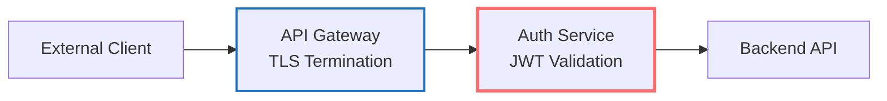
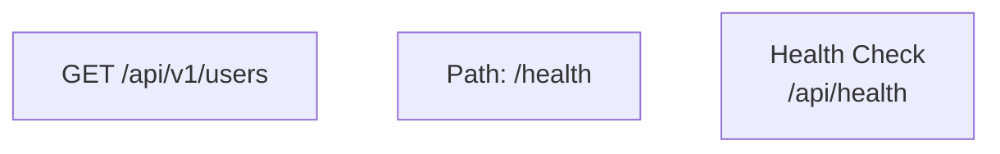
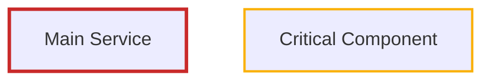
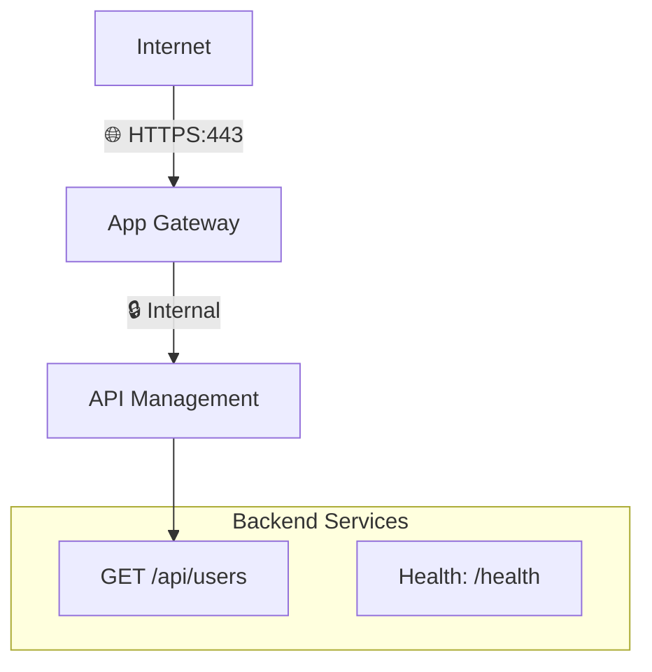
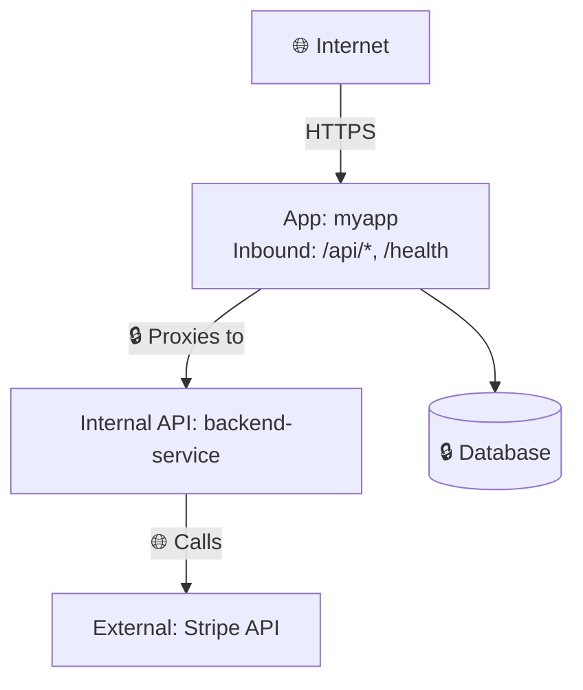
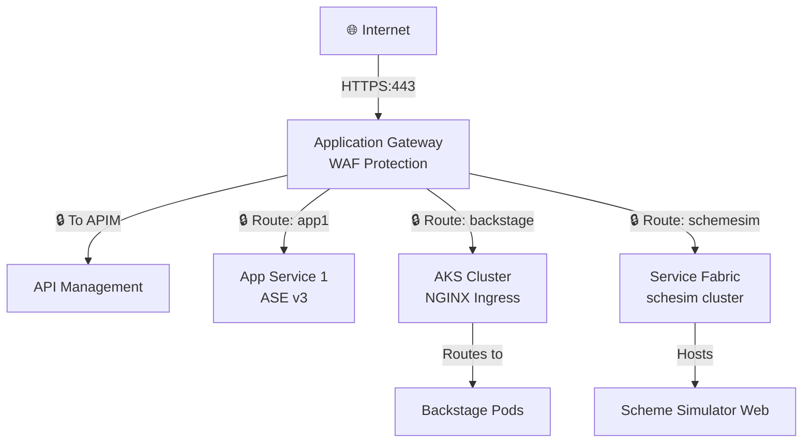
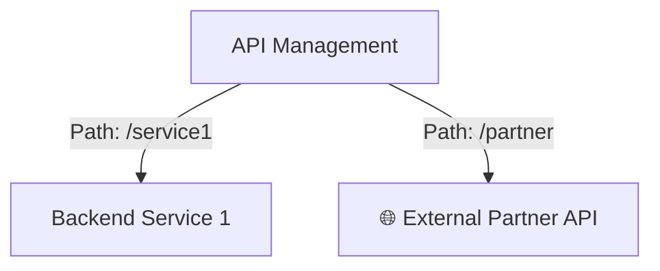
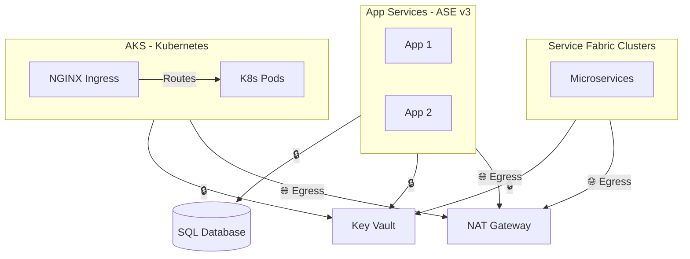
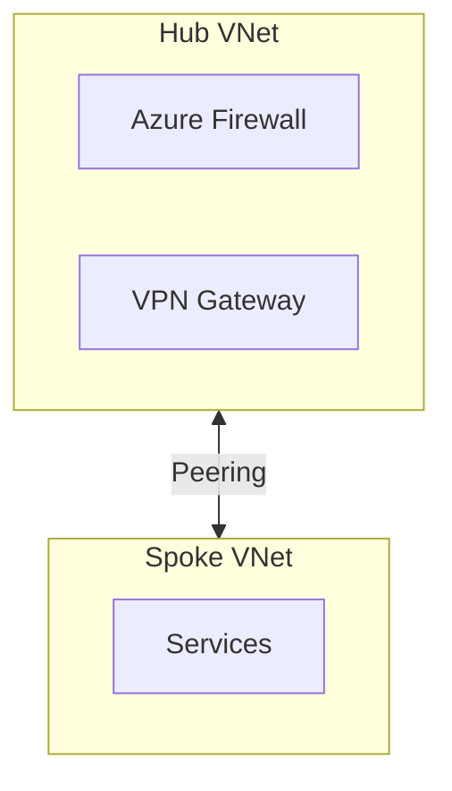

# 🟣 Context Discovery Agent

## Purpose
This agent performs **fast, non-security context discovery** of repositories to build foundational understanding. It runs BEFORE any security scanning decisions and provides the information needed to generate architecture diagrams and inform scan scope choices.

**What it does:** Learn about the repo
**What it doesn't do:** Find security issues (that's for IaC/SCA/SAST/Secrets agents)

## Two-Phase Approach

### Phase 1: Automated Baseline (Script) - ~10 seconds
**Tool:** `Scripts/discover_repo_context.py`
**Method:** Pattern matching, regex, file scanning

**Run:** `python3 Scripts/discover_repo_context.py <repo_path> --repos-root <repos_root>`

**Detects automatically:**
- **Languages & frameworks** - C#, F#, VB.NET, TypeScript, JavaScript, Python, Go, Java, Kotlin
- **IaC & orchestration** - Terraform, Bicep, Helm, Kustomize, Skaffold, Tilt, K8s manifests
- **Container runtime** - Dockerfile analysis (base images, exposed ports, runtime user, health checks, multi-stage builds)
- **Network topology** - VNets, subnets, NSGs, private endpoints, VNet peerings (from Terraform)
- **Hosting platform** - App Service (Windows/Linux), AKS, Functions, Container Apps
- **CI/CD pipelines** - Azure Pipelines, GitHub Actions, GitLab CI with file citations
- **API routes** - MapGet/MapPost, [HttpGet], route mapping JSON files
- **Authentication methods** - JWT, OAuth, APIM keys, mTLS, Digital Signatures with implementation details
- **External dependencies** - Databases (with auth method), storage, queues, monitoring, backend APIs
- **Ingress patterns** - App Gateway, Front Door, APIM (from code & Terraform)
- **APIM routing** - Mock vs real backend routing detection
- **Backend services** - Extracted from HttpClient config and route mapping JSON files

**Output:** Creates baseline `Output/Summary/Repos/<RepoName>.md` with:
- **Architecture diagram** (Mermaid) - Infrastructure topology with colored borders, clean connections (no numbered steps)
- **TL;DR Executive Summary** - Score placeholders, Phase 2 TODO markers
- **Security Observations** - Detected controls for validation, Phase 2 guidance
- **Overview** - Purpose, hosting, CI/CD, dependencies, authentication, container runtime, network topology
- **Traffic Flow** - Phase 2 TODO marker with detected hints, route mappings table
- **Security Review** - Languages, automated scanning status (SCA/SAST/Secrets/IaC pending), grouped evidence

### Phase 2: Intelligent Analysis (Explore Agent) - ~30-60 seconds
**Tool:** Launch ONE explore agent per repo
**Method:** Code reading, understanding, synthesis

**The explore agent should:**
1. **Read Phase 1 output** - Review the baseline summary from the script
2. **Deep dive for understanding:**
   - **Purpose & Business Logic** - What problem does this solve? Who uses it?
   - **Traffic Flow (MANDATORY)** - Trace complete request path with middleware execution order
   - **Architecture Pattern** - Confirm pattern (API, reverse proxy, event processor, etc.)
   - **Security Controls** - Which middleware enforces which control? Validation rules?
   - **Route Logic** - HOW does routing work? Pattern matching? Conditional logic?
3. **Synthesize & enhance** - Update the summary with deeper insights

**Phase 2 prompt template:**
```
You are performing Phase 2 context discovery for <repo_name> at <repo_path>.

Phase 1 (automated script) detected:
- Languages: [list]
- Hosting: [platform]
- Ingress: [detected]
- Authentication: [methods]
- Dependencies: [list]

Your task is deeper analysis:
1. PURPOSE: Read README - what business problem does this solve?
2. TRAFFIC FLOW (MANDATORY): Trace complete request path including middleware order
3. ARCHITECTURE: Confirm pattern and explain HOW routing/processing works
4. SECURITY: Map which components enforce which controls
5. KEY FILES: Identify the 5-10 most important files that define behavior

Read code as needed. Target: < 2 minutes.
```

**DO NOT:** Use multiple parallel agents, general-purpose agent, run security scans, or do exhaustive code analysis during context discovery.

## Workflow

### When starting fresh repo analysis:
1. ✅ **Run Phase 1 script first** - Get automated baseline
2. ✅ **Review Phase 1 output** - Check what was detected
3. ✅ **Launch Phase 2 explore agent** - Deep dive for understanding
4. ✅ **Synthesize results** - Combine into comprehensive summary
5. ✅ **If IaC detected: Update cloud architecture diagrams** - Launch ArchitectureAgent (see below)
6. ✅ **Ask user for scan scope** - IaC, SCA, SAST, Secrets, or combinations

### When Phase 1 baseline already exists:
1. ✅ **Skip script, read existing summary** - Use cached Phase 1 results
2. ✅ **Launch Phase 2 explore agent** - Fill in understanding gaps
3. ✅ **Update summary with insights** - Enhance existing document
4. ✅ **If IaC detected: Update cloud architecture diagrams** - Launch ArchitectureAgent

### After Context Discovery - Update Cloud Architecture (if IaC detected):

**When to trigger:** If Phase 1 detected Terraform/Bicep/K8s or Phase 2 discovered infrastructure

**Action:** Launch ArchitectureAgent to update `Output/Summary/Cloud/Architecture_<Provider>.md`

**Agent:** `Agents/ArchitectureAgent.md`

**What it does:**
- Reads `Knowledge/<Provider>.md` (updated by Phase 1 script)
- Updates multi-diagram cloud architecture view (Ingress, Routing, Backend, Network)
- Shows where this repo/service fits in overall cloud estate
- Creates hyperlinks (🔗) between services for navigation
- Uses colored borders per `Settings/Styling.md`

**Example prompt:**
```
Update the Azure cloud architecture diagrams in Output/Summary/Cloud/Architecture_Azure.md.

New service discovered: fi_api (reverse proxy to APIM)
- Hosting: Windows App Service
- Ingress: Application Gateway
- Routes to: APIM → fiauthentication + backend services
- Dependencies: Blob Storage, Application Insights

Review Knowledge/Azure.md for all services. Update the existing diagrams to include fi_api:
1. Ingress diagram - add App Gateway → fi_api flow
2. API Routing diagram - show fi_api → APIM → backends chain
3. Backend Services diagram - show backends that fi_api routes to

Use multiple focused diagrams. Add hyperlinks with 🔗 to Output/Summary/Repos/fi_api.md.
```

### Example Combined Output:
The final `Output/Summary/Repos/<RepoName>.md` should contain:
- **Architecture Diagram** (Phase 1) - Infrastructure, services, auth flow with labeled arrows
- **Overview** (Phase 1) - Languages, hosting, CI/CD, dependencies, authentication
- **Traffic Flow** (Phase 1 placeholders → Phase 2 completes) - Detected hints + complete middleware execution order
- **Security Review** (Phase 1) - Detected languages, frameworks, evidence
- **Key Files** (Phase 2) - Most important files defining behavior
- **Purpose & Business Context** (Phase 2) - What problem it solves, who uses it

### Phase 2 Traffic Flow Completion:
The Phase 1 script creates a `## 🚦 Traffic Flow` section with **[PHASE 2 TODO]** marker and detected hints.

**Phase 2 agent should replace this section with:**
1. **Request Path Summary** - One sentence arrow flow (Client → Gateway → Service → Backend)
2. **Components breakdown:**
   - Entry Point (Load Balancer/Gateway with TLS termination)
   - Service Layer (Web server, middleware pipeline with numbered execution order)
   - Route Mapping (How routing logic works)
   - Backend Gateway (APIM, service mesh)
   - Backend Services (Final destinations)
3. **Key Characteristics:**
   - Ports & protocols
   - Authentication validation points
   - Routing logic with code evidence
   - State (stateless/stateful)
4. **Route Mappings table** - Incoming path → Backend → Purpose
5. **External Dependencies** - With resilience patterns

See `Templates/RepoFinding.md` for complete Traffic Flow template structure.

## Outputs
- `Output/Summary/Repos/<RepoName>.md` with comprehensive context (Phase 1 baseline + Phase 2 enhancements)
- `Output/Knowledge/Repos.md` updated with repository entry
- If IaC detected:
  - `Output/Knowledge/<Provider>.md` updated with services discovered (Azure/AWS/GCP)
  - `Output/Summary/Cloud/Architecture_<Provider>.md` created/updated with cloud architecture diagram
- Audit log entries with timing and findings count

## Discovery Scope Reference

**NOTE:** The patterns below are implemented in the Phase 1 script (`discover_repo_context.py`). The Phase 2 explore agent should focus on UNDERSTANDING the results rather than re-running these searches.

### Repository Metadata
**Goal:** Understand repo activity and ownership
```bash
# Current state
git --no-pager log --oneline -1
git rev-parse --abbrev-ref HEAD
git rev-parse HEAD

# Recent activity level
git --no-pager log --oneline --since="3 months ago" | wc -l

# Key contributors
git --no-pager shortlog -sn --since="6 months ago" | head -5
```

**Capture:**
- Current commit SHA and branch
- Last commit date
- Activity level (commits in last 3 months)
- Primary contributors

### Ingress Discovery (MANDATORY - CRITICAL FOR THREAT MODELING)
**Goal:** Identify all ways data/requests enter this service

**For Application Code:**
```bash
# Web server/API endpoints
grep -r "Listen\|BindAddress\|app.Run\|http.ListenAndServe" --include="*.cs" --include="*.go" --include="*.py" --include="*.js" | head -10

# Route definitions
grep -r "@app.route\|@RestController\|@RequestMapping\|app.get\|app.post\|Route\[" --include="*.cs" --include="*.py" --include="*.java" --include="*.js" | head -20

# Exposed ports in config
grep -r "port:\|PORT=\|--port" --include="*.yaml" --include="*.json" --include=".env" --include="Dockerfile"

# APIM endpoint configuration (CRITICAL for routing chain discovery)
grep -r "ApiManagerBaseUrl\|ApiManagementUrl\|azure-api.net\|api-gateway.*url" --include="*.json" --include="*.config" --include="*.yaml"
```

**For IaC:**
```bash
# Azure - Public exposure points
grep -r "public_ip\|frontend_ip\|public.*endpoint" --include="*.tf" | head -10
grep -r "azurerm_application_gateway\|azurerm_api_management\|azurerm_lb\|azurerm_front_door" --include="*.tf"

# AWS - Public exposure points
grep -r "aws_lb\|aws_alb\|aws_api_gateway\|aws_cloudfront\|aws_elastic_ip" --include="*.tf" | head -10
grep -r "aws_apigatewayv2\|aws_api_gateway_rest_api\|aws_lb_listener" --include="*.tf"

# GCP - Public exposure points
grep -r "google_compute_address\|google_compute_forwarding_rule\|google_compute_url_map" --include="*.tf" | head -10
grep -r "google_compute_global_address\|google_api_gateway\|google_cloud_run_service" --include="*.tf"

# Network security rules (all clouds)
grep -r "network_security_group\|security_rule\|firewall_rule\|aws_security_group\|google_compute_firewall" --include="*.tf" | head -10

# Kubernetes/AKS Ingress (CRITICAL for service mesh discovery)
grep -r "ingress\|IngressController" --include="*.yaml" --include="*.tf"
grep -r "kind: Ingress\|kind: Service" --include="*.yaml" | head -20
```

**For Kubernetes/AKS Services:**
```bash
# K8s Service definitions (LoadBalancer, NodePort expose services externally)
grep -r "kind: Service" --include="*.yaml" -A 10 | grep -E "type:|LoadBalancer|NodePort|ClusterIP" | head -20

# Ingress resources (nginx, traefik, istio, etc.)
grep -r "kind: Ingress" --include="*.yaml" -A 20 | head -30
grep -r "kubernetes.io/ingress.class\|ingressClassName:" --include="*.yaml"

# Extract Ingress rules (hosts, paths, backend services)
grep -r "kind: Ingress" --include="*.yaml" -A 30 | grep -E "host:|path:|backend:|serviceName:|servicePort:" | head -50

# Service annotations (external-dns, load balancer annotations)
grep -r "service.beta.kubernetes.io/azure-load-balancer\|external-dns.alpha.kubernetes.io" --include="*.yaml"

# Istio/Service Mesh ingress
grep -r "kind: Gateway\|kind: VirtualService" --include="*.yaml" -A 10 | head -20

# Service ports and selectors
grep -r "ports:\|selector:\|targetPort:" --include="*.yaml" | head -30
```

**Capture:**
- Entry points (HTTP endpoints, TCP ports, message queues)
- Exposure level (Internet-facing, VNet-only, Private Link)
- Authentication requirements (public, authenticated, internal-only)
- Frontend services (API Gateway, Load Balancer, direct)
- **APIM routing:** If service calls APIM, document:
  - APIM endpoint URL (from config files)
  - APIM APIs called (if discoverable from code/config)
  - Subscription keys or authentication methods

### Traffic Flow Discovery (MANDATORY - NEW)
**Goal:** Document complete request path from entry point to backend, including all middleware and routing layers

**Critical for:** Understanding attack surface, authentication points, and data flow

**For Application Code:**
```bash
# Web server/application entry points
grep -r "app.Run\|app.Listen\|http.ListenAndServe\|Kestrel\|Tomcat\|Uvicorn" --include="*.cs" --include="*.go" --include="*.py" --include="*.java" | head -10

# Middleware pipeline (order matters!)
grep -r "UseMiddleware\|app.use\|middleware.py\|Filter\|Interceptor" --include="*.cs" --include="*.js" --include="*.py" --include="*.java" | head -20

# Authentication middleware
grep -r "UseAuthentication\|UseAuthorization\|@RequiresAuth\|authenticate\|authorize" --include="*.cs" --include="*.py" --include="*.java" --include="*.js" | head -15

# Request processing pipeline (ASP.NET Startup.cs, Express app.js, Django settings.py)
grep -r "Configure\|ConfigureServices\|app = express\|MIDDLEWARE" --include="Startup.cs" --include="Program.cs" --include="*.js" --include="settings.py"

# Routing configuration
grep -r "MapControllers\|UseRouting\|UseEndpoints\|routes.MapRoute\|app.route" --include="*.cs" --include="*.js" --include="*.py" | head -15

# Reverse proxy / forwarding logic
grep -r "ProxyPass\|proxy_pass\|HttpClient.*Forward\|ReverseProxy" --include="*.conf" --include="*.cs" --include="*.go" | head -10
```

**For Load Balancer / Gateway Configuration:**
```bash
# Application Gateway backend pools (Azure)
grep -r "backend_address_pool\|backend_http_settings" --include="*.tf" -A 5

# ALB/NLB target groups (AWS)
grep -r "aws_lb_target_group\|target_group_arn" --include="*.tf" -A 5

# Nginx/HAProxy config
grep -r "upstream\|backend\|server.*:.*;" --include="nginx.conf" --include="haproxy.cfg" | head -20

# API Management policies (Azure APIM)
grep -r "<inbound>\|<backend>\|<outbound>\|forward-request" --include="*.xml" --include="*.json" | head -15
```

**Capture in Traffic Flow section:**

Follow the structure in Templates/RepoFinding.md exactly:

1. **Request Path Summary:** One sentence with arrows (→) showing complete flow
   - Example: "Client HTTPS → App Gateway (TLS termination) → Kestrel → Auth middleware → APIM → Backend services"

2. **Components:**
   - **Entry Point:** Load balancer/gateway/public IP with emoji 🛡️
     - Include evidence (code/config snippet + file path)
   - **Service Layer:** 
     - Web server/runtime with emoji 🔒 (port, protocol)
     - Middleware pipeline with emoji 🔐 - LIST IN EXECUTION ORDER with file paths:
       1. Component 1 with purpose + evidence source
       2. Component 2 with purpose + evidence source
       3. Component 3 with purpose + evidence source
     - Route mapping config with emoji 🗺️ + file path
   - **Backend Gateway:** (if applicable) API Gateway/Service Mesh with emoji 📡
   - **Backend Services:** List with appropriate emoji from Settings/Styling.md (💰 💳 📊 🔄 etc)

3. **Key Characteristics:**
   - **Port(s):** All ports with protocol and context (public/internal)
   - **Protocols:** Show protocol at each hop (Client → Gateway, Gateway → App, etc)
   - **Authentication:** Method, validation point, resilience patterns (circuit breakers/retries)
   - **Routing Logic:** How routing is configured with code snippet evidence
     - Include header enrichment/transformation with code snippets
   - **State:** Stateless/stateful, caching, persistence details

4. **Route Mappings:** Table of incoming paths → destinations → purpose

5. **External Dependencies:** List each with:
   - Purpose, protocol, endpoint, resilience patterns
   - External API call

**Example Traffic Flow Output:**
```
Client → Azure App Gateway (HTTPS:443) 
      → Kestrel (HTTP:80)
      → [TokenExtractionMiddleware]
      → [AuthenticationMiddleware → FI Auth Service (via APIM)]
      → [InstitutionIdMiddleware]
      → [RouteMappingMiddleware → ApiManagerRouteMappings.json]
      → Azure APIM (HTTPS)
      → Backend Services (Accounts, Ledger, BACS, etc.)
```

### Egress Discovery (MANDATORY - CRITICAL FOR THREAT MODELING)
**Goal:** Identify all external connections and data flows

**For Application Code:**
```bash
# HTTP/API calls
grep -r "HttpClient\|http.Get\|http.Post\|requests.get\|requests.post\|axios\|fetch(" --include="*.cs" --include="*.go" --include="*.py" --include="*.js" | head -20

# APIM endpoint calls (CRITICAL for routing chain)
grep -r "ApiManagerBaseUrl\|ApiManagementUrl\|/api/\|\.azure-api\.net" --include="*.cs" --include="*.go" --include="*.py" --include="*.js" --include="*.json" | head -20

# Database connections
grep -r "Server=\|Host=\|Data Source=\|ConnectionString\|DATABASE_URL" --include="*.config" --include="*.json" --include="*.env" | head -10

# Message queues / Event buses
grep -r "ServiceBus\|EventHub\|Kafka\|RabbitMQ\|SQS\|PubSub" --include="*.cs" --include="*.go" --include="*.py" --include="*.java" | head -10

# External domains/APIs
grep -r "https://[a-zA-Z0-9.-]*\\.com\|http://[a-zA-Z0-9.-]*\\.com" --include="*.cs" --include="*.json" --include="*.yaml" --include="*.config" | head -20

# Storage access
grep -r "blob.core.windows.net\|s3.amazonaws.com\|storage.googleapis.com" --include="*.cs" --include="*.json" | head -10
```

**For IaC:**
```bash
# Data sources (existing resources we depend on)
grep -r "data \"azurerm_\|data \"aws_\|data \"google_" --include="*.tf" | grep -oP 'data "\K[^"]+' | sort -u

# Remote state dependencies
grep -r "terraform_remote_state" --include="*.tf"

# Backend pools / target groups
grep -r "backend.*pool\|target_group\|backend.*address" --include="*.tf" | head -10
```

**For Kubernetes/AKS Services:**
```bash
# Service-to-service calls within cluster
grep -r "http://.*svc.cluster.local\|http://.*:.*/" --include="*.yaml" --include="*.cs" --include="*.go" --include="*.py" | head -20

# External service endpoints (egress from cluster)
grep -r "externalName:\|ExternalName" --include="*.yaml"

# ConfigMaps/Secrets with service endpoints
grep -r "SERVICE_URL\|API_ENDPOINT\|BACKEND_HOST" --include="*.yaml" | head -20

# Service dependencies from K8s manifests
grep -r "- name:.*URL\|_SERVICE_HOST\|_SERVICE_PORT" --include="*.yaml" | head -20

# Istio/Service Mesh egress policies
grep -r "kind: ServiceEntry\|kind: DestinationRule" --include="*.yaml" -A 10 | head -20

# Network policies (egress rules)
grep -r "kind: NetworkPolicy" --include="*.yaml" -A 20 | grep -E "egress:|to:" | head -20
```

**Capture (classify EVERY connection):**
- 🔒 **Internal egress:** Same VNet/private network (databases, storage accounts, internal APIs)
- 🌐 **External egress:** Internet/third-party (Stripe, SendGrid, partner APIs)
- ❓ **Unknown egress:** Boundary unclear from available code
- Protocols used (HTTP/HTTPS, SQL, message protocols)
- Downstream flows (what internal services then connect to)

### Technology Stack
**Goal:** Identify languages, frameworks, versions

**Detection patterns:**
- `.csproj`, `*.sln` → .NET (extract TargetFramework)
- `package.json` → Node.js (extract "engines", dependencies)
- `requirements.txt`, `pyproject.toml` → Python
- `go.mod` → Go
- `pom.xml`, `build.gradle` → Java
- `Gemfile` → Ruby
- `Cargo.toml` → Rust

**Capture:**
- Primary language(s)
- Framework(s) and versions
- Runtime target (e.g., "net8.0", "python3.11")
- Build tool (npm, pip, maven, cargo, etc.)

### Infrastructure as Code
**Goal:** Discover what cloud resources this repo provisions

**Detection patterns:**
```bash
# Terraform
find . -name "*.tf" -not -path "*/\.*" | head -20
grep -r "resource \"" --include="*.tf" | grep -oP 'resource "\K[^"]+' | sort -u

# CRITICAL: Public vs Private Exposure (Check Variables AND Environment Overrides)
# AKS API Server exposure
grep -r "private_cluster_enabled\|api_server_authorized_ip_ranges\|private_dns_zone_id" --include="*.tf" -A 3 | head -30
# Check variable defaults
grep -A 5 "variable \"private_cluster_enabled\"" --include="*.tf"
# Check hiera/config overrides (CRITICAL: Default may be private but overridden to public)
grep -r "private_cluster_enabled:" --include="*.yaml" --include="*.yml" | head -20

# App Gateway / Load Balancer public vs private
grep -r "sku.*=.*\"WAF\|frontend_ip_configuration\|public_ip_address_id" --include="*.tf" -A 5 | head -30
grep -r "private_ip_address_allocation\|subnet_id.*frontend" --include="*.tf" -A 3 | head -20

# AKS Node Pools - Check if nodes have public IPs
grep -r "enable_node_public_ip\|node_public_ip_enabled\|node_public_ip_prefix" --include="*.tf" -A 2 | head -20

# Kubernetes Services - Public LoadBalancer exposure
grep -r "type:.*LoadBalancer\|service.beta.kubernetes.io/azure-load-balancer-internal" --include="*.yaml" -A 5 | head -30
grep -r "service.*annotations\|loadBalancerIP\|externalTrafficPolicy" --include="*.yaml" -A 3 | head -20

# Storage accounts - Public blob access
grep -r "allow_blob_public_access\|public_network_access_enabled\|network_rules" --include="*.tf" -A 5 | head -30

# SQL/Database - Public endpoint exposure
grep -r "public_network_access_enabled\|firewall_rule.*0.0.0.0" --include="*.tf" -A 3 | head -20

# WAF policies and modes (CRITICAL: Check if in Detection vs Prevention)
grep -r "azurerm_web_application_firewall_policy\|azurerm_application_gateway" --include="*.tf" -A 10 | grep -E "mode|policy_settings|firewall_mode" | head -30
grep -ri "mode.*=.*\"Detection\"\|mode.*=.*\"Alert\"\|policy_settings.*Prevention" --include="*.tf" --include="*.yaml" --include="*.json"

# WAF policy associations (which services have WAF)
grep -r "firewall_policy_id\|waf_configuration" --include="*.tf" -A 5 | head -30

# Azure SQL Server/Databases
grep -r "azurerm_mssql_server\|azurerm_mssql_database\|azurerm_sql_" --include="*.tf" | head -20
find . -name "*.bicep" -o -name "*.json" | grep -i template

# AWS CloudFormation
find . -name "*.yaml" -o -name "*.yml" | xargs grep -l "AWSTemplateFormatVersion"

# Pulumi
find . -name "Pulumi.yaml"

# Kubernetes/Helm
find . -name "Chart.yaml" -o -path "*/k8s/*.yaml"

# Configuration data (Hiera, Helm values, etc.) - CRITICAL FOR OVERRIDES
find . -path "*/hiera/data/*.yaml" -o -path "*/values*.yaml" -o -path "*/config/*.yaml" | head -20
# Check environment-specific overrides
find . -path "*/hiera-infrastructure-shared/data/*.yaml" -o -path "*/environments/*.yaml" | head -20

# API Management / API Gateway Terraform resources (CRITICAL)
grep -r "azurerm_api_management\|aws_api_gateway\|google_api_gateway" --include="*.tf" | head -20
```

**CRITICAL: Variable Defaults vs Environment Overrides**
When assessing privacy/security controls, ALWAYS check BOTH:
1. **Variable defaults** in `variable.tf` or `variables.tf`
2. **Environment-specific overrides** in:
   - Hiera data files (`hiera/data/*.yaml`, `hiera-infrastructure-shared/data/global.yaml`)
   - Helm values files (`values-prod.yaml`, `values-test.yaml`)
   - Environment config files (`config/prod.yaml`, `config/test.yaml`)
   - Terraform tfvars (`prod.tfvars`, `test.tfvars`)

**Example findings to document:**
- ✅ **ALWAYS PRIVATE:** Variable default is private AND no overrides found making it public
- ⚠️ **CONDITIONALLY PUBLIC:** Variable default is private BUT `global.yaml` sets it to public (test/preview environments)
- ❌ **PUBLIC BY DEFAULT:** Variable default is public (requires explicit override to be private)

**When documenting exposure:**
- DON'T say "Private cluster support" (ambiguous - just means it CAN be private)
- DO say "Private cluster by default, but global.yaml overrides to public for test/preview environments"
- DO check if production environments override back to private
- DO note which environments are public vs private

**For API Management / API Gateway specific discovery:**
```bash
# Azure APIM - API definitions, backends, policies
grep -r "azurerm_api_management_api\|azurerm_api_management_backend\|azurerm_api_management_policy" --include="*.tf" | head -20

# AWS API Gateway - REST/HTTP/WebSocket APIs
grep -r "aws_api_gateway_rest_api\|aws_apigatewayv2_api\|aws_api_gateway_integration" --include="*.tf" | head -20

# GCP API Gateway - API configs and gateways
grep -r "google_api_gateway_api\|google_api_gateway_gateway\|google_api_gateway_api_config" --include="*.tf" | head -20

# APIM backend service URLs (where APIM routes to)
grep -r "service_url\|backend_url\|url.*backend" --include="*.tf" --include="*.yaml" | head -20

# APIM/API Gateway operations and paths
grep -r "url_template\|path.*pattern\|operation_id" --include="*.tf" | head -20
```

**For modules with configuration data (Hiera, Helm values, etc.):**
```bash
# Azure - Backend pool / routing configurations
grep -r "backend.*pool\|backend.*address\|backend_address_pool" --include="*.yaml" --include="*.yml" | head -20

# AWS - Target groups and ALB/NLB routing
grep -r "target_group\|target_group_arn\|listener_rule\|forward_config" --include="*.yaml" --include="*.yml" | head -20

# GCP - Backend services and URL maps
grep -r "backend.*service\|url_map\|path_matcher\|backend_bucket" --include="*.yaml" --include="*.yml" | head -20

# Find service mappings and FQDNs (all clouds)
grep -r "fqdns:\|hostname:\|host_name:\|domain:\|endpoint:" --include="*.yaml" | head -20

# Find routing rules (all clouds)
grep -r "routing\|listener\|ingress\|route_table\|path_rule" --include="*.yaml" | head -20

# Find references to other services (CRITICAL for cross-service discovery)
grep -r "api.*management\|apim\|gateway\|proxy\|upstream\|backend.*service\|api.*gateway\|cloudfront\|lambda\|aks\|kubernetes\|service.*fabric\|servicefabric" --include="*.yaml" --include="*.yml" -i | head -30

# Kubernetes/AKS ingress backend pools in gateway configs
grep -r "backstage\|ingress.*nginx\|ingress.*traefik\|-aks\|\.aks\." --include="*.yaml" --include="*.yml" | head -20

# Service Fabric backend pools in gateway configs
grep -r "service.*fabric\|servicefabric\|-sf-\|\.sf\.|schesim\|shared.*fabric" --include="*.yaml" --include="*.yml" | head -20

# Kubernetes service mesh routing (Istio/Linkerd)
grep -r "host:\|destination:\|service:\|port:" --include="*.yaml" -A 3 | head -30
```

**CRITICAL: Cross-Service Configuration Detection (Multi-Cloud + Kubernetes + APIM + Service Fabric)**
- Gateway/proxy/LB/APIM repos often contain routing config for MULTIPLE services across clouds:
  - **Azure:** App Gateway, Front Door, API Management, Traffic Manager
  - **AWS:** ALB/NLB, API Gateway, CloudFront, Route 53
  - **GCP:** Cloud Load Balancing, API Gateway, Cloud CDN, Cloud Armor
  - **Kubernetes:** Ingress controllers (nginx/traefik/istio), Service mesh (Istio/Linkerd), Gateway API
  - **Service Fabric:** Stateful/legacy microservices platform
- Example: `terraform-app_gateway` may contain API Management routing + AKS ingress routing + Service Fabric routing, not just AGW resources
- Example: `psd2-integration` contains APIM API definitions with backend service URLs
- Example: `terraform-alb` may route to Lambda, ECS, EC2 across multiple services
- Example: `k8s-ingress` may route to 20+ internal services via nginx ingress
- **Always check if config files reference services NOT in the repo name**
- Parse backend pool/target group names, listener configurations, routing rules for service identifiers
- Look for patterns: service names in backend pools, lambda function ARNs, ECS service names, Cloud Run services, K8s service names, **AKS ingress endpoints** (e.g., `backstage-aks.internal`), **Service Fabric FQDNs** (e.g., `sf-uksouth-schesim.private.uk`)
- **For K8s:** Parse Ingress rules, VirtualService hosts, Service selectors to map traffic flows
- **For APIM:** Look for `service_url`, `backend_url`, `url_template` in Terraform to find backend routing
- **For Service Fabric:** Look for FQDNs with `sf-` prefix or `.private.uk/.private.io` domains, cluster names like `schesim`, `shared`
- If you find references to another service (e.g., API Management in an App Gateway repo, or AKS in gateway backend pools, or Service Fabric clusters), note this prominently

**Capture:**
- IaC tool (Terraform, Bicep, CloudFormation, Pulumi, Helm)
- Provider (Azure, AWS, GCP)
- Resource types provisioned (list top 10 most common)
- Backend configuration (remote state location)
- **Configuration data sources:** Hiera, Helm values, config files
- **API Management specific:** If APIM resources detected, document:
  - APIs defined (name, path patterns)
  - Backend service URLs (where APIM routes to)
  - Policies applied (rate limiting, authentication, IP whitelisting)
  - Products and subscriptions
  - **Operations:** Key operations per API (GET/POST/PUT paths)
- **Gateway → APIM → Backend routing chains:** For App Gateway repos with APIM backends, trace:
  - Public hostname → Backend pool name → Service → APIM API called → Final backend service
  - Example: `prod-institution-api.example.com` → `myapi` pool → my-api (ASE v3) → calls APIM `my_authentication` API → routes to internal services
  - Document services that proxy TO APIM vs services accessed directly
  - Check app config files (appsettings.json, web.config) for APIM URLs like `ApiManagerBaseUrl`
- **Gateway → AKS routing:** If backend pools reference AKS/Kubernetes services, document:
  - Backend pool name (e.g., `backstage`)
  - Target FQDN (e.g., `prod-backstage-aks.internal`)
  - Ingress controller type (nginx, traefik, istio)
  - Services hosted on AKS
- **Gateway → Service Fabric routing:** If backend pools reference Service Fabric clusters, document:
  - Backend pool name (e.g., `schemesimulator`, `shared`)
  - Target FQDN (e.g., `cbuk-core-prod-sf-uksouth-schesim.cbinnovation.private.uk`)
  - Services hosted on Service Fabric with ports
  - Service Fabric cluster type (shared, dedicated, per-service)
- **Kubernetes Ingress definitions:** If K8s Ingress resources found, document:
  - Ingress name and IngressClass (nginx, traefik, istio)
  - Hostnames exposed (e.g., `backstage-prod.cbinnovation.uk`)
  - Path patterns and backend services
  - Backend service ports
  - TLS configuration (cert-manager, manual certs)
  - External access method (LoadBalancer, App Gateway backend pool, NodePort)
- **WAF policies and protection modes (CRITICAL):** If WAF detected, document:
  - WAF policy names and which services they protect
  - **WAF Mode:** Detection/Alert vs Prevention/Block (CRITICAL: Flag if Detection mode on production)
  - OWASP CRS version (e.g., 3.2, 3.1)
  - Custom rules (IP whitelisting, geo-blocking, rate limiting)
  - Managed rule sets enabled
  - **Security Risk:** WAF in Detection mode = NO ACTIVE PROTECTION (logs only)
  - Services with WAF: List which backend pools/services have WAF protection
  - Services WITHOUT WAF: Identify unprotected public endpoints
- **Specific service mappings:** If gateway/proxy/LB, list ALL backend pools → service FQDNs
- **Cross-service configurations:** Services configured/routed by this repo but defined elsewhere
- Resource types provisioned (list top 10 most common)
- Backend configuration (remote state location)

### Cloud Services & Dependencies
**Goal:** Identify external services this repo integrates with

**From IaC resources:**
- Storage (azurerm_storage_account, aws_s3_bucket, google_storage_bucket)
- Compute (azurerm_windows_web_app, aws_lambda_function, google_cloud_run_service)
- Databases (azurerm_mssql_server, aws_rds_instance, google_sql_database_instance)
- Key management (azurerm_key_vault, aws_kms_key, google_kms_key_ring)
- Messaging (azurerm_servicebus_namespace, aws_sqs_queue, google_pubsub_topic)
- Monitoring (azurerm_log_analytics_workspace, aws_cloudwatch_log_group)

**From application code (quick grep):**
```bash
# Azure SDK usage
grep -r "Azure\." --include="*.cs" --include="*.py" --include="*.js" | grep -oP 'Azure\.\K[A-Za-z]+' | sort -u | head -10

# AWS SDK usage  
grep -r "boto3\|aws-sdk" --include="*.py" --include="*.js" | head -5

# Database connections
grep -ri "connectionstring\|database.*connect" --include="*.cs" --include="*.config" --include="*.json" | head -5
```

**Capture:**
- Cloud services in use (list with resource counts)
- Database types (SQL, Cosmos, DynamoDB, etc.)
- Authentication methods (managed identity, service principals, API keys)
- External APIs/webhooks

### Deployment Target
**Goal:** Understand where and how this deploys

**Detection patterns:**
```bash
# CI/CD pipelines
find . -name ".azure-pipelines.yml" -o -name "azure-pipelines.yml"
find . -path "*/.github/workflows/*.yml"
find . -name ".gitlab-ci.yml"
find . -name "Jenkinsfile"

# Container
find . -name "Dockerfile" -o -name "Dockerfile.*"
find . -name "docker-compose.yml" -o -name "docker-compose.*.yml"

# Skaffold
find . -name "skaffold.yaml" -o -name "skaffold.yml"

# Kubernetes
find . -path "*/k8s/*.yaml" -o -path "*/kubernetes/*.yaml"
find . -name "Chart.yaml" -o -name "values.yaml" -o -name "values-*.yaml"

# Helm charts
find . -path "*/charts/*" -o -path "*/templates/*.yaml"
```

**Analyze Dockerfiles (CRITICAL for runtime context):**
```bash
# Find all Dockerfiles
find . -name "Dockerfile*" | head -10

# Extract base images (reveals runtime environment)
grep -h "^FROM" Dockerfile* 2>/dev/null | head -10

# Extract exposed ports (ingress information)
grep -h "^EXPOSE" Dockerfile* 2>/dev/null

# Extract environment variables (may contain service URLs)
grep -h "^ENV" Dockerfile* 2>/dev/null | head -20

# Extract entrypoint/command (how service runs)
grep -h "^ENTRYPOINT\|^CMD" Dockerfile* 2>/dev/null

# Multi-stage build detection
grep -c "^FROM" Dockerfile 2>/dev/null
```

**Analyze Skaffold (K8s development workflow):**
```bash
# Find skaffold config
cat skaffold.yaml 2>/dev/null | grep -E "artifacts:|manifests:|deploy:|portForward:" -A 5

# Image repositories
grep -h "image:" skaffold.yaml 2>/dev/null

# Deploy targets
grep -h "manifests:\|helm:\|kustomize:" skaffold.yaml 2>/dev/null -A 3
```

**Analyze CI/CD Pipelines (CRITICAL for deployment context):**
```bash
# Azure Pipelines - deployment stages
grep -h "stage:\|deployment:\|environment:" azure-pipelines.yml .azure-pipelines.yml 2>/dev/null | head -20

# GitHub Actions - deployment targets
grep -rh "deploy\|environment:\|runs-on:" .github/workflows/ 2>/dev/null | head -20

# GitLab CI - deployment jobs
grep -h "deploy:\|environment:\|stage:" .gitlab-ci.yml 2>/dev/null | head -20

# Environment variables in pipelines (may reveal service endpoints)
grep -rh "env:\|ENV:\|variables:" azure-pipelines.yml .azure-pipelines.yml .github/workflows/ .gitlab-ci.yml 2>/dev/null | head -30

# Deployment commands (where does it deploy to?)
grep -rh "kubectl\|helm\|az webapp\|aws deploy\|gcloud deploy" azure-pipelines.yml .azure-pipelines.yml .github/workflows/ .gitlab-ci.yml Jenkinsfile 2>/dev/null | head -20
```

**For Kubernetes/AKS Repositories (CRITICAL):**
```bash
# List all K8s resources
grep -rh "^kind:" --include="*.yaml" | sort -u

# Find all Services (how pods are exposed)
find . -name "*.yaml" -exec grep -l "kind: Service" {} \; | head -20

# Find all Deployments (what's running)
find . -name "*.yaml" -exec grep -l "kind: Deployment\|kind: StatefulSet\|kind: DaemonSet" {} \; | head -20

# ConfigMaps and Secrets (may contain service URLs)
find . -name "*.yaml" -exec grep -l "kind: ConfigMap\|kind: Secret" {} \; | head -20

# Service mesh resources
find . -name "*.yaml" -exec grep -l "kind: Gateway\|kind: VirtualService\|kind: ServiceEntry" {} \; | head -10
```

**Capture:**
- CI/CD platform (Azure DevOps, GitHub Actions, GitLab, Jenkins)
- Deployment target (App Service, AKS, Lambda, Cloud Run, EC2, etc.)
- Containerization (Docker, yes/no)
- Orchestration (Kubernetes, Docker Compose, none)
- **If K8s/AKS:** Cluster name(s), namespaces, ingress controller type (nginx/traefik/istio)
- **From Dockerfile:** Base image, exposed ports, runtime user, multi-stage build
- **From CI/CD:** Deployment environments (dev/staging/prod), test stages, security scans run
- **From Skaffold:** Local dev workflow, port forwarding, image registries

### Repository Purpose
**Goal:** One-line business function description

**Sources:**
1. README.md (first paragraph or H1)
2. Repository description (if available via git config or API)
3. Infer from:
   - Folder structure (Controllers → API, Views → Web UI)
   - IaC resources (mostly compute → application, mostly networking → infrastructure)
   - Naming patterns (repo name contains: api, ui, worker, terraform, etc.)

**Capture:**
- Primary purpose (API, Web UI, Background Worker, IaC Module, Library, CLI Tool)
- Business domain (if evident: payments, auth, reporting, etc.)

### Architecture Relationships (CRITICAL FOR SECURITY)
**Goal:** Understand ingress and egress for threat modeling - this is the MOST IMPORTANT context for security assessment

**INGRESS Discovery (How does data/requests enter this service?):**
```bash
# For applications:
grep -r "Listen\|BindAddress\|Port\|endpoint" --include="*.cs" --include="*.go" --include="*.py" --include="*.js"
grep -r "@app.route\|@RestController\|app.get\|app.post" --include="*.py" --include="*.java" --include="*.js"

# From Dockerfile EXPOSE directives
grep -h "^EXPOSE" */Dockerfile* Dockerfile* 2>/dev/null

# For IaC:
grep -r "public_ip\|load_balancer\|application_gateway\|ingress" --include="*.tf"
grep -r "network_security_group\|firewall_rule" --include="*.tf"
```

**EGRESS Discovery (Where does this service send data/requests?):**
```bash
# API calls / HTTP clients
grep -r "http.Get\|http.Post\|HttpClient\|requests.get\|axios\|fetch" --include="*.cs" --include="*.go" --include="*.py" --include="*.js"

# Database connections
grep -r "Server=\|Host=\|ConnectionString\|database.*url" --include="*.config" --include="*.json" --include="*.env"

# Message queues / event buses
grep -r "ServiceBus\|EventHub\|Kafka\|RabbitMQ\|SQS" --include="*.cs" --include="*.go" --include="*.py"

# External APIs (look for domains)
grep -r "https://.*\.com\|http://.*\.com" --include="*.cs" --include="*.json" --include="*.yaml"

# From Dockerfile ENV variables (may contain service endpoints)
grep -h "^ENV.*URL\|^ENV.*ENDPOINT\|^ENV.*HOST" */Dockerfile* Dockerfile* 2>/dev/null

# From CI/CD environment variables
grep -rh "API_URL\|SERVICE_URL\|ENDPOINT\|DATABASE_URL" azure-pipelines.yml .azure-pipelines.yml .github/workflows/ .gitlab-ci.yml 2>/dev/null | head -20

# For IaC - data sources and remote state
grep -r "data \"" --include="*.tf" | grep -oP 'data "\K[^"]+' | sort -u
```

**For Application Gateways / Load Balancers / Proxies - also capture (Multi-Cloud):**
```bash
# Azure - Backend pool mappings
grep -r "backend.*pool\|backend.*address" --include="*.tf" --include="*.json"
grep -r "routing.*rule\|http.*listener\|request_routing_rule" --include="*.tf"
grep -r "firewall_policy\|waf_policy\|owasp\|rule_set" --include="*.tf"

# AWS - Target groups and routing
grep -r "target_group\|listener_rule\|listener_arn\|forward\|target_type" --include="*.tf" --include="*.json"
grep -r "aws_lb_target_group\|aws_lb_listener\|aws_lb_target_group_attachment" --include="*.tf"
grep -r "aws_wafv2\|aws_waf_web_acl\|aws_shield" --include="*.tf"

# GCP - Backend services and URL maps
grep -r "backend_service\|url_map\|path_matcher\|host_rule" --include="*.tf" --include="*.json"
grep -r "google_compute_backend_service\|google_compute_url_map\|google_compute_target" --include="*.tf"
grep -r "google_compute_security_policy\|cloud_armor" --include="*.tf"
```

**Capture (MANDATORY for all repos):**
- **INGRESS:**
  - Entry points (public endpoints, private endpoints, ports, protocols)
  - Authentication requirements (public, auth required, internal-only)
  - Exposure level (Internet, VNet-only, Private Link)
  - Frontend services (API Gateway, Load Balancer, direct exposure)
- **EGRESS:**
  - Upstream dependencies (services this calls) with classification:
    - 🔒 **Internal:** Same VNet/private network (e.g., SQL DB, Storage Account, internal APIs)
    - 🌐 **External:** Third-party/Internet (e.g., Stripe, SendGrid, partner APIs)
    - ❓ **Unknown:** Boundary unclear from discovery
  - Downstream flows: What internal services then connect to (if discoverable)
  - Protocols and ports used for outbound connections
- **Network boundaries crossed:** VNet boundaries, Internet egress, Private Link usage
- **Downstream consumers:** Services that call this repo
- Shared infrastructure (VNets, databases, key vaults used)

## Output Format

Use template: `Templates/RepoKnowledge.md`

**Key sections:**
```markdown
# 🟣 <RepoName>

## 🗺️ Architecture

**Key:** 🔒 Internal = Within VNet/Private | 🌐 External = Third-party/Internet | ❓ Unknown = Boundary unclear | 🔗 = Clickable link


**Components:**
- **Ingress (CRITICAL):** <how requests/data enter - public/private endpoints, ports, exposure level>
  - **Links:** If accessed via gateway/APIM, link to cloud architecture sections
- **Inbound routes:** <API paths/endpoints/queues if applicable>
- **Egress (CRITICAL):** <where requests/data go - classify each connection>
  - 🔒 **Internal:** <within VNet - databases, storage, internal APIs>
    - **Links:** If calling documented services, link to their repo summaries
  - 🌐 **External:** <third-party - Stripe, SendGrid, partner APIs>
  - ❓ **Unknown:** <boundary unclear>
  - **Service dependencies:** Link to downstream service repos if scanned

## 🎯 Purpose
- **Primary Function:** <one-line description>
- **Business Domain:** <domain if evident>

## 🛠️ Technology Stack
<languages, frameworks, dependencies>

## ☁️ Infrastructure as Code
<IaC tool, provider, resources>

**Cross-Service Configurations:** <if this repo configures/routes services defined elsewhere, list them here>
- Example: "This App Gateway routes to 5 API Management services + 13 App Services"
- Example: "Nginx config contains routing for customer-api (separate repo)"

**WAF Protection (CRITICAL):** <if WAF policies detected, document mode and coverage>
```markdown
### WAF Policies & Protection Status
| Policy Name | Mode | OWASP CRS | Protected Services | Risk Level |
|-------------|------|-----------|-------------------|------------|
| institution_api | 🔴 Detection | 3.2 | my-api (backend: myapi) | 🔴 CRITICAL - Not blocking attacks |
| public | ✅ Prevention | 3.2 | APIM (backend: apimanagementpublic) | ✅ Active protection |
| portals | ✅ Prevention | 3.2 | 3 Institution Portals | ✅ Active protection |
| auth | ✅ Prevention | 3.2 | STS, TOTP, Auth Portal | ✅ Active protection |
| backstage | 🔴 Detection | 3.2 | Backstage (backend: backstage) | 🔴 CRITICAL - Not blocking attacks |

**WAF Mode Explanation:**
- ✅ **Prevention/Block Mode:** Actively blocks malicious traffic (production ready)
- 🔴 **Detection/Alert Mode:** Only logs threats, does NOT block (testing/monitoring only)

**CRITICAL FINDINGS:**
- ⚠️ **my-api (public-facing):** WAF in Detection mode - NOT blocking SQL injection, XSS, etc.
- ⚠️ **Backstage:** WAF in Detection mode - Developer portal exposed without active protection

**Managed Rule Sets:**
- OWASP Core Rule Set 3.2 (SQL injection, XSS, RCE, LFI/RFI, command injection)
- Microsoft Bot Manager (bot detection/mitigation)

**Custom Rules:**
- IP whitelisting: 10.0.0.0/8 (internal networks)
- Geo-blocking: Block traffic from high-risk countries
- Rate limiting: 1000 requests/5min per IP

**Unprotected Services:**
- ❌ None - All public-facing services have WAF (but check mode!)
```

**Database Schema & Data Model:** <if SQL Server, databases, or schema definitions found>
```markdown
### Database Infrastructure
| Database Server | Database Name | Purpose | Sensitive Data | Backup Policy |
|-----------------|---------------|---------|----------------|---------------|
| cbuk-prod-sql-uksouth | CustomerDB | Customer accounts & profiles | ✅ PII (name, email, address) | Geo-redundant, 7-day retention |
| cbuk-prod-sql-uksouth | TransactionsDB | Payment transactions | ✅ Financial data (PCI-DSS) | Geo-redundant, 90-day retention |
| cbuk-prod-sql-uksouth | AuditDB | Audit logs | ⚠️ Activity logs | Local redundant, 365-day retention |

**Schema Sources:**
- Terraform: `azurerm_mssql_server`, `azurerm_mssql_database` resources
- Dacpac: `Database.dacpac` (schema deployment package)
- Entity Framework: `Migrations/*.cs`, `CustomerDbContext.cs`
- SQL Scripts: `schema/Tables/*.sql`, `migrations/V001_*.sql`

**Key Tables/Entities:**
- **Users/Customers:** Username, Email, PasswordHash, PersonalDetails (PII)
- **Accounts:** AccountNumber, Balance, AccountType, CustomerId (Financial)
- **Transactions:** TransactionId, Amount, Currency, Timestamp, SourceAccount, DestinationAccount (Financial)
- **AuditLog:** EventType, UserId, Timestamp, IPAddress, Action (Compliance)
- **Sessions:** SessionId, UserId, ExpiryTime, RefreshToken (Authentication)

**Data Classification:**
- 🔴 **PII (GDPR):** Customer names, emails, addresses, phone numbers, DOB
- 🔴 **Financial (PCI-DSS):** Account numbers, transaction amounts, card references
- 🟡 **Authentication:** Password hashes, session tokens, API keys
- 🟢 **Non-sensitive:** Product catalogs, reference data, audit logs

**Backup & DR:**
- Geo-redundant backup enabled (UK South → UK West)
- Point-in-time restore: 7-35 days
- Long-term retention: 90 days for financial data
- Auditing: Extended auditing to Log Analytics workspace
```

**Kubernetes Ingress Resources:** <if K8s Ingress definitions found>
```markdown
### Ingress Definitions
| Ingress Name | IngressClass | Hosts | Paths | Backend Service | Backend Port | TLS |
|--------------|--------------|-------|-------|-----------------|--------------|-----|
| backstage-ingress | nginx | backstage-prod.cbinnovation.uk | / | backstage-backend | 7007 | Yes (cert-manager) |
| api-ingress | nginx | api-prod.cbinnovation.uk | /v1/* | api-service | 8080 | Yes |
| webhook-ingress | nginx | webhooks-prod.cbinnovation.uk | /github/* | github-webhook | 3000 | Yes |

**Ingress Controller:**
- Type: NGINX Ingress Controller v1.14.0
- Namespace: ingress-nginx
- Configuration: use-forwarded-headers: true (works with App Gateway)
- External Access: Via App Gateway backend pool (`backstage-aks.internal`)

**Services Exposed:**
- backstage-backend: Developer portal (internal use)
- api-service: REST API (authenticated)
- github-webhook: GitHub webhook receiver (IP whitelisted)
```

**API Management APIs:** <if APIM resources detected, list registered APIs>
```markdown
### Registered APIs
| API Name | Path Pattern | Backend Service | Authentication | Notes |
|----------|--------------|-----------------|----------------|-------|
| psd2-api | /psd2/* | psd2-api.internal:443 | Subscription key | Open Banking PSD2 |
| bankconnect-api | /psd2-bankconnect-api/* | psd2-bankconnect-api.internal:443 | Subscription key | Private frontend only |
| cards-marqeta | /cards/marqeta-gateway/v1/* | Marqeta API (external) | API key injection | Card processing |
| napier-events | /napier-api/* | Napier API (external) | Subscription key | AML events webhook |
| signicat-webhooks | /signicat-webhooks | Signicat API (external) | IP whitelisting | KYC webhooks |

**Products:**
- PSD2 APIs (includes psd2-api, bankconnect-api)
- Partner Integrations (includes cards-marqeta, napier-events, signicat-webhooks)

**Policies Applied:**
- Rate limiting: 100 requests/minute per subscription
- IP whitelisting: Specific partner IPs for Marqeta, Napier, Signicat
- API key injection: Marqeta backend requires API key from APIM
- Request logging: All requests logged to Application Insights
```

**Complete Routing Chains:** <for gateway repos, document full path from internet to backend>
```markdown
### Internet → Backend Service Routing

| Public Hostname | App Gateway Pool | Service | APIM API | Final Backend |
|-----------------|------------------|---------|----------|---------------|
| prod-institution-api-uksouth.example.com | myapi | my-api (ASE v3) | my_authentication | my-api-bacs, my-api-accounts, ledger-external |
| apimanagement-prod.cbinnovation.uk | apimanagementpublic | API Management | thetaray-callbacks, eventgrid-bridge | psd2-api.internal |
| psd2-bankconnect-prod.private.cbinnovation.uk | apimanagement | API Management | psd2-bankconnect-api | psd2-bankconnect-api.internal |
| marqeta-prod.cbinnovation.uk | apimanagement | API Management | cards-marqeta | Marqeta API (external) |
| backstage-prod.cbinnovation.uk | backstage | AKS NGINX Ingress | N/A | Backstage pods |
| simgreen-schemesimulator.cbinnovation.uk | schemesimulator | Service Fabric | N/A | Scheme Simulator Web/MT/MX |

**Key Insights:**
- **my-api** acts as reverse proxy: receives requests from Internet but forwards to APIM for authentication/routing
- **Direct APIM access** via apimanagementpublic pool for external webhooks/callbacks
- **Private APIM access** for PSD2 BankConnect (internal-only, .private.cbinnovation.uk domain)
- **Service Fabric** and **AKS** accessed directly without APIM layer
```

## 📦 Deployment
<CI/CD, deployment method>

## 🔗 Dependencies
<upstream/downstream services>

## 📝 Notes
<observations, gaps>

## 📍 Scan Metadata
- **Repository:** <name>
- **Discovery Date:** DD/MM/YYYY HH:MM GMT
- **Scanned Commit:** `<SHA>` (<branch>)
- **Last Commit:** DD/MM/YYYY (X days/months ago)
- **Activity Level:** X commits in last 3 months
- **Primary Contributors:** <name1>, <name2>, <name3>
```
    Users[Users/Internet] --> App[App Service: my_api]
    App --> KV[Key Vault: Secrets]
    App --> DB[SQL Database]
    App --> SB[Service Bus: Orders]
    App --> Storage[Blob Storage: Files]
    
    App --> LA[Log Analytics: Monitoring]
    
    VNet[VNet: shared_ase] -.-> App
    VNet -.-> Storage
```

**Components:**
- **Ingress:** How requests enter (public endpoint, API gateway, load balancer)
- **Inbound routes:** API paths/endpoints accepted
- **Core function:** What the service does
- **Egress:** Where requests go and boundary classification
  - 🔒 **Internal egress:** Stays within VNet/private network (e.g., database, internal APIs)
  - 🌐 **External egress:** Leaves organizational control (e.g., Stripe, SendGrid, external partner APIs)
  - ❓ **Unknown egress:** Boundary unclear from discovery
  - **Downstream flows:** What internal APIs further connect to (if discoverable)
- **Monitoring:** Logging, telemetry, alerts
- **Network:** VNet integration, private endpoints, network isolation
- **Authentication:** Identity model, managed identity, auth mechanisms

## 📦 Deployment

### CI/CD
- **Platform:** <GitHub Actions/Azure DevOps/GitLab CI>
- **Build Trigger:** <branches>
- **Test Framework:** <framework if evident>
- **Deployment Target:** <environment>

### Containerization
- **Docker:** Yes/No
- **Orchestration:** Kubernetes/Docker Compose/None
- **Registry:** <ACR/ECR/GCR if evident>

## 🔗 Dependencies

### Upstream (Services This Calls)
- <service name> - <purpose>

### Downstream (Services That Call This)
- <service name> - <purpose>

### Shared Infrastructure
- <VNet/database/key vault used by multiple repos>

## 📝 Notes
- <Any interesting observations>
- <Migration history from git log>
- <Known gaps or unclear patterns>
```

## Mermaid Diagram Guidelines

**🚨 CRITICAL: NO FILL COLORS - STROKE ONLY 🚨**
- ❌ **FORBIDDEN:** `style <node> fill:#xxxxxx` or any `fill:` attribute
- ❌ **FORBIDDEN:** Background colors in style blocks (breaks dark themes)
- ✅ **ALLOWED:** `stroke:#xxxxxx,stroke-width:3px` (border styling only)
- ✅ **ALLOWED:** Emojis for visual distinction: 🔴 ⚠️ ✅ 🔒 🌐
- ✅ **ALLOWED:** `stroke-dasharray: 5 5` for assumed/unconfirmed items

**🚨 NEW STANDARD: Traffic Flow Diagrams 🚨**
- ✅ **REQUIRED:** Use Mermaid `flowchart LR` diagrams for sequential traffic flows
- ✅ **REQUIRED:** Apply colored borders to components (security, network, identity)
- ✅ **ALLOWED:** Simple text-based lists for basic fan-out patterns (e.g., APIM → backends)
- ❌ **DISCOURAGED:** Long text-based arrow chains (hard to scan)

**Traffic Flow Best Practices:**


**Recommended colored borders (visual hierarchy):**
- **Security** (red): `style Security stroke:#ff6b6b,stroke-width:3px` - Firewalls, WAF, auth services, security controls
- **Network** (blue): `style Network stroke:#1971c2,stroke-width:2px` - VNets, subnets, gateways, load balancers, routing
- **Identity/Secrets** (orange): `style Identity stroke:#f59f00,stroke-width:2px` - Key Vault, AAD, managed identities
- **Platform/Core** (orange bold): `style Platform stroke:#f59f00,stroke-width:3px` - Critical infrastructure
- **Data** (teal): `style Data stroke:#96f2d7,stroke-width:3px` - Databases, storage accounts, data services
- **Assumptions** (gray dashed): `style Assumed stroke:#999,stroke-dasharray:5 5` - Unconfirmed components

**Stroke width:**
- `stroke-width:3px` - Critical/primary components
- `stroke-width:2px` - Secondary/supporting components

**🚨 CRITICAL: Mermaid Node Syntax Rules 🚨**
- ❌ **FORBIDDEN:** `Node[/path/with/slashes]` (interpreted as trapezoid shape, causes parse errors)
- ❌ **FORBIDDEN:** Starting node labels with `/` (conflicts with shape syntax)
- ✅ **CORRECT:** `Node["GET /path/to/endpoint"]` (quoted text for paths)
- ✅ **CORRECT:** `Node["Path: /api/v1"]` (prefix with descriptor)
- ✅ **CORRECT:** `Node[API Endpoint<br/>/api/v1/users]` (path on second line)

**Example - CORRECT node definitions:**


**Example - INCORRECT node definitions (PARSE ERRORS):**
```mermaid
flowchart TB
    API[/api/v1/users]           ❌ TRAPEZOID SYNTAX, NOT TEXT
    Endpoint[/health]            ❌ PARSE ERROR
```

**Example - CORRECT styling (no fill):**


**Example - INCORRECT styling (has fill - FORBIDDEN):**
```mermaid
flowchart TB
    Main[Main Service]
    
    style Main fill:#ff6b6b,stroke:#c92a2a    ❌ NEVER USE FILL
```

**Additional Guidelines:**
- ✅ Use 🔗 emoji prefix for clickable nodes
- Use dotted borders `-.->` for assumed/uncertain connections
- Use solid arrows `-->` for confirmed connections

**CRITICAL: Mermaid Syntax Validation**
Arrow labels MUST follow these rules to avoid parse errors:
- ❌ **NEVER use curly braces** `{}` in labels (e.g., `|apimanagement-{env}|` will FAIL)
- ❌ **NEVER use quotes** `"` inside labels
- ❌ **NEVER use pipes** `|` inside the label text itself
- ❌ **NEVER use brackets** `[]` or parentheses `()` inside labels
- ❌ **NEVER use quotes in subgraph names:** `subgraph "Name"` (breaks Mermaid v11+)
- ✅ **DO use descriptive text without variables:** `|🔒 apimanagement-prod|` instead of `|🔒 apimanagement-{env}|`
- ✅ **DO use emojis and hyphens:** `|🔒 Internal HTTPS|` ✅
- ✅ **DO keep labels simple:** `|HTTPS:443|` ✅
- ✅ **DO use spaces:** `|Authenticated Requests|` ✅
- ✅ **DO use subgraph ID syntax:** `subgraph ID["Name"]` or `subgraph Name`

**CRITICAL: Node Label Syntax**
- ❌ **NEVER start labels with `/`** like `Node[/path]` (trapezoid syntax, causes parse errors)
- ✅ **DO add context for paths:** `Node[GET /api/v1/users]` (HTTP method prefix)
- ✅ **DO use line breaks:** `Node[Health Check<br/>/api/health]`

**Examples of CORRECT syntax:**


**Examples of INCORRECT syntax (will cause parse errors):**
```mermaid
flowchart TB
    Internet -->|🌐 HTTPS:{port}| AGW    ❌ curly braces
    AGW -->|route-{env}| APIM            ❌ curly braces
    
    subgraph "Backend Services"          ❌ quotes in subgraph (Mermaid v11+)
        API[/api/users]                  ❌ path without context (trapezoid syntax)
    end
```

**Before outputting any Mermaid diagram:**
1. Check all arrow labels for curly braces, quotes, or special chars
2. Replace variable placeholders with example values (e.g., `{env}` → `prod` or remove it)
3. Keep labels simple and descriptive without dynamic content

**Document Structure:**
- Diagram must appear at the top of the document, immediately after the title (`# 🟣 <RepoName>`)
- Section heading: `## 🗺️ Architecture`
- Followed by: `## 🎯 Purpose`, `## 🛠️ Technology Stack`, `## ☁️ Infrastructure as Code`, `## 📦 Deployment`, `## 🔗 Dependencies`, `## 📝 Notes`
- **Metadata at bottom:** `## 📍 Scan Metadata` goes at the very end of the document with discovery date, commit info, activity level, contributors

**Architecture diagram should show:**
- **Ingress flows:** Entry points (Internet, users, APIs, upstream services) with clear inbound route labels
- **Main application/service:** Central repo with inbound routes listed in the node
- **Egress flows:** Outbound calls to backend APIs, databases, external services with "Proxies to" or similar labels
  - **Label egress destinations:** Use 🔒 for internal/private, 🌐 for external/public, ❓ for unknown
  - **Show downstream flows:** If known, show what internal APIs connect to (databases, external APIs, third parties)
  - **Network boundaries:** Clearly indicate if egress crosses VNet boundaries or leaves organizational control
- **Data stores:** Databases, storage, caches
- **Infrastructure:** Key Vault, queues, monitoring, logging
- **Network boundaries:** VNets, private endpoints, ASE

**Labeling Requirements:**
- **Ingress:** Use arrow labels like "HTTPS Requests", "Authenticated Requests"
- **Inbound routes:** List key API paths/routes in the main application node (e.g., "/api/accounts, /api/ledger")
- **Egress:** Use arrow labels like "Proxies to", "Queries", "Sends to"
  - Add emojis: "🔒 Internal", "🌐 External", "❓ Unknown"
- **Add markdown key above diagram:** Place key as markdown text immediately before the mermaid code block

**Example structure:**
```markdown
## 🗺️ Architecture

**Key:** 🔒 Internal = Within VNet | 🌐 External = Third-party/Internet | ❓ Unknown = Boundary unclear



**Keep it simple:** Focus on primary flows, omit minor dependencies

## Knowledge Updates

### Update Output/Knowledge/<Provider>.md
**If IaC detected with cloud provider (Azure/AWS/GCP):**

Create or update `Output/Knowledge/<Provider>.md` with:

**Add to `## Confirmed` section:**
```markdown
### Services in Use (from <RepoName>)
- **App Service:** my_api (ASE v3, VNet integrated)
- **Key Vault:** <name> (secrets, certificates)
- **SQL Database:** <name> (<tier>)
- **Service Bus:** <namespace> (queues: orders, payments)
- **Storage Account:** <name> (blob, private)
- **Log Analytics:** <workspace> (monitoring)
```

### Create/Update Output/Summary/Cloud/Architecture_<Provider>.md
**If IaC detected with cloud provider:**

Create or update `Output/Summary/Cloud/Architecture_Azure.md` (or AWS/GCP) with **MULTIPLE FOCUSED DIAGRAMS** (one per architectural concern):

```markdown
# 🟣 Azure Architecture

## 🗺️ Ingress Flow (Internet → Services)

**Key:** 🔒 Internal = Within VNet/Private | 🌐 External = Third-party/Internet

This diagram shows how external requests flow through security layers to reach backend services.



**Components:**
- Brief explanation of ingress flow
- Security layers (WAF, authentication)
- Backend service routing **to all compute platforms:** ASE v3, APIM, AKS, Service Fabric
- **CRITICAL:** Always check for ALL backend pools - App Gateway may route to ASE/APIM/AKS/SF

---

## 🗺️ API Management Routing

This diagram shows API routing patterns and external integrations.



**Components:**
- API path routing
- Internal vs external services
- Authentication/authorization

---

## 🗺️ Backend Services & Data Layer

This diagram shows internal service architecture and data flow across all compute platforms.



**Components:**
- **ALL Compute Platforms:** ASE v3, AKS (Kubernetes), Service Fabric
- Data storage connections (SQL, Cosmos, Blob Storage)
- Shared infrastructure (Key Vault, NAT Gateway)
- Messaging patterns (Service Bus, Event Grid)

---

## 🗺️ Network Topology (Hub-Spoke)

This diagram shows overall network architecture.



**Components:**
- VNet architecture
- Hub-spoke topology
- Egress patterns

---

## 📝 Notes
- **Detailed service diagrams:** See individual repo summaries in `Output/Summary/Repos/`
- **Services Inventory:**
  - **Compute:** App Service (ASE v3), AKS (Kubernetes), Service Fabric, ...
  - **API Gateway:** API Management
  - **Data:** SQL Database, Cosmos DB, Storage Accounts, ...
  - **Networking:** VNet, Application Gateway (WAF), NAT Gateway, Private Link, ...
  - **Security:** Key Vault, Managed Identity, DDoS Protection, ...
  - **Monitoring:** Log Analytics, Application Insights, Dynatrace, ...

## Repositories Contributing to This Architecture
- **my_api** - API Gateway (reverse proxy)
- **terraform-aks** - Kubernetes infrastructure
- **terraform-service_fabric_cluster** - Service Fabric clusters (schesim, shared, fps)
- **terraform-app_gateway** - Application Gateway with routing to ASE/APIM/AKS/SF
- **psd2-integration** - API Management configuration
- ...
```

**CRITICAL: Use multiple focused diagrams, NOT one monolithic diagram.**
- Each diagram should tell ONE story (ingress OR routing OR data OR network)
- Benefits: easier to review, clearer for security assessment, simpler to maintain
- Update this file as more repos are discovered - it shows cumulative cloud architecture

### Update Output/Knowledge/Repos.md
**Track repository portfolio:**
```markdown
## Repository Inventory

### Application Repos
- **my_api** - My Institution API (.NET 8, Azure App Service ASE)
- **accounts** - Account Management Service (.NET 8, Azure App Service)

### Infrastructure Repos
- **terraform-acr** - Container Registry IaC (Terraform)
- **terraform-aks** - Kubernetes Cluster IaC (Terraform)
- **terraform-network** - VNet/NSG/Firewall IaC (Terraform)
```

## Execution Guidelines

### Single Repo Discovery
```bash
cd <repo_path>

# Step 1: Repository metadata (git history)
# Step 2: Technology stack detection (package files)
# Step 3: INGRESS discovery (entry points, exposure)
# Step 4: EGRESS discovery (external connections, classify all)
# Step 5: Infrastructure as Code (if present)
# Step 6: Dependencies and architecture relationships
# Step 7: Generate summary markdown with diagram
# Step 8: Update knowledge files (Repos.md, Provider.md)
# Step 9: If IaC detected, create/update cloud architecture diagram
#   - **CRITICAL:** For gateway repos (app_gateway, alb, load_balancer), check ALL backend pools:
#     ✅ App Services (ASE v3, App Service Plan)
#     ✅ API Management (APIM backend pool)
#     ✅ AKS/Kubernetes (ingress controller endpoints like *-aks.internal)
#     ✅ Service Fabric (cluster FQDNs like sf-*-schesim.private.uk)
#     ✅ VMs/VMSS (if present)
#     ✅ Lambda/Cloud Functions (AWS/GCP)
#     ✅ ECS/Cloud Run (AWS/GCP)
#   - Document ALL backend services found, not just the obvious ones
#   - Parse config data files (Hiera, Helm values) for service mappings
# Step 10: Return summary to user
```

**Critical:** ALWAYS run ingress and egress discovery (Steps 3-4) - this is mandatory security context for threat modeling.
# Run discovery steps (metadata, tech stack, IaC, etc.)
# Generate summary markdown
# Update knowledge files
# Return summary to user
```

**Time budget:** 30-60 seconds

### Batch Repo Discovery (Parallel)
```
User selects: "Scan all terraform-* repos" (12 repos)

Launch 12 parallel task agents:
├─ task agent: "Discover terraform-acr"
├─ task agent: "Discover terraform-aks"
├─ task agent: "Discover terraform-network"
... (9 more)

Each agent:
1. Discovers context independently
2. Creates Summary/Repos/<name>.md
3. Updates Knowledge/ (with merge-safe appends)
4. Reports completion

User receives: 12 summaries in ~60 seconds (vs 12 minutes sequential)
```

### After Discovery

**Present to user:**
```
Discovered 12 terraform modules:

- terraform-acr: Container registry with private endpoint
- terraform-aks: Kubernetes cluster (3 node pools) 
- terraform-network: Hub VNet (10.0.0.0/16) + 3 subnets
- terraform-key_vault: Key Vault with RBAC policies
... (8 more)

Would you like to run security scans on these repos?
1. IaC scan (Recommended) - all 12 repos
2. Select specific repos for deeper scanning
3. Skip security scans (context only)
```

## Error Handling

### Repository Not Found
- Verify path exists
- Check permissions
- Report clear error to user

### Not a Git Repository
- Treat as standalone folder
- Still gather tech stack info
- Note "Not version controlled" in summary

### Sparse/Unclear Context
- Don't guess or assume
- Mark sections as "Unknown" or "Not detected"
- Note what's missing in summary

### Conflicting Signals
- Example: Both .NET and Python files present
- List both languages
- Indicate "Multi-language repository"
- Try to identify primary vs. tooling

## Success Criteria

**Good discovery output:**
- ✅ Clear one-line purpose
- ✅ Accurate tech stack (languages, frameworks, versions)
- ✅ Comprehensive service list (from IaC + code)
- ✅ Valid Mermaid diagram (renders without errors)
- ✅ **NO FILL COLORS in any Mermaid style blocks** (stroke-only styling)
- ✅ Useful architecture context for scan decisions
- ✅ No security findings (that's not our job)
- ✅ **No CVE identification** (versions only, let SCA scan find vulnerabilities)

**Discovery is complete when:**
1. Summary file created at `Summary/Repos/<name>.md`
2. Knowledge files updated (services added)
3. **Architecture diagram updated:** If cloud services were discovered, update `Output/Summary/Cloud/Architecture_<Provider>.md` to include the newly discovered services/infrastructure (UPDATE existing file, don't replace with single-service content)
4. Mermaid diagram renders correctly (no syntax errors, no fill colors)
5. **Pre-flight check passed:** Verified no `fill:` attributes in style blocks
6. **No CVEs mentioned:** Only dependency versions listed, not vulnerabilities
7. **Validation script run:** Execute `python3 Scripts/validate_markdown.py --path Output/Summary/Repos/<name>.md` to verify Mermaid syntax
8. Audit log updated with timing
9. User can make informed scan scope decision

## Pre-Flight Checklist (Before Saving Summary)

**🚨 MANDATORY: Check every diagram before output 🚨**

Run this mental checklist on EVERY Mermaid diagram:
1. ❌ Search for `fill:` in all style blocks → If found, REMOVE IT
2. ✅ Verify only `stroke:` and `stroke-width:` are used for styling
3. ❌ Check for `subgraph "Name"` with quotes → Change to `subgraph ID["Name"]` or `subgraph Name`
4. ❌ Check for nodes starting with `/` like `Node[/path]` → Add context: `Node[GET /path]`
5. ✅ Verify paths in labels have context (HTTP method, descriptor, or line break)
6. ✅ Check arrow labels have no curly braces `{}`, quotes `"`, or brackets `[]`
7. ✅ Verify clickable links use relative paths (`../Repos/` or `#section`)
8. ✅ Emojis are acceptable for visual distinction (node labels AND subgraph labels)

**If any check fails, FIX IT before proceeding.**

**🚨 CRITICAL: File Creation for UTF-8 Content**
- ✅ **ALWAYS use create/edit tools** when creating files with emojis or Unicode
- ❌ **NEVER use bash heredocs** (`cat << 'EOF'`) for UTF-8 content
- **Why:** Heredocs cause Unicode corruption (e.g., `🔗` becomes `��`)

## Anti-Patterns (Don't Do This)

❌ **Don't run security scans** - That's for IaC/SCA/SAST/Secrets agents
❌ **Don't analyze vulnerabilities** - Just note dependency versions (e.g., "Newtonsoft.Json 13.0.4"), NOT CVEs
❌ **Don't identify CVEs** - SCA scan will find vulnerabilities later
❌ **Don't score risk** - Context discovery is neutral
❌ **Don't run slow tools** - Keep discovery fast (<60s)
❌ **Don't create findings** - Only summaries and knowledge
❌ **Don't guess** - Mark unclear items as "Unknown"
❌ **🚨 NEVER use `fill:` in Mermaid styles** - Breaks dark themes (stroke-only styling)
❌ **🚨 NEVER use bash heredocs for UTF-8 files** - Use create/edit tools to preserve Unicode

**Example - CORRECT tech stack discovery:**
```markdown
### Key Dependencies
- Newtonsoft.Json 13.0.4
- Microsoft.AspNetCore 8.0.0
- Polly 8.6.4

Note: Run SCA scan to identify vulnerabilities
```

**Example - INCORRECT (doing security analysis):**
```markdown
### Key Dependencies
- Newtonsoft.Json 13.0.4 ⚠️ CVE-2024-21319    ❌ NO! Don't analyze CVEs
- Microsoft.AspNetCore 8.0.0 ✅ Up to date      ❌ NO! Don't assess security
```

## Integration with Other Agents

### Before Discovery
- SessionKickoff determines which repos to discover
- User selects repo(s) from available list

### After Discovery
- User reviews summaries
- User selects security scan scope (IaC/SCA/SAST/Secrets)
- SecurityAgent reads context from summaries
- RepoAgent runs security scans using discovered context

### Parallel Execution
- Multiple context discoveries can run simultaneously
- Each writes to separate summary file (no conflicts)
- Knowledge updates are append-safe
- Audit log updates are timestamped (merge-safe)

## See Also
- **Repo security scanning:** Agents/RepoAgent.md
- **Security finding template:** Templates/CodeFinding.md
- **Repo summary template:** Templates/RepoKnowledge.md
- **Styling rules:** Settings/Styling.md
- **Session workflow:** SessionKickoff.md
