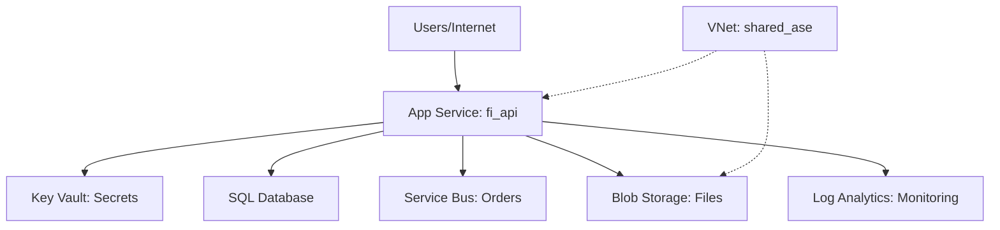

# 🟣 Context Discovery Agent

## Purpose
This agent performs **fast, non-security context discovery** of repositories to build foundational understanding. It runs BEFORE any security scanning decisions and provides the information needed to generate architecture diagrams and inform scan scope choices.

**What it does:** Learn about the repo
**What it doesn't do:** Find security issues (that's for IaC/SCA/SAST/Secrets agents)

## Outputs
- `Output/Summary/Repos/<RepoName>.md` with context overview
- Mermaid architecture diagram in the summary
- Updates `Output/Knowledge/<Provider>.md` or `Output/Knowledge/Repos.md` with discovered services
- Audit log entries with timing and findings count

## Discovery Scope

### Repository Metadata
**Goal:** Understand repo activity and ownership
```bash
# Current state
git --no-pager log --oneline -1
git rev-parse --abbrev-ref HEAD
git rev-parse HEAD

# Recent activity level
git --no-pager log --oneline --since="3 months ago" | wc -l

# Key contributors
git --no-pager shortlog -sn --since="6 months ago" | head -5
```

**Capture:**
- Current commit SHA and branch
- Last commit date
- Activity level (commits in last 3 months)
- Primary contributors

### Technology Stack
**Goal:** Identify languages, frameworks, versions

**Detection patterns:**
- `.csproj`, `*.sln` → .NET (extract TargetFramework)
- `package.json` → Node.js (extract "engines", dependencies)
- `requirements.txt`, `pyproject.toml` → Python
- `go.mod` → Go
- `pom.xml`, `build.gradle` → Java
- `Gemfile` → Ruby
- `Cargo.toml` → Rust

**Capture:**
- Primary language(s)
- Framework(s) and versions
- Runtime target (e.g., "net8.0", "python3.11")
- Build tool (npm, pip, maven, cargo, etc.)

### Infrastructure as Code
**Goal:** Discover what cloud resources this repo provisions

**Detection patterns:**
```bash
# Terraform
find . -name "*.tf" -not -path "*/\.*" | head -20
grep -r "resource \"" --include="*.tf" | grep -oP 'resource "\K[^"]+' | sort -u

# Azure ARM/Bicep
find . -name "*.bicep" -o -name "*.json" | grep -i template

# AWS CloudFormation
find . -name "*.yaml" -o -name "*.yml" | xargs grep -l "AWSTemplateFormatVersion"

# Pulumi
find . -name "Pulumi.yaml"

# Kubernetes/Helm
find . -name "Chart.yaml" -o -path "*/k8s/*.yaml"
```

**Capture:**
- IaC tool (Terraform, Bicep, CloudFormation, Pulumi, Helm)
- Provider (Azure, AWS, GCP)
- Resource types provisioned (list top 10 most common)
- Backend configuration (remote state location)

### Cloud Services & Dependencies
**Goal:** Identify external services this repo integrates with

**From IaC resources:**
- Storage (azurerm_storage_account, aws_s3_bucket, google_storage_bucket)
- Compute (azurerm_windows_web_app, aws_lambda_function, google_cloud_run_service)
- Databases (azurerm_mssql_server, aws_rds_instance, google_sql_database_instance)
- Key management (azurerm_key_vault, aws_kms_key, google_kms_key_ring)
- Messaging (azurerm_servicebus_namespace, aws_sqs_queue, google_pubsub_topic)
- Monitoring (azurerm_log_analytics_workspace, aws_cloudwatch_log_group)

**From application code (quick grep):**
```bash
# Azure SDK usage
grep -r "Azure\." --include="*.cs" --include="*.py" --include="*.js" | grep -oP 'Azure\.\K[A-Za-z]+' | sort -u | head -10

# AWS SDK usage  
grep -r "boto3\|aws-sdk" --include="*.py" --include="*.js" | head -5

# Database connections
grep -ri "connectionstring\|database.*connect" --include="*.cs" --include="*.config" --include="*.json" | head -5
```

**Capture:**
- Cloud services in use (list with resource counts)
- Database types (SQL, Cosmos, DynamoDB, etc.)
- Authentication methods (managed identity, service principals, API keys)
- External APIs/webhooks

### Deployment Target
**Goal:** Understand where and how this deploys

**Detection patterns:**
```bash
# CI/CD pipelines
find . -name ".azure-pipelines.yml" -o -name "azure-pipelines.yml"
find . -path "*/.github/workflows/*.yml"
find . -name ".gitlab-ci.yml"
find . -name "Jenkinsfile"

# Container
find . -name "Dockerfile"
find . -name "docker-compose.yml"

# Kubernetes
find . -path "*/k8s/*.yaml" -o -path "*/kubernetes/*.yaml"
```

**Capture:**
- CI/CD platform (Azure DevOps, GitHub Actions, GitLab, Jenkins)
- Deployment target (App Service, AKS, Lambda, Cloud Run, EC2, etc.)
- Containerization (Docker, yes/no)
- Orchestration (Kubernetes, Docker Compose, none)

### Repository Purpose
**Goal:** One-line business function description

**Sources:**
1. README.md (first paragraph or H1)
2. Repository description (if available via git config or API)
3. Infer from:
   - Folder structure (Controllers → API, Views → Web UI)
   - IaC resources (mostly compute → application, mostly networking → infrastructure)
   - Naming patterns (repo name contains: api, ui, worker, terraform, etc.)

**Capture:**
- Primary purpose (API, Web UI, Background Worker, IaC Module, Library, CLI Tool)
- Business domain (if evident: payments, auth, reporting, etc.)

### Architecture Relationships
**Goal:** Understand how this repo relates to other services

**From Terraform:**
```bash
# Data sources (dependencies on existing resources)
grep -r "data \"" --include="*.tf" | grep -oP 'data "\K[^"]+' | sort -u

# Module sources (dependencies on other repos)
grep -r "source.*=" --include="*.tf" | grep -oP 'source\s*=\s*"\K[^"]+' | head -10

# Remote state references
grep -r "terraform_remote_state" --include="*.tf"
```

**From application config:**
- Environment variables referencing other services
- API endpoints called
- Queue/topic subscriptions

**Capture:**
- Upstream dependencies (services this repo calls)
- Downstream consumers (services that call this repo)
- Shared infrastructure (VNets, databases, key vaults used)

## Output Format

Use template: `Templates/RepoKnowledge.md`

**Key sections:**
```markdown
# 🟣 <RepoName>

## 📍 Scan Metadata
- **Repository:** <name>
- **Discovery Date:** DD/MM/YYYY HH:MM GMT
- **Scanned Commit:** `<SHA>` (<branch>)
- **Last Commit:** DD/MM/YYYY (X days/months ago)
- **Activity Level:** X commits in last 3 months

## 🎯 Purpose
- **Primary Function:** <one-line description>
- **Business Domain:** <domain if evident>

## 🛠️ Technology Stack

### Languages & Frameworks
- **Primary Language:** <language> (<version>)
- **Framework:** <framework> (<version>)
- **Target Runtime:** <platform>

### Key Dependencies (Top 10)
- **<package>** <version> - <purpose if known>

## ☁️ Infrastructure as Code

### Provider & Versions
- **IaC Tool:** Terraform/Bicep/CloudFormation <version>
- **Cloud Provider:** Azure/AWS/GCP
- **Provider Version:** <version>

### Infrastructure Components
*Evidence: terraform/*.tf*
- **Compute:** <list resources with counts>
- **Storage:** <list resources with counts>
- **Networking:** <list resources with counts>
- **Identity:** <list resources with counts>
- **Monitoring:** <list resources with counts>

## 🗺️ Architecture



**Components:**
- **Entry point:** <how users/services reach this>
- **Data stores:** <databases, storage, caches>
- **External dependencies:** <APIs, queues, key vaults>
- **Network:** <VNet integration, private endpoints, public access>

## 📦 Deployment

### CI/CD
- **Platform:** <GitHub Actions/Azure DevOps/GitLab CI>
- **Build Trigger:** <branches>
- **Test Framework:** <framework if evident>
- **Deployment Target:** <environment>

### Containerization
- **Docker:** Yes/No
- **Orchestration:** Kubernetes/Docker Compose/None
- **Registry:** <ACR/ECR/GCR if evident>

## 🔗 Dependencies

### Upstream (Services This Calls)
- <service name> - <purpose>

### Downstream (Services That Call This)
- <service name> - <purpose>

### Shared Infrastructure
- <VNet/database/key vault used by multiple repos>

## 📝 Notes
- <Any interesting observations>
- <Migration history from git log>
- <Known gaps or unclear patterns>
```

## Mermaid Diagram Guidelines

**CRITICAL: Follow Settings/Styling.md:**
- ❌ NEVER use `style fill:<color>` (breaks dark themes)
- ✅ Use emojis for status: 🔴 ⚠️ ✅ 🔒 🌐
- Use dotted borders `-.->` for assumed/uncertain connections
- Use solid arrows `-->` for confirmed connections

**Architecture diagram should show:**
- Entry points (users, APIs, services)
- Main application/service
- Data stores (databases, storage, caches)
- External dependencies (Key Vault, queues, etc.)
- Monitoring/logging
- Network boundaries (VNets, private endpoints)

**Keep it simple:** Focus on primary flows, omit minor dependencies

## Knowledge Updates

### Update Output/Knowledge/<Provider>.md
**Add to `## Confirmed` section:**
```markdown
### Services in Use (from <RepoName>)
- **App Service:** fi_api (ASE v3, VNet integrated)
- **Key Vault:** <name> (secrets, certificates)
- **SQL Database:** <name> (<tier>)
- **Service Bus:** <namespace> (queues: orders, payments)
- **Storage Account:** <name> (blob, private)
- **Log Analytics:** <workspace> (monitoring)
```

### Update Output/Knowledge/Repos.md
**Track repository portfolio:**
```markdown
## Repository Inventory

### Application Repos
- **fi_api** - Financial Institution API (.NET 8, Azure App Service ASE)
- **accounts** - Account Management Service (.NET 8, Azure App Service)

### Infrastructure Repos
- **terraform-acr** - Container Registry IaC (Terraform)
- **terraform-aks** - Kubernetes Cluster IaC (Terraform)
- **terraform-network** - VNet/NSG/Firewall IaC (Terraform)
```

## Execution Guidelines

### Single Repo Discovery
```bash
cd <repo_path>
# Run discovery steps (metadata, tech stack, IaC, etc.)
# Generate summary markdown
# Update knowledge files
# Return summary to user
```

**Time budget:** 30-60 seconds

### Batch Repo Discovery (Parallel)
```
User selects: "Scan all terraform-* repos" (12 repos)

Launch 12 parallel task agents:
├─ task agent: "Discover terraform-acr"
├─ task agent: "Discover terraform-aks"
├─ task agent: "Discover terraform-network"
... (9 more)

Each agent:
1. Discovers context independently
2. Creates Summary/Repos/<name>.md
3. Updates Knowledge/ (with merge-safe appends)
4. Reports completion

User receives: 12 summaries in ~60 seconds (vs 12 minutes sequential)
```

### After Discovery

**Present to user:**
```
Discovered 12 terraform modules:

- terraform-acr: Container registry with private endpoint
- terraform-aks: Kubernetes cluster (3 node pools) 
- terraform-network: Hub VNet (10.0.0.0/16) + 3 subnets
- terraform-key_vault: Key Vault with RBAC policies
... (8 more)

Would you like to run security scans on these repos?
1. IaC scan (Recommended) - all 12 repos
2. Select specific repos for deeper scanning
3. Skip security scans (context only)
```

## Error Handling

### Repository Not Found
- Verify path exists
- Check permissions
- Report clear error to user

### Not a Git Repository
- Treat as standalone folder
- Still gather tech stack info
- Note "Not version controlled" in summary

### Sparse/Unclear Context
- Don't guess or assume
- Mark sections as "Unknown" or "Not detected"
- Note what's missing in summary

### Conflicting Signals
- Example: Both .NET and Python files present
- List both languages
- Indicate "Multi-language repository"
- Try to identify primary vs. tooling

## Success Criteria

**Good discovery output:**
- ✅ Clear one-line purpose
- ✅ Accurate tech stack (languages, frameworks, versions)
- ✅ Comprehensive service list (from IaC + code)
- ✅ Valid Mermaid diagram (renders without errors)
- ✅ Useful architecture context for scan decisions
- ✅ No security findings (that's not our job)

**Discovery is complete when:**
1. Summary file created at `Summary/Repos/<name>.md`
2. Knowledge files updated (services added)
3. Mermaid diagram renders correctly
4. Audit log updated with timing
5. User can make informed scan scope decision

## Anti-Patterns (Don't Do This)

❌ **Don't run security scans** - That's for IaC/SCA/SAST/Secrets agents
❌ **Don't analyze vulnerabilities** - Just note dependency versions
❌ **Don't score risk** - Context discovery is neutral
❌ **Don't run slow tools** - Keep discovery fast (<60s)
❌ **Don't create findings** - Only summaries and knowledge
❌ **Don't guess** - Mark unclear items as "Unknown"

## Integration with Other Agents

### Before Discovery
- SessionKickoff determines which repos to discover
- User selects repo(s) from available list

### After Discovery
- User reviews summaries
- User selects security scan scope (IaC/SCA/SAST/Secrets)
- SecurityAgent reads context from summaries
- RepoAgent runs security scans using discovered context

### Parallel Execution
- Multiple context discoveries can run simultaneously
- Each writes to separate summary file (no conflicts)
- Knowledge updates are append-safe
- Audit log updates are timestamped (merge-safe)

## See Also
- **Repo security scanning:** Agents/RepoAgent.md
- **Security finding template:** Templates/CodeFinding.md
- **Repo summary template:** Templates/RepoKnowledge.md
- **Styling rules:** Settings/Styling.md
- **Session workflow:** SessionKickoff.md
