# 🟣 Context Discovery Agent

## Purpose
This agent performs **fast, non-security context discovery** of repositories to build foundational understanding. It runs BEFORE any security scanning decisions and provides the information needed to generate architecture diagrams and inform scan scope choices.

**What it does:** Learn about the repo
**What it doesn't do:** Find security issues (that's for IaC/SCA/SAST/Secrets agents)

## Speed Target
**< 1 minute** for context discovery using parallel explore agents. This is reconnaissance, not deep analysis.

## Execution Strategy
**USE PARALLEL EXPLORE AGENTS** - Launch 4-6 explore agents simultaneously for:
1. Purpose & README (what does this repo do?)
2. Tech stack (languages, frameworks, dependencies)
3. IaC files (Terraform, Bicep, K8s YAML)
4. Ingress points (APIs, load balancers, public endpoints, APIM)
5. Database connections (schemas, connection strings, migrations)
6. Egress targets (external APIs, third-party services)

Each explore agent returns focused answers <300 words. Synthesize results into context document.

**DO NOT:** Use general-purpose agent, run security scans, or do deep code analysis during context discovery.

## Outputs
- `Output/Summary/Repos/<RepoName>.md` with context overview and architecture diagram
- `Output/Knowledge/Repos.md` updated with repository entry
- If IaC detected:
  - `Output/Knowledge/<Provider>.md` updated with services discovered (Azure/AWS/GCP)
  - `Output/Summary/Cloud/Architecture_<Provider>.md` created/updated with cloud architecture diagram
- Audit log entries with timing and findings count

## Discovery Scope

### Repository Metadata
**Goal:** Understand repo activity and ownership
```bash
# Current state
git --no-pager log --oneline -1
git rev-parse --abbrev-ref HEAD
git rev-parse HEAD

# Recent activity level
git --no-pager log --oneline --since="3 months ago" | wc -l

# Key contributors
git --no-pager shortlog -sn --since="6 months ago" | head -5
```

**Capture:**
- Current commit SHA and branch
- Last commit date
- Activity level (commits in last 3 months)
- Primary contributors

### Ingress Discovery (MANDATORY - CRITICAL FOR THREAT MODELING)
**Goal:** Identify all ways data/requests enter this service

**For Application Code:**
```bash
# Web server/API endpoints
grep -r "Listen\|BindAddress\|app.Run\|http.ListenAndServe" --include="*.cs" --include="*.go" --include="*.py" --include="*.js" | head -10

# Route definitions
grep -r "@app.route\|@RestController\|@RequestMapping\|app.get\|app.post\|Route\[" --include="*.cs" --include="*.py" --include="*.java" --include="*.js" | head -20

# Exposed ports in config
grep -r "port:\|PORT=\|--port" --include="*.yaml" --include="*.json" --include=".env" --include="Dockerfile"

# APIM endpoint configuration (CRITICAL for routing chain discovery)
grep -r "ApiManagerBaseUrl\|ApiManagementUrl\|azure-api.net\|api-gateway.*url" --include="*.json" --include="*.config" --include="*.yaml"
```

**For IaC:**
```bash
# Azure - Public exposure points
grep -r "public_ip\|frontend_ip\|public.*endpoint" --include="*.tf" | head -10
grep -r "azurerm_application_gateway\|azurerm_api_management\|azurerm_lb\|azurerm_front_door" --include="*.tf"

# AWS - Public exposure points
grep -r "aws_lb\|aws_alb\|aws_api_gateway\|aws_cloudfront\|aws_elastic_ip" --include="*.tf" | head -10
grep -r "aws_apigatewayv2\|aws_api_gateway_rest_api\|aws_lb_listener" --include="*.tf"

# GCP - Public exposure points
grep -r "google_compute_address\|google_compute_forwarding_rule\|google_compute_url_map" --include="*.tf" | head -10
grep -r "google_compute_global_address\|google_api_gateway\|google_cloud_run_service" --include="*.tf"

# Network security rules (all clouds)
grep -r "network_security_group\|security_rule\|firewall_rule\|aws_security_group\|google_compute_firewall" --include="*.tf" | head -10

# Kubernetes/AKS Ingress (CRITICAL for service mesh discovery)
grep -r "ingress\|IngressController" --include="*.yaml" --include="*.tf"
grep -r "kind: Ingress\|kind: Service" --include="*.yaml" | head -20
```

**For Kubernetes/AKS Services:**
```bash
# K8s Service definitions (LoadBalancer, NodePort expose services externally)
grep -r "kind: Service" --include="*.yaml" -A 10 | grep -E "type:|LoadBalancer|NodePort|ClusterIP" | head -20

# Ingress resources (nginx, traefik, istio, etc.)
grep -r "kind: Ingress" --include="*.yaml" -A 20 | head -30
grep -r "kubernetes.io/ingress.class\|ingressClassName:" --include="*.yaml"

# Extract Ingress rules (hosts, paths, backend services)
grep -r "kind: Ingress" --include="*.yaml" -A 30 | grep -E "host:|path:|backend:|serviceName:|servicePort:" | head -50

# Service annotations (external-dns, load balancer annotations)
grep -r "service.beta.kubernetes.io/azure-load-balancer\|external-dns.alpha.kubernetes.io" --include="*.yaml"

# Istio/Service Mesh ingress
grep -r "kind: Gateway\|kind: VirtualService" --include="*.yaml" -A 10 | head -20

# Service ports and selectors
grep -r "ports:\|selector:\|targetPort:" --include="*.yaml" | head -30
```

**Capture:**
- Entry points (HTTP endpoints, TCP ports, message queues)
- Exposure level (Internet-facing, VNet-only, Private Link)
- Authentication requirements (public, authenticated, internal-only)
- Frontend services (API Gateway, Load Balancer, direct)
- **APIM routing:** If service calls APIM, document:
  - APIM endpoint URL (from config files)
  - APIM APIs called (if discoverable from code/config)
  - Subscription keys or authentication methods

### Egress Discovery (MANDATORY - CRITICAL FOR THREAT MODELING)
**Goal:** Identify all external connections and data flows

**For Application Code:**
```bash
# HTTP/API calls
grep -r "HttpClient\|http.Get\|http.Post\|requests.get\|requests.post\|axios\|fetch(" --include="*.cs" --include="*.go" --include="*.py" --include="*.js" | head -20

# APIM endpoint calls (CRITICAL for routing chain)
grep -r "ApiManagerBaseUrl\|ApiManagementUrl\|/api/\|\.azure-api\.net" --include="*.cs" --include="*.go" --include="*.py" --include="*.js" --include="*.json" | head -20

# Database connections
grep -r "Server=\|Host=\|Data Source=\|ConnectionString\|DATABASE_URL" --include="*.config" --include="*.json" --include="*.env" | head -10

# Message queues / Event buses
grep -r "ServiceBus\|EventHub\|Kafka\|RabbitMQ\|SQS\|PubSub" --include="*.cs" --include="*.go" --include="*.py" --include="*.java" | head -10

# External domains/APIs
grep -r "https://[a-zA-Z0-9.-]*\\.com\|http://[a-zA-Z0-9.-]*\\.com" --include="*.cs" --include="*.json" --include="*.yaml" --include="*.config" | head -20

# Storage access
grep -r "blob.core.windows.net\|s3.amazonaws.com\|storage.googleapis.com" --include="*.cs" --include="*.json" | head -10
```

**For IaC:**
```bash
# Data sources (existing resources we depend on)
grep -r "data \"azurerm_\|data \"aws_\|data \"google_" --include="*.tf" | grep -oP 'data "\K[^"]+' | sort -u

# Remote state dependencies
grep -r "terraform_remote_state" --include="*.tf"

# Backend pools / target groups
grep -r "backend.*pool\|target_group\|backend.*address" --include="*.tf" | head -10
```

**For Kubernetes/AKS Services:**
```bash
# Service-to-service calls within cluster
grep -r "http://.*svc.cluster.local\|http://.*:.*/" --include="*.yaml" --include="*.cs" --include="*.go" --include="*.py" | head -20

# External service endpoints (egress from cluster)
grep -r "externalName:\|ExternalName" --include="*.yaml"

# ConfigMaps/Secrets with service endpoints
grep -r "SERVICE_URL\|API_ENDPOINT\|BACKEND_HOST" --include="*.yaml" | head -20

# Service dependencies from K8s manifests
grep -r "- name:.*URL\|_SERVICE_HOST\|_SERVICE_PORT" --include="*.yaml" | head -20

# Istio/Service Mesh egress policies
grep -r "kind: ServiceEntry\|kind: DestinationRule" --include="*.yaml" -A 10 | head -20

# Network policies (egress rules)
grep -r "kind: NetworkPolicy" --include="*.yaml" -A 20 | grep -E "egress:|to:" | head -20
```

**Capture (classify EVERY connection):**
- 🔒 **Internal egress:** Same VNet/private network (databases, storage accounts, internal APIs)
- 🌐 **External egress:** Internet/third-party (Stripe, SendGrid, partner APIs)
- ❓ **Unknown egress:** Boundary unclear from available code
- Protocols used (HTTP/HTTPS, SQL, message protocols)
- Downstream flows (what internal services then connect to)

### Technology Stack
**Goal:** Identify languages, frameworks, versions

**Detection patterns:**
- `.csproj`, `*.sln` → .NET (extract TargetFramework)
- `package.json` → Node.js (extract "engines", dependencies)
- `requirements.txt`, `pyproject.toml` → Python
- `go.mod` → Go
- `pom.xml`, `build.gradle` → Java
- `Gemfile` → Ruby
- `Cargo.toml` → Rust

**Capture:**
- Primary language(s)
- Framework(s) and versions
- Runtime target (e.g., "net8.0", "python3.11")
- Build tool (npm, pip, maven, cargo, etc.)

### Infrastructure as Code
**Goal:** Discover what cloud resources this repo provisions

**Detection patterns:**
```bash
# Terraform
find . -name "*.tf" -not -path "*/\.*" | head -20
grep -r "resource \"" --include="*.tf" | grep -oP 'resource "\K[^"]+' | sort -u

# WAF policies and modes (CRITICAL: Check if in Detection vs Prevention)
grep -r "azurerm_web_application_firewall_policy\|azurerm_application_gateway" --include="*.tf" -A 10 | grep -E "mode|policy_settings|firewall_mode" | head -30
grep -ri "mode.*=.*\"Detection\"\|mode.*=.*\"Alert\"\|policy_settings.*Prevention" --include="*.tf" --include="*.yaml" --include="*.json"

# WAF policy associations (which services have WAF)
grep -r "firewall_policy_id\|waf_configuration" --include="*.tf" -A 5 | head -30

# Azure SQL Server/Databases
grep -r "azurerm_mssql_server\|azurerm_mssql_database\|azurerm_sql_" --include="*.tf" | head -20
find . -name "*.bicep" -o -name "*.json" | grep -i template

# AWS CloudFormation
find . -name "*.yaml" -o -name "*.yml" | xargs grep -l "AWSTemplateFormatVersion"

# Pulumi
find . -name "Pulumi.yaml"

# Kubernetes/Helm
find . -name "Chart.yaml" -o -path "*/k8s/*.yaml"

# Configuration data (Hiera, Helm values, etc.)
find . -path "*/hiera/data/*.yaml" -o -path "*/values*.yaml" -o -path "*/config/*.yaml" | head -20

# API Management / API Gateway Terraform resources (CRITICAL)
grep -r "azurerm_api_management\|aws_api_gateway\|google_api_gateway" --include="*.tf" | head -20
```

**For API Management / API Gateway specific discovery:**
```bash
# Azure APIM - API definitions, backends, policies
grep -r "azurerm_api_management_api\|azurerm_api_management_backend\|azurerm_api_management_policy" --include="*.tf" | head -20

# AWS API Gateway - REST/HTTP/WebSocket APIs
grep -r "aws_api_gateway_rest_api\|aws_apigatewayv2_api\|aws_api_gateway_integration" --include="*.tf" | head -20

# GCP API Gateway - API configs and gateways
grep -r "google_api_gateway_api\|google_api_gateway_gateway\|google_api_gateway_api_config" --include="*.tf" | head -20

# APIM backend service URLs (where APIM routes to)
grep -r "service_url\|backend_url\|url.*backend" --include="*.tf" --include="*.yaml" | head -20

# APIM/API Gateway operations and paths
grep -r "url_template\|path.*pattern\|operation_id" --include="*.tf" | head -20
```

**For modules with configuration data (Hiera, Helm values, etc.):**
```bash
# Azure - Backend pool / routing configurations
grep -r "backend.*pool\|backend.*address\|backend_address_pool" --include="*.yaml" --include="*.yml" | head -20

# AWS - Target groups and ALB/NLB routing
grep -r "target_group\|target_group_arn\|listener_rule\|forward_config" --include="*.yaml" --include="*.yml" | head -20

# GCP - Backend services and URL maps
grep -r "backend.*service\|url_map\|path_matcher\|backend_bucket" --include="*.yaml" --include="*.yml" | head -20

# Find service mappings and FQDNs (all clouds)
grep -r "fqdns:\|hostname:\|host_name:\|domain:\|endpoint:" --include="*.yaml" | head -20

# Find routing rules (all clouds)
grep -r "routing\|listener\|ingress\|route_table\|path_rule" --include="*.yaml" | head -20

# Find references to other services (CRITICAL for cross-service discovery)
grep -r "api.*management\|apim\|gateway\|proxy\|upstream\|backend.*service\|api.*gateway\|cloudfront\|lambda\|aks\|kubernetes\|service.*fabric\|servicefabric" --include="*.yaml" --include="*.yml" -i | head -30

# Kubernetes/AKS ingress backend pools in gateway configs
grep -r "backstage\|ingress.*nginx\|ingress.*traefik\|-aks\|\.aks\." --include="*.yaml" --include="*.yml" | head -20

# Service Fabric backend pools in gateway configs
grep -r "service.*fabric\|servicefabric\|-sf-\|\.sf\.|schesim\|shared.*fabric" --include="*.yaml" --include="*.yml" | head -20

# Kubernetes service mesh routing (Istio/Linkerd)
grep -r "host:\|destination:\|service:\|port:" --include="*.yaml" -A 3 | head -30
```

**CRITICAL: Cross-Service Configuration Detection (Multi-Cloud + Kubernetes + APIM + Service Fabric)**
- Gateway/proxy/LB/APIM repos often contain routing config for MULTIPLE services across clouds:
  - **Azure:** App Gateway, Front Door, API Management, Traffic Manager
  - **AWS:** ALB/NLB, API Gateway, CloudFront, Route 53
  - **GCP:** Cloud Load Balancing, API Gateway, Cloud CDN, Cloud Armor
  - **Kubernetes:** Ingress controllers (nginx/traefik/istio), Service mesh (Istio/Linkerd), Gateway API
  - **Service Fabric:** Stateful/legacy microservices platform
- Example: `terraform-app_gateway` may contain API Management routing + AKS ingress routing + Service Fabric routing, not just AGW resources
- Example: `psd2-integration` contains APIM API definitions with backend service URLs
- Example: `terraform-alb` may route to Lambda, ECS, EC2 across multiple services
- Example: `k8s-ingress` may route to 20+ internal services via nginx ingress
- **Always check if config files reference services NOT in the repo name**
- Parse backend pool/target group names, listener configurations, routing rules for service identifiers
- Look for patterns: service names in backend pools, lambda function ARNs, ECS service names, Cloud Run services, K8s service names, **AKS ingress endpoints** (e.g., `backstage-aks.internal`), **Service Fabric FQDNs** (e.g., `sf-uksouth-schesim.private.uk`)
- **For K8s:** Parse Ingress rules, VirtualService hosts, Service selectors to map traffic flows
- **For APIM:** Look for `service_url`, `backend_url`, `url_template` in Terraform to find backend routing
- **For Service Fabric:** Look for FQDNs with `sf-` prefix or `.private.uk/.private.io` domains, cluster names like `schesim`, `shared`
- If you find references to another service (e.g., API Management in an App Gateway repo, or AKS in gateway backend pools, or Service Fabric clusters), note this prominently

**Capture:**
- IaC tool (Terraform, Bicep, CloudFormation, Pulumi, Helm)
- Provider (Azure, AWS, GCP)
- Resource types provisioned (list top 10 most common)
- Backend configuration (remote state location)
- **Configuration data sources:** Hiera, Helm values, config files
- **API Management specific:** If APIM resources detected, document:
  - APIs defined (name, path patterns)
  - Backend service URLs (where APIM routes to)
  - Policies applied (rate limiting, authentication, IP whitelisting)
  - Products and subscriptions
  - **Operations:** Key operations per API (GET/POST/PUT paths)
- **Gateway → APIM → Backend routing chains:** For App Gateway repos with APIM backends, trace:
  - Public hostname → Backend pool name → Service → APIM API called → Final backend service
  - Example: `prod-institution-api.cbinnovation.uk` → `fiapi` pool → fi-api (ASE v3) → calls APIM `fi_authentication` API → routes to internal services
  - Document services that proxy TO APIM vs services accessed directly
  - Check app config files (appsettings.json, web.config) for APIM URLs like `ApiManagerBaseUrl`
- **Gateway → AKS routing:** If backend pools reference AKS/Kubernetes services, document:
  - Backend pool name (e.g., `backstage`)
  - Target FQDN (e.g., `prod-backstage-aks.internal`)
  - Ingress controller type (nginx, traefik, istio)
  - Services hosted on AKS
- **Gateway → Service Fabric routing:** If backend pools reference Service Fabric clusters, document:
  - Backend pool name (e.g., `schemesimulator`, `shared`)
  - Target FQDN (e.g., `cbuk-core-prod-sf-uksouth-schesim.cbinnovation.private.uk`)
  - Services hosted on Service Fabric with ports
  - Service Fabric cluster type (shared, dedicated, per-service)
- **Kubernetes Ingress definitions:** If K8s Ingress resources found, document:
  - Ingress name and IngressClass (nginx, traefik, istio)
  - Hostnames exposed (e.g., `backstage-prod.cbinnovation.uk`)
  - Path patterns and backend services
  - Backend service ports
  - TLS configuration (cert-manager, manual certs)
  - External access method (LoadBalancer, App Gateway backend pool, NodePort)
- **WAF policies and protection modes (CRITICAL):** If WAF detected, document:
  - WAF policy names and which services they protect
  - **WAF Mode:** Detection/Alert vs Prevention/Block (CRITICAL: Flag if Detection mode on production)
  - OWASP CRS version (e.g., 3.2, 3.1)
  - Custom rules (IP whitelisting, geo-blocking, rate limiting)
  - Managed rule sets enabled
  - **Security Risk:** WAF in Detection mode = NO ACTIVE PROTECTION (logs only)
  - Services with WAF: List which backend pools/services have WAF protection
  - Services WITHOUT WAF: Identify unprotected public endpoints
- **Specific service mappings:** If gateway/proxy/LB, list ALL backend pools → service FQDNs
- **Cross-service configurations:** Services configured/routed by this repo but defined elsewhere
- Resource types provisioned (list top 10 most common)
- Backend configuration (remote state location)

### Cloud Services & Dependencies
**Goal:** Identify external services this repo integrates with

**From IaC resources:**
- Storage (azurerm_storage_account, aws_s3_bucket, google_storage_bucket)
- Compute (azurerm_windows_web_app, aws_lambda_function, google_cloud_run_service)
- Databases (azurerm_mssql_server, aws_rds_instance, google_sql_database_instance)
- Key management (azurerm_key_vault, aws_kms_key, google_kms_key_ring)
- Messaging (azurerm_servicebus_namespace, aws_sqs_queue, google_pubsub_topic)
- Monitoring (azurerm_log_analytics_workspace, aws_cloudwatch_log_group)

**From application code (quick grep):**
```bash
# Azure SDK usage
grep -r "Azure\." --include="*.cs" --include="*.py" --include="*.js" | grep -oP 'Azure\.\K[A-Za-z]+' | sort -u | head -10

# AWS SDK usage  
grep -r "boto3\|aws-sdk" --include="*.py" --include="*.js" | head -5

# Database connections
grep -ri "connectionstring\|database.*connect" --include="*.cs" --include="*.config" --include="*.json" | head -5
```

**Capture:**
- Cloud services in use (list with resource counts)
- Database types (SQL, Cosmos, DynamoDB, etc.)
- Authentication methods (managed identity, service principals, API keys)
- External APIs/webhooks

### Deployment Target
**Goal:** Understand where and how this deploys

**Detection patterns:**
```bash
# CI/CD pipelines
find . -name ".azure-pipelines.yml" -o -name "azure-pipelines.yml"
find . -path "*/.github/workflows/*.yml"
find . -name ".gitlab-ci.yml"
find . -name "Jenkinsfile"

# Container
find . -name "Dockerfile" -o -name "Dockerfile.*"
find . -name "docker-compose.yml" -o -name "docker-compose.*.yml"

# Skaffold
find . -name "skaffold.yaml" -o -name "skaffold.yml"

# Kubernetes
find . -path "*/k8s/*.yaml" -o -path "*/kubernetes/*.yaml"
find . -name "Chart.yaml" -o -name "values.yaml" -o -name "values-*.yaml"

# Helm charts
find . -path "*/charts/*" -o -path "*/templates/*.yaml"
```

**Analyze Dockerfiles (CRITICAL for runtime context):**
```bash
# Find all Dockerfiles
find . -name "Dockerfile*" | head -10

# Extract base images (reveals runtime environment)
grep -h "^FROM" Dockerfile* 2>/dev/null | head -10

# Extract exposed ports (ingress information)
grep -h "^EXPOSE" Dockerfile* 2>/dev/null

# Extract environment variables (may contain service URLs)
grep -h "^ENV" Dockerfile* 2>/dev/null | head -20

# Extract entrypoint/command (how service runs)
grep -h "^ENTRYPOINT\|^CMD" Dockerfile* 2>/dev/null

# Multi-stage build detection
grep -c "^FROM" Dockerfile 2>/dev/null
```

**Analyze Skaffold (K8s development workflow):**
```bash
# Find skaffold config
cat skaffold.yaml 2>/dev/null | grep -E "artifacts:|manifests:|deploy:|portForward:" -A 5

# Image repositories
grep -h "image:" skaffold.yaml 2>/dev/null

# Deploy targets
grep -h "manifests:\|helm:\|kustomize:" skaffold.yaml 2>/dev/null -A 3
```

**Analyze CI/CD Pipelines (CRITICAL for deployment context):**
```bash
# Azure Pipelines - deployment stages
grep -h "stage:\|deployment:\|environment:" azure-pipelines.yml .azure-pipelines.yml 2>/dev/null | head -20

# GitHub Actions - deployment targets
grep -rh "deploy\|environment:\|runs-on:" .github/workflows/ 2>/dev/null | head -20

# GitLab CI - deployment jobs
grep -h "deploy:\|environment:\|stage:" .gitlab-ci.yml 2>/dev/null | head -20

# Environment variables in pipelines (may reveal service endpoints)
grep -rh "env:\|ENV:\|variables:" azure-pipelines.yml .azure-pipelines.yml .github/workflows/ .gitlab-ci.yml 2>/dev/null | head -30

# Deployment commands (where does it deploy to?)
grep -rh "kubectl\|helm\|az webapp\|aws deploy\|gcloud deploy" azure-pipelines.yml .azure-pipelines.yml .github/workflows/ .gitlab-ci.yml Jenkinsfile 2>/dev/null | head -20
```

**For Kubernetes/AKS Repositories (CRITICAL):**
```bash
# List all K8s resources
grep -rh "^kind:" --include="*.yaml" | sort -u

# Find all Services (how pods are exposed)
find . -name "*.yaml" -exec grep -l "kind: Service" {} \; | head -20

# Find all Deployments (what's running)
find . -name "*.yaml" -exec grep -l "kind: Deployment\|kind: StatefulSet\|kind: DaemonSet" {} \; | head -20

# ConfigMaps and Secrets (may contain service URLs)
find . -name "*.yaml" -exec grep -l "kind: ConfigMap\|kind: Secret" {} \; | head -20

# Service mesh resources
find . -name "*.yaml" -exec grep -l "kind: Gateway\|kind: VirtualService\|kind: ServiceEntry" {} \; | head -10
```

**Capture:**
- CI/CD platform (Azure DevOps, GitHub Actions, GitLab, Jenkins)
- Deployment target (App Service, AKS, Lambda, Cloud Run, EC2, etc.)
- Containerization (Docker, yes/no)
- Orchestration (Kubernetes, Docker Compose, none)
- **If K8s/AKS:** Cluster name(s), namespaces, ingress controller type (nginx/traefik/istio)
- **From Dockerfile:** Base image, exposed ports, runtime user, multi-stage build
- **From CI/CD:** Deployment environments (dev/staging/prod), test stages, security scans run
- **From Skaffold:** Local dev workflow, port forwarding, image registries

### Repository Purpose
**Goal:** One-line business function description

**Sources:**
1. README.md (first paragraph or H1)
2. Repository description (if available via git config or API)
3. Infer from:
   - Folder structure (Controllers → API, Views → Web UI)
   - IaC resources (mostly compute → application, mostly networking → infrastructure)
   - Naming patterns (repo name contains: api, ui, worker, terraform, etc.)

**Capture:**
- Primary purpose (API, Web UI, Background Worker, IaC Module, Library, CLI Tool)
- Business domain (if evident: payments, auth, reporting, etc.)

### Architecture Relationships (CRITICAL FOR SECURITY)
**Goal:** Understand ingress and egress for threat modeling - this is the MOST IMPORTANT context for security assessment

**INGRESS Discovery (How does data/requests enter this service?):**
```bash
# For applications:
grep -r "Listen\|BindAddress\|Port\|endpoint" --include="*.cs" --include="*.go" --include="*.py" --include="*.js"
grep -r "@app.route\|@RestController\|app.get\|app.post" --include="*.py" --include="*.java" --include="*.js"

# From Dockerfile EXPOSE directives
grep -h "^EXPOSE" */Dockerfile* Dockerfile* 2>/dev/null

# For IaC:
grep -r "public_ip\|load_balancer\|application_gateway\|ingress" --include="*.tf"
grep -r "network_security_group\|firewall_rule" --include="*.tf"
```

**EGRESS Discovery (Where does this service send data/requests?):**
```bash
# API calls / HTTP clients
grep -r "http.Get\|http.Post\|HttpClient\|requests.get\|axios\|fetch" --include="*.cs" --include="*.go" --include="*.py" --include="*.js"

# Database connections
grep -r "Server=\|Host=\|ConnectionString\|database.*url" --include="*.config" --include="*.json" --include="*.env"

# Message queues / event buses
grep -r "ServiceBus\|EventHub\|Kafka\|RabbitMQ\|SQS" --include="*.cs" --include="*.go" --include="*.py"

# External APIs (look for domains)
grep -r "https://.*\.com\|http://.*\.com" --include="*.cs" --include="*.json" --include="*.yaml"

# From Dockerfile ENV variables (may contain service endpoints)
grep -h "^ENV.*URL\|^ENV.*ENDPOINT\|^ENV.*HOST" */Dockerfile* Dockerfile* 2>/dev/null

# From CI/CD environment variables
grep -rh "API_URL\|SERVICE_URL\|ENDPOINT\|DATABASE_URL" azure-pipelines.yml .azure-pipelines.yml .github/workflows/ .gitlab-ci.yml 2>/dev/null | head -20

# For IaC - data sources and remote state
grep -r "data \"" --include="*.tf" | grep -oP 'data "\K[^"]+' | sort -u
```

**For Application Gateways / Load Balancers / Proxies - also capture (Multi-Cloud):**
```bash
# Azure - Backend pool mappings
grep -r "backend.*pool\|backend.*address" --include="*.tf" --include="*.json"
grep -r "routing.*rule\|http.*listener\|request_routing_rule" --include="*.tf"
grep -r "firewall_policy\|waf_policy\|owasp\|rule_set" --include="*.tf"

# AWS - Target groups and routing
grep -r "target_group\|listener_rule\|listener_arn\|forward\|target_type" --include="*.tf" --include="*.json"
grep -r "aws_lb_target_group\|aws_lb_listener\|aws_lb_target_group_attachment" --include="*.tf"
grep -r "aws_wafv2\|aws_waf_web_acl\|aws_shield" --include="*.tf"

# GCP - Backend services and URL maps
grep -r "backend_service\|url_map\|path_matcher\|host_rule" --include="*.tf" --include="*.json"
grep -r "google_compute_backend_service\|google_compute_url_map\|google_compute_target" --include="*.tf"
grep -r "google_compute_security_policy\|cloud_armor" --include="*.tf"
```

**Capture (MANDATORY for all repos):**
- **INGRESS:**
  - Entry points (public endpoints, private endpoints, ports, protocols)
  - Authentication requirements (public, auth required, internal-only)
  - Exposure level (Internet, VNet-only, Private Link)
  - Frontend services (API Gateway, Load Balancer, direct exposure)
- **EGRESS:**
  - Upstream dependencies (services this calls) with classification:
    - 🔒 **Internal:** Same VNet/private network (e.g., SQL DB, Storage Account, internal APIs)
    - 🌐 **External:** Third-party/Internet (e.g., Stripe, SendGrid, partner APIs)
    - ❓ **Unknown:** Boundary unclear from discovery
  - Downstream flows: What internal services then connect to (if discoverable)
  - Protocols and ports used for outbound connections
- **Network boundaries crossed:** VNet boundaries, Internet egress, Private Link usage
- **Downstream consumers:** Services that call this repo
- Shared infrastructure (VNets, databases, key vaults used)

## Output Format

Use template: `Templates/RepoKnowledge.md`

**Key sections:**
```markdown
# 🟣 <RepoName>

## 🗺️ Architecture

**Key:** 🔒 Internal = Within VNet/Private | 🌐 External = Third-party/Internet | ❓ Unknown = Boundary unclear | 🔗 = Clickable link

```mermaid
flowchart TB
    Internet[🌐 Internet] -->|HTTPS| AGW[🔗 Application Gateway]
    AGW -->|Backend: fiapi| App[🔗 fi-api<br/>ASE v3]
    App -->|🔒 Calls| APIM[🔗 API Management]
    APIM -->|Routes to| Backend[🔗 Backend Services]
    App -->|🔒| KV[Key Vault]
    App -->|🔒| DB[SQL Database]
    
    click AGW "../../Summary/Cloud/Architecture_Azure.md#-ingress-flow-internet--services" "View complete ingress architecture"
    click APIM "../../Summary/Cloud/Architecture_Azure.md#-api-management-routing" "View APIM routing details"
    click Backend "psd2-api.md" "View backend service (if documented)"
```



**Components:**
- **Ingress (CRITICAL):** <how requests/data enter - public/private endpoints, ports, exposure level>
  - **Links:** If accessed via gateway/APIM, link to cloud architecture sections
- **Inbound routes:** <API paths/endpoints/queues if applicable>
- **Egress (CRITICAL):** <where requests/data go - classify each connection>
  - 🔒 **Internal:** <within VNet - databases, storage, internal APIs>
    - **Links:** If calling documented services, link to their repo summaries
  - 🌐 **External:** <third-party - Stripe, SendGrid, partner APIs>
  - ❓ **Unknown:** <boundary unclear>
  - **Service dependencies:** Link to downstream service repos if scanned

## 🎯 Purpose
- **Primary Function:** <one-line description>
- **Business Domain:** <domain if evident>

## 🛠️ Technology Stack
<languages, frameworks, dependencies>

## ☁️ Infrastructure as Code
<IaC tool, provider, resources>

**Cross-Service Configurations:** <if this repo configures/routes services defined elsewhere, list them here>
- Example: "This App Gateway routes to 5 API Management services + 13 App Services"
- Example: "Nginx config contains routing for customer-api (separate repo)"

**WAF Protection (CRITICAL):** <if WAF policies detected, document mode and coverage>
```markdown
### WAF Policies & Protection Status
| Policy Name | Mode | OWASP CRS | Protected Services | Risk Level |
|-------------|------|-----------|-------------------|------------|
| institution_api | 🔴 Detection | 3.2 | fi-api (backend: fiapi) | 🔴 CRITICAL - Not blocking attacks |
| public | ✅ Prevention | 3.2 | APIM (backend: apimanagementpublic) | ✅ Active protection |
| portals | ✅ Prevention | 3.2 | 3 Institution Portals | ✅ Active protection |
| auth | ✅ Prevention | 3.2 | STS, TOTP, Auth Portal | ✅ Active protection |
| backstage | 🔴 Detection | 3.2 | Backstage (backend: backstage) | 🔴 CRITICAL - Not blocking attacks |

**WAF Mode Explanation:**
- ✅ **Prevention/Block Mode:** Actively blocks malicious traffic (production ready)
- 🔴 **Detection/Alert Mode:** Only logs threats, does NOT block (testing/monitoring only)

**CRITICAL FINDINGS:**
- ⚠️ **fi-api (public-facing):** WAF in Detection mode - NOT blocking SQL injection, XSS, etc.
- ⚠️ **Backstage:** WAF in Detection mode - Developer portal exposed without active protection

**Managed Rule Sets:**
- OWASP Core Rule Set 3.2 (SQL injection, XSS, RCE, LFI/RFI, command injection)
- Microsoft Bot Manager (bot detection/mitigation)

**Custom Rules:**
- IP whitelisting: 10.0.0.0/8 (internal networks)
- Geo-blocking: Block traffic from high-risk countries
- Rate limiting: 1000 requests/5min per IP

**Unprotected Services:**
- ❌ None - All public-facing services have WAF (but check mode!)
```

**Database Schema & Data Model:** <if SQL Server, databases, or schema definitions found>
```markdown
### Database Infrastructure
| Database Server | Database Name | Purpose | Sensitive Data | Backup Policy |
|-----------------|---------------|---------|----------------|---------------|
| cbuk-prod-sql-uksouth | CustomerDB | Customer accounts & profiles | ✅ PII (name, email, address) | Geo-redundant, 7-day retention |
| cbuk-prod-sql-uksouth | TransactionsDB | Payment transactions | ✅ Financial data (PCI-DSS) | Geo-redundant, 90-day retention |
| cbuk-prod-sql-uksouth | AuditDB | Audit logs | ⚠️ Activity logs | Local redundant, 365-day retention |

**Schema Sources:**
- Terraform: `azurerm_mssql_server`, `azurerm_mssql_database` resources
- Dacpac: `Database.dacpac` (schema deployment package)
- Entity Framework: `Migrations/*.cs`, `CustomerDbContext.cs`
- SQL Scripts: `schema/Tables/*.sql`, `migrations/V001_*.sql`

**Key Tables/Entities:**
- **Users/Customers:** Username, Email, PasswordHash, PersonalDetails (PII)
- **Accounts:** AccountNumber, Balance, AccountType, CustomerId (Financial)
- **Transactions:** TransactionId, Amount, Currency, Timestamp, SourceAccount, DestinationAccount (Financial)
- **AuditLog:** EventType, UserId, Timestamp, IPAddress, Action (Compliance)
- **Sessions:** SessionId, UserId, ExpiryTime, RefreshToken (Authentication)

**Data Classification:**
- 🔴 **PII (GDPR):** Customer names, emails, addresses, phone numbers, DOB
- 🔴 **Financial (PCI-DSS):** Account numbers, transaction amounts, card references
- 🟡 **Authentication:** Password hashes, session tokens, API keys
- 🟢 **Non-sensitive:** Product catalogs, reference data, audit logs

**Backup & DR:**
- Geo-redundant backup enabled (UK South → UK West)
- Point-in-time restore: 7-35 days
- Long-term retention: 90 days for financial data
- Auditing: Extended auditing to Log Analytics workspace
```

**Kubernetes Ingress Resources:** <if K8s Ingress definitions found>
```markdown
### Ingress Definitions
| Ingress Name | IngressClass | Hosts | Paths | Backend Service | Backend Port | TLS |
|--------------|--------------|-------|-------|-----------------|--------------|-----|
| backstage-ingress | nginx | backstage-prod.cbinnovation.uk | / | backstage-backend | 7007 | Yes (cert-manager) |
| api-ingress | nginx | api-prod.cbinnovation.uk | /v1/* | api-service | 8080 | Yes |
| webhook-ingress | nginx | webhooks-prod.cbinnovation.uk | /github/* | github-webhook | 3000 | Yes |

**Ingress Controller:**
- Type: NGINX Ingress Controller v1.14.0
- Namespace: ingress-nginx
- Configuration: use-forwarded-headers: true (works with App Gateway)
- External Access: Via App Gateway backend pool (`backstage-aks.internal`)

**Services Exposed:**
- backstage-backend: Developer portal (internal use)
- api-service: REST API (authenticated)
- github-webhook: GitHub webhook receiver (IP whitelisted)
```

**API Management APIs:** <if APIM resources detected, list registered APIs>
```markdown
### Registered APIs
| API Name | Path Pattern | Backend Service | Authentication | Notes |
|----------|--------------|-----------------|----------------|-------|
| psd2-api | /psd2/* | psd2-api.internal:443 | Subscription key | Open Banking PSD2 |
| bankconnect-api | /psd2-bankconnect-api/* | psd2-bankconnect-api.internal:443 | Subscription key | Private frontend only |
| cards-marqeta | /cards/marqeta-gateway/v1/* | Marqeta API (external) | API key injection | Card processing |
| napier-events | /napier-api/* | Napier API (external) | Subscription key | AML events webhook |
| signicat-webhooks | /signicat-webhooks | Signicat API (external) | IP whitelisting | KYC webhooks |

**Products:**
- PSD2 APIs (includes psd2-api, bankconnect-api)
- Partner Integrations (includes cards-marqeta, napier-events, signicat-webhooks)

**Policies Applied:**
- Rate limiting: 100 requests/minute per subscription
- IP whitelisting: Specific partner IPs for Marqeta, Napier, Signicat
- API key injection: Marqeta backend requires API key from APIM
- Request logging: All requests logged to Application Insights
```

**Complete Routing Chains:** <for gateway repos, document full path from internet to backend>
```markdown
### Internet → Backend Service Routing

| Public Hostname | App Gateway Pool | Service | APIM API | Final Backend |
|-----------------|------------------|---------|----------|---------------|
| prod-institution-api-uksouth.cbinnovation.uk | fiapi | fi-api (ASE v3) | fi_authentication | fi-api-bacs, fi-api-accounts, ledger-external |
| apimanagement-prod.cbinnovation.uk | apimanagementpublic | API Management | thetaray-callbacks, eventgrid-bridge | psd2-api.internal |
| psd2-bankconnect-prod.private.cbinnovation.uk | apimanagement | API Management | psd2-bankconnect-api | psd2-bankconnect-api.internal |
| marqeta-prod.cbinnovation.uk | apimanagement | API Management | cards-marqeta | Marqeta API (external) |
| backstage-prod.cbinnovation.uk | backstage | AKS NGINX Ingress | N/A | Backstage pods |
| simgreen-schemesimulator.cbinnovation.uk | schemesimulator | Service Fabric | N/A | Scheme Simulator Web/MT/MX |

**Key Insights:**
- **fi-api** acts as reverse proxy: receives requests from Internet but forwards to APIM for authentication/routing
- **Direct APIM access** via apimanagementpublic pool for external webhooks/callbacks
- **Private APIM access** for PSD2 BankConnect (internal-only, .private.cbinnovation.uk domain)
- **Service Fabric** and **AKS** accessed directly without APIM layer
```

## 📦 Deployment
<CI/CD, deployment method>

## 🔗 Dependencies
<upstream/downstream services>

## 📝 Notes
<observations, gaps>

## 📍 Scan Metadata
- **Repository:** <name>
- **Discovery Date:** DD/MM/YYYY HH:MM GMT
- **Scanned Commit:** `<SHA>` (<branch>)
- **Last Commit:** DD/MM/YYYY (X days/months ago)
- **Activity Level:** X commits in last 3 months
- **Primary Contributors:** <name1>, <name2>, <name3>
```
    Users[Users/Internet] --> App[App Service: fi_api]
    App --> KV[Key Vault: Secrets]
    App --> DB[SQL Database]
    App --> SB[Service Bus: Orders]
    App --> Storage[Blob Storage: Files]
    
    App --> LA[Log Analytics: Monitoring]
    
    VNet[VNet: shared_ase] -.-> App
    VNet -.-> Storage
```

**Components:**
- **Ingress:** How requests enter (public endpoint, API gateway, load balancer)
- **Inbound routes:** API paths/endpoints accepted
- **Core function:** What the service does
- **Egress:** Where requests go and boundary classification
  - 🔒 **Internal egress:** Stays within VNet/private network (e.g., database, internal APIs)
  - 🌐 **External egress:** Leaves organizational control (e.g., Stripe, SendGrid, external partner APIs)
  - ❓ **Unknown egress:** Boundary unclear from discovery
  - **Downstream flows:** What internal APIs further connect to (if discoverable)
- **Monitoring:** Logging, telemetry, alerts
- **Network:** VNet integration, private endpoints, network isolation
- **Authentication:** Identity model, managed identity, auth mechanisms

## 📦 Deployment

### CI/CD
- **Platform:** <GitHub Actions/Azure DevOps/GitLab CI>
- **Build Trigger:** <branches>
- **Test Framework:** <framework if evident>
- **Deployment Target:** <environment>

### Containerization
- **Docker:** Yes/No
- **Orchestration:** Kubernetes/Docker Compose/None
- **Registry:** <ACR/ECR/GCR if evident>

## 🔗 Dependencies

### Upstream (Services This Calls)
- <service name> - <purpose>

### Downstream (Services That Call This)
- <service name> - <purpose>

### Shared Infrastructure
- <VNet/database/key vault used by multiple repos>

## 📝 Notes
- <Any interesting observations>
- <Migration history from git log>
- <Known gaps or unclear patterns>
```

## Mermaid Diagram Guidelines

**CRITICAL: Follow Settings/Styling.md:**
- ❌ NEVER use `style fill:<color>` (breaks dark themes)
- ✅ Use emojis for status: 🔴 ⚠️ ✅ 🔒 🌐
- ✅ Use 🔗 emoji prefix for clickable nodes
- Use dotted borders `-.->` for assumed/uncertain connections
- Use solid arrows `-->` for confirmed connections

**CRITICAL: Mermaid Syntax Validation**
Arrow labels MUST follow these rules to avoid parse errors:
- ❌ **NEVER use curly braces** `{}` in labels (e.g., `|apimanagement-{env}|` will FAIL)
- ❌ **NEVER use quotes** `"` inside labels
- ❌ **NEVER use pipes** `|` inside the label text itself
- ❌ **NEVER use brackets** `[]` or parentheses `()` inside labels
- ✅ **DO use descriptive text without variables:** `|🔒 apimanagement-prod|` instead of `|🔒 apimanagement-{env}|`
- ✅ **DO use emojis and hyphens:** `|🔒 Internal HTTPS|` ✅
- ✅ **DO keep labels simple:** `|HTTPS:443|` ✅
- ✅ **DO use spaces:** `|Authenticated Requests|` ✅

**Examples of CORRECT syntax:**

```mermaid
flowchart TB
    Internet -->|🌐 HTTPS:443| AGW[App Gateway]
    AGW -->|🔒 Internal| APIM[API Management]
    APIM -->|🔒 HTTPS| API[API Service]
```


**Examples of INCORRECT syntax (will cause parse errors):**
```mermaid
flowchart TB
    Internet -->|🌐 HTTPS:{port}| AGW    ❌ curly braces
    AGW -->|route-{env}| APIM            ❌ curly braces
    APIM -->|"quoted label"| API         ❌ quotes
```

**Before outputting any Mermaid diagram:**
1. Check all arrow labels for curly braces, quotes, or special chars
2. Replace variable placeholders with example values (e.g., `{env}` → `prod` or remove it)
3. Keep labels simple and descriptive without dynamic content

**Document Structure:**
- Diagram must appear at the top of the document, immediately after the title (`# 🟣 <RepoName>`)
- Section heading: `## 🗺️ Architecture`
- Followed by: `## 🎯 Purpose`, `## 🛠️ Technology Stack`, `## ☁️ Infrastructure as Code`, `## 📦 Deployment`, `## 🔗 Dependencies`, `## 📝 Notes`
- **Metadata at bottom:** `## 📍 Scan Metadata` goes at the very end of the document with discovery date, commit info, activity level, contributors

**Architecture diagram should show:**
- **Ingress flows:** Entry points (Internet, users, APIs, upstream services) with clear inbound route labels
- **Main application/service:** Central repo with inbound routes listed in the node
- **Egress flows:** Outbound calls to backend APIs, databases, external services with "Proxies to" or similar labels
  - **Label egress destinations:** Use 🔒 for internal/private, 🌐 for external/public, ❓ for unknown
  - **Show downstream flows:** If known, show what internal APIs connect to (databases, external APIs, third parties)
  - **Network boundaries:** Clearly indicate if egress crosses VNet boundaries or leaves organizational control
- **Data stores:** Databases, storage, caches
- **Infrastructure:** Key Vault, queues, monitoring, logging
- **Network boundaries:** VNets, private endpoints, ASE

**Labeling Requirements:**
- **Ingress:** Use arrow labels like "HTTPS Requests", "Authenticated Requests"
- **Inbound routes:** List key API paths/routes in the main application node (e.g., "/api/accounts, /api/ledger")
- **Egress:** Use arrow labels like "Proxies to", "Queries", "Sends to"
  - Add emojis: "🔒 Internal", "🌐 External", "❓ Unknown"
- **Add markdown key above diagram:** Place key as markdown text immediately before the mermaid code block

**Example structure:**
```markdown
## 🗺️ Architecture

**Key:** 🔒 Internal = Within VNet | 🌐 External = Third-party/Internet | ❓ Unknown = Boundary unclear

```mermaid
flowchart TB
    Internet[🌐 Internet] -->|HTTPS| API[App: myapp<br/>Inbound: /api/*, /health]
    API -->|🔒 Proxies to| Backend[Internal API: backend-service]
    Backend -->|🌐 Calls| ThirdParty[External: Stripe API]
    API --> DB[(🔒 Database)]
```



**Keep it simple:** Focus on primary flows, omit minor dependencies

## Knowledge Updates

### Update Output/Knowledge/<Provider>.md
**If IaC detected with cloud provider (Azure/AWS/GCP):**

Create or update `Output/Knowledge/<Provider>.md` with:

**Add to `## Confirmed` section:**
```markdown
### Services in Use (from <RepoName>)
- **App Service:** fi_api (ASE v3, VNet integrated)
- **Key Vault:** <name> (secrets, certificates)
- **SQL Database:** <name> (<tier>)
- **Service Bus:** <namespace> (queues: orders, payments)
- **Storage Account:** <name> (blob, private)
- **Log Analytics:** <workspace> (monitoring)
```

### Create/Update Output/Summary/Cloud/Architecture_<Provider>.md
**If IaC detected with cloud provider:**

Create or update `Output/Summary/Cloud/Architecture_Azure.md` (or AWS/GCP) with **MULTIPLE FOCUSED DIAGRAMS** (one per architectural concern):

```markdown
# 🟣 Azure Architecture

## 🗺️ Ingress Flow (Internet → Services)

**Key:** 🔒 Internal = Within VNet/Private | 🌐 External = Third-party/Internet

This diagram shows how external requests flow through security layers to reach backend services.


**Components:**
- Brief explanation of ingress flow
- Security layers (WAF, authentication)
- Backend service routing **to all compute platforms:** ASE v3, APIM, AKS, Service Fabric
- **CRITICAL:** Always check for ALL backend pools - App Gateway may route to ASE/APIM/AKS/SF

---

## 🗺️ API Management Routing

This diagram shows API routing patterns and external integrations.

```mermaid
flowchart TB
    APIM[API Management] -->|Path: /service1| Svc1[Backend Service 1]
    APIM -->|Path: /partner| Partner[🌐 External Partner API]
```



**Components:**
- API path routing
- Internal vs external services
- Authentication/authorization

---

## 🗺️ Backend Services & Data Layer

This diagram shows internal service architecture and data flow across all compute platforms.

```mermaid
flowchart TB
    subgraph Apps[App Services - ASE v3]
        App1[App 1]
        App2[App 2]
    end
    
    subgraph AKS[AKS - Kubernetes]
        Ingress[NGINX Ingress] -->|Routes| Pods[K8s Pods]
    end
    
    subgraph SF[Service Fabric Clusters]
        SFApps[Microservices]
    end
    
    Apps -->|🔒| DB[(SQL Database)]
    Apps -->|🔒| KV[Key Vault]
    AKS -->|🔒| KV
    SF -->|🔒| KV
    
    Apps -->|🌐 Egress| NAT[NAT Gateway]
    AKS -->|🌐 Egress| NAT
    SF -->|🌐 Egress| NAT
```



**Components:**
- **ALL Compute Platforms:** ASE v3, AKS (Kubernetes), Service Fabric
- Data storage connections (SQL, Cosmos, Blob Storage)
- Shared infrastructure (Key Vault, NAT Gateway)
- Messaging patterns (Service Bus, Event Grid)

---

## 🗺️ Network Topology (Hub-Spoke)

This diagram shows overall network architecture.


**Components:**
- VNet architecture
- Hub-spoke topology
- Egress patterns

---

## 📝 Notes
- **Detailed service diagrams:** See individual repo summaries in `Output/Summary/Repos/`
- **Services Inventory:**
  - **Compute:** App Service (ASE v3), AKS (Kubernetes), Service Fabric, ...
  - **API Gateway:** API Management
  - **Data:** SQL Database, Cosmos DB, Storage Accounts, ...
  - **Networking:** VNet, Application Gateway (WAF), NAT Gateway, Private Link, ...
  - **Security:** Key Vault, Managed Identity, DDoS Protection, ...
  - **Monitoring:** Log Analytics, Application Insights, Dynatrace, ...

## Repositories Contributing to This Architecture
- **fi_api** - API Gateway (reverse proxy)
- **terraform-aks** - Kubernetes infrastructure
- **terraform-service_fabric_cluster** - Service Fabric clusters (schesim, shared, fps)
- **terraform-app_gateway** - Application Gateway with routing to ASE/APIM/AKS/SF
- **psd2-integration** - API Management configuration
- ...
```

**CRITICAL: Use multiple focused diagrams, NOT one monolithic diagram.**
- Each diagram should tell ONE story (ingress OR routing OR data OR network)
- Benefits: easier to review, clearer for security assessment, simpler to maintain
- Update this file as more repos are discovered - it shows cumulative cloud architecture

### Update Output/Knowledge/Repos.md
**Track repository portfolio:**
```markdown
## Repository Inventory

### Application Repos
- **fi_api** - Financial Institution API (.NET 8, Azure App Service ASE)
- **accounts** - Account Management Service (.NET 8, Azure App Service)

### Infrastructure Repos
- **terraform-acr** - Container Registry IaC (Terraform)
- **terraform-aks** - Kubernetes Cluster IaC (Terraform)
- **terraform-network** - VNet/NSG/Firewall IaC (Terraform)
```

## Execution Guidelines

### Single Repo Discovery
```bash
cd <repo_path>

# Step 1: Repository metadata (git history)
# Step 2: Technology stack detection (package files)
# Step 3: INGRESS discovery (entry points, exposure)
# Step 4: EGRESS discovery (external connections, classify all)
# Step 5: Infrastructure as Code (if present)
# Step 6: Dependencies and architecture relationships
# Step 7: Generate summary markdown with diagram
# Step 8: Update knowledge files (Repos.md, Provider.md)
# Step 9: If IaC detected, create/update cloud architecture diagram
#   - **CRITICAL:** For gateway repos (app_gateway, alb, load_balancer), check ALL backend pools:
#     ✅ App Services (ASE v3, App Service Plan)
#     ✅ API Management (APIM backend pool)
#     ✅ AKS/Kubernetes (ingress controller endpoints like *-aks.internal)
#     ✅ Service Fabric (cluster FQDNs like sf-*-schesim.private.uk)
#     ✅ VMs/VMSS (if present)
#     ✅ Lambda/Cloud Functions (AWS/GCP)
#     ✅ ECS/Cloud Run (AWS/GCP)
#   - Document ALL backend services found, not just the obvious ones
#   - Parse config data files (Hiera, Helm values) for service mappings
# Step 10: Return summary to user
```

**Critical:** ALWAYS run ingress and egress discovery (Steps 3-4) - this is mandatory security context for threat modeling.
# Run discovery steps (metadata, tech stack, IaC, etc.)
# Generate summary markdown
# Update knowledge files
# Return summary to user
```

**Time budget:** 30-60 seconds

### Batch Repo Discovery (Parallel)
```
User selects: "Scan all terraform-* repos" (12 repos)

Launch 12 parallel task agents:
├─ task agent: "Discover terraform-acr"
├─ task agent: "Discover terraform-aks"
├─ task agent: "Discover terraform-network"
... (9 more)

Each agent:
1. Discovers context independently
2. Creates Summary/Repos/<name>.md
3. Updates Knowledge/ (with merge-safe appends)
4. Reports completion

User receives: 12 summaries in ~60 seconds (vs 12 minutes sequential)
```

### After Discovery

**Present to user:**
```
Discovered 12 terraform modules:

- terraform-acr: Container registry with private endpoint
- terraform-aks: Kubernetes cluster (3 node pools) 
- terraform-network: Hub VNet (10.0.0.0/16) + 3 subnets
- terraform-key_vault: Key Vault with RBAC policies
... (8 more)

Would you like to run security scans on these repos?
1. IaC scan (Recommended) - all 12 repos
2. Select specific repos for deeper scanning
3. Skip security scans (context only)
```

## Error Handling

### Repository Not Found
- Verify path exists
- Check permissions
- Report clear error to user

### Not a Git Repository
- Treat as standalone folder
- Still gather tech stack info
- Note "Not version controlled" in summary

### Sparse/Unclear Context
- Don't guess or assume
- Mark sections as "Unknown" or "Not detected"
- Note what's missing in summary

### Conflicting Signals
- Example: Both .NET and Python files present
- List both languages
- Indicate "Multi-language repository"
- Try to identify primary vs. tooling

## Success Criteria

**Good discovery output:**
- ✅ Clear one-line purpose
- ✅ Accurate tech stack (languages, frameworks, versions)
- ✅ Comprehensive service list (from IaC + code)
- ✅ Valid Mermaid diagram (renders without errors)
- ✅ Useful architecture context for scan decisions
- ✅ No security findings (that's not our job)

**Discovery is complete when:**
1. Summary file created at `Summary/Repos/<name>.md`
2. Knowledge files updated (services added)
3. Mermaid diagram renders correctly
4. Audit log updated with timing
5. User can make informed scan scope decision

## Anti-Patterns (Don't Do This)

❌ **Don't run security scans** - That's for IaC/SCA/SAST/Secrets agents
❌ **Don't analyze vulnerabilities** - Just note dependency versions
❌ **Don't score risk** - Context discovery is neutral
❌ **Don't run slow tools** - Keep discovery fast (<60s)
❌ **Don't create findings** - Only summaries and knowledge
❌ **Don't guess** - Mark unclear items as "Unknown"

## Integration with Other Agents

### Before Discovery
- SessionKickoff determines which repos to discover
- User selects repo(s) from available list

### After Discovery
- User reviews summaries
- User selects security scan scope (IaC/SCA/SAST/Secrets)
- SecurityAgent reads context from summaries
- RepoAgent runs security scans using discovered context

### Parallel Execution
- Multiple context discoveries can run simultaneously
- Each writes to separate summary file (no conflicts)
- Knowledge updates are append-safe
- Audit log updates are timestamped (merge-safe)

## See Also
- **Repo security scanning:** Agents/RepoAgent.md
- **Security finding template:** Templates/CodeFinding.md
- **Repo summary template:** Templates/RepoKnowledge.md
- **Styling rules:** Settings/Styling.md
- **Session workflow:** SessionKickoff.md
