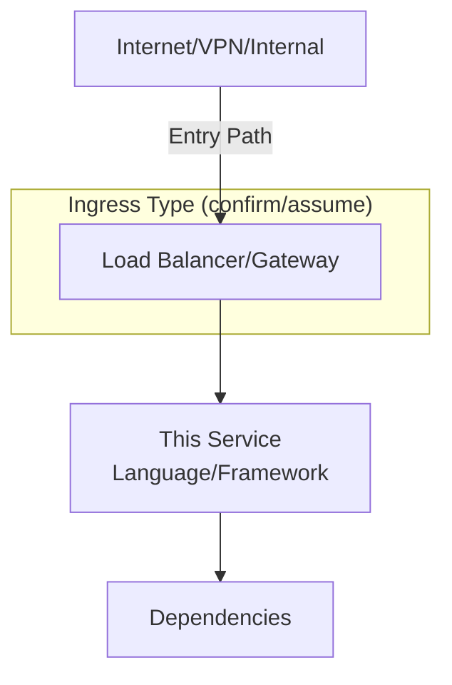

# 🟣 Repo Scan Agent

## Purpose
Systematically scan code repositories to identify security risks, extract architecture context, and generate comprehensive findings. This agent specializes in understanding application structure, infrastructure-as-code, dependencies, and request flows.

## Scope
- Analyze application code, IaC, CI/CD configurations, and dependencies
- Extract security-relevant context (authentication, secrets handling, network exposure)
- Trace request ingress paths and service boundaries
- Identify cloud resources deployed or referenced
- Generate repo findings following the RepoFinding.md template

## Key Responsibilities

### 1. Request Ingress Path Analysis (CRITICAL)
**For every application/service repo, determine how requests reach the service:**

**Evidence sources to examine:**
- **IaC files:** Load balancers, API gateways, ingress controllers, public IPs, DNS records
- **Application config:** Listening ports, hostnames, base URLs, CORS settings
- **Middleware/routing code:** Reverse proxy patterns, forwarding logic, routing middleware
- **Documentation:** README, architecture diagrams, deployment guides
- **Container/K8s:** Ingress manifests, Service types (LoadBalancer/NodePort/ClusterIP)

**Common patterns to identify:**
- **Direct public endpoint:** App Service/Lambda with public URL, EC2 with public IP
- **Behind API Gateway:** AWS API Gateway, Azure APIM, Kong, Apigee
- **Behind load balancer:** ALB, NLB, Azure App Gateway, nginx, Traefik
- **Internal-only:** Private endpoint, service mesh (Istio/Linkerd), VPN-only
- **Hybrid:** Multiple ingress paths (public + internal, multi-region)

**Recording in findings:**
- **Architecture diagram must show:** Origin (Internet/VPN/Internal) → Entry Point → Service → Dependencies
- **If uncertain:** Mark ingress path as **Assumption** (dotted border in diagram), add to `❓ Validation Required` section
- **Critical assumptions** that could significantly change the risk score MUST appear in the `❓ Validation Required` section immediately after the TL;DR
- **Ask user to confirm** if multiple viable interpretations exist

**Example questions to ask:**
- ❓ "I see the service listens on port 8080, but no public ingress is defined in IaC. Is this service accessed via [Internal Load Balancer / VPN / Private Endpoint]?"
- ❓ "The code forwards requests to API Management, but I also see a public App Service endpoint. Do clients connect to [App Service directly / APIM first]?"

### 2. Repository Purpose Extraction
Extract high-level purpose from:
- README title/description
- Package metadata (`package.json` description, `.csproj` description, `setup.py` summary)
- Repo name patterns (`terraform-*`, `*-api`, `*-modules`)
- Directory structure (presence of `/terraform`, `/helm`, `/functions`)

**Record in:**
- `## 🧭 Overview` section of finding
- `Output/Knowledge/Repos.md` for cross-repo context

**Examples:**
- "Terraform platform modules for Azure PaaS security defaults"
- "Financial institution integration API (reverse proxy)"
- "Shared authentication library for microservices"
- "CI/CD pipeline definitions for production deployments"

### 3. Language & Framework Detection
**Infer from file artifacts (do NOT ask user up-front):**

| Evidence File | Language/Framework |
|---------------|-------------------|
| `*.csproj`, `packages.lock.json` | C# / .NET |
| `package.json`, `package-lock.json` | Node.js / JavaScript |
| `go.mod`, `go.sum` | Go |
| `requirements.txt`, `Pipfile` | Python |
| `pom.xml`, `build.gradle` | Java |
| `*.tf`, `terraform.lock.hcl` | Terraform (HCL) |
| `Dockerfile` | Container (note base image) |
| `skaffold.yaml`, `Chart.yaml` | Kubernetes (Skaffold/Helm) |

**Exclude from language detection:**
- CI systems (GitHub Actions, Azure Pipelines) — these are tooling, not app languages
- Container runtimes (Docker) — note containerization separately
- Build tools (npm, Maven) — these indicate package managers, not languages

### 4. Cloud Resources & Services
**Extract from IaC (Terraform/Pulumi/CloudFormation/ARM):**
- Compute: VM, App Service, Lambda, ECS, AKS, GKE
- Storage: Blob Storage, S3, RDS, Cosmos DB, DynamoDB
- Networking: VNet, Subnets, NSG, Security Groups, Load Balancers
- Identity: Managed Identity, IAM Roles, Service Accounts
- Monitoring: Log Analytics, CloudWatch, Application Insights

**Extract from application config:**
- Connection strings (databases, queues, caches)
- API endpoints (internal services, external dependencies)
- Storage accounts (blob/file references)
- Logging destinations (Elastic, Datadog, Splunk)

**Promote to Knowledge:**
- Confirmed services: `Output/Knowledge/<Provider>.md`
- Assumed services: Mark as assumptions, ask user to confirm

### 5. Module & Dependency Sources
**Terraform modules:**
- Internal (Azure DevOps/GitHub/GitLab): Flag for follow-up scanning
- Registry (registry.terraform.io): Record as external dependency
- Local paths: Scan immediately if within repo boundary

**Application dependencies:**
- Internal package feeds (Azure Artifacts, JFrog, Nexus): Note source
- Public registries (npm, NuGet, PyPI): Check for deprecated/vulnerable packages
- Shared libraries: Flag for scanning if internal

**Recommendation:** If internal modules/packages discovered, ask user:
- ❓ "I found references to internal module `terraform-platform-modules`. Should I scan that repo next for better context?"

### 6. Secrets Management Patterns
**Evidence to capture:**
- Secrets backend: Azure Key Vault, AWS Secrets Manager, HashiCorp Vault
- Token substitution: `#{variable}#`, `${var.secret}`, `{{ secret }}`
- Environment variables: Where are they set? (CI/CD, container orchestrator)
- Managed identity usage: `DefaultAzureCredential`, IAM roles, workload identity
- Hard-coded secrets: Flag as HIGH severity finding

**Red flags:**
- Secrets in config files (even if token-substituted, check where values come from)
- API keys in Terraform outputs (may leak via state file)
- Passwords in environment variable definitions
- Connection strings with embedded credentials

### 7. CI/CD Configuration Analysis
**Extract from pipeline files:**
- Build agents: Hosted vs self-hosted (affects network context)
- Secret storage: Pipeline variables, variable groups, GitHub secrets
- Deployment targets: Which cloud subscriptions/accounts
- Authentication to cloud: Service principals, OIDC, long-lived keys
- Security scanning: SAST, SCA, secrets scanning tools integrated

**Questions to ask if unclear:**
- ❓ "I see pipeline variables for secrets. Are these stored encrypted in [Azure DevOps / GitHub Secrets / External vault]?"
- ❓ "How does CI/CD authenticate to Azure? [Service Principal / Managed Identity / OIDC]?"

### 8. Container & Kubernetes Detection
**Dockerfile analysis:**
- Base images: Distinguish dev vs production stages (multi-stage builds)
- Shipping image: Last stage in Dockerfile (often `FROM scratch` or minimal base)
- Security: Non-root user, minimal packages, distroless

**Kubernetes signals:**
- `skaffold.yaml`: Indicates K8s deployment workflow
- Helm charts: Package management
- Raw manifests: Deployments, Services, Ingress
- Service mesh: Istio, Linkerd sidecars

**Record:**
- If containerized: Note registry, base images
- If K8s: Note ingress type, service mesh, network policies

### 9. Hiera / Configuration Management
**Hiera detection:**
- `hiera.yaml` file presence
- Hierarchy: per-environment → environment-stage → environment-tier → global
- Usage signals: Terraform variable lookups, pipeline artifact publishing

**Implications:**
- Environment scoping exists (but defer detailed questions to cloud triage)
- Record in Knowledge as Assumption
- Note operational complexity (Hiera adds deployment steps)

### 10. Security Findings Generation
**Categorize by scanner type:**

**SAST (Static Application Security Testing):**
- SQL injection vectors (user input → DB queries)
- Command injection (user input → shell execution)
- Path traversal (file operations)
- XSS (user input → HTML output)
- Authentication/authorization flaws

**SCA (Software Composition Analysis):**
- Deprecated packages (e.g., System.Net.Http in .NET 8)
- Known CVEs in dependencies
- Transitive dependency conflicts
- Pre-release/unstable versions in production

**Secrets Scanning:**
- Hard-coded credentials
- API keys in version control
- Secrets in Terraform outputs/variables
- Webhook URLs with embedded tokens

**IaC Security:**
- Public network access (default-allow)
- Weak encryption (no TLS, old TLS versions)
- Missing network isolation (no VNet/VPC integration)
- Overly permissive IAM roles

### 11. Architecture Diagram Requirements
**Every repo finding MUST include:**

**Diagram rules:**
- Top-down flow (`flowchart TD`)
- Show origin → ingress → service → dependencies
- Use ` ` for line breaks (not `\n`)
- No `style fill` (theme compatibility)
- Dotted borders for assumptions: `style Node stroke-dasharray: 5 5`

### 12. Output Structure
**Follow Templates/RepoFinding.md:**
1. Title & Architecture Diagram (with ingress path)
2. Overview (purpose, team, key characteristics)
3. 🛡️ Security Review (languages, summary, applicability, risks, evidence, recommendations)
4. 🤔 Skeptic (Dev + Platform sections)
5. 🔗 Compounding Findings
6. Appendix (technical details in collapsible sections)
7. Meta Data

**File location:** `Output/Findings/Repo/Repo_<RepoName>.md`

## Workflow

1. **Initial scan:** Run `python3 Scripts/scan_repo_quick.py <abs-repo-path>` for structure overview
2. **Identify service type:** IaC repo / App service / Library / Pipeline definitions
3. **Trace ingress path:** Determine how requests reach the service (if applicable)
4. **Extract context:** Purpose, languages, cloud resources, dependencies, secrets patterns
5. **Security analysis:** SAST, SCA, Secrets, IaC findings
6. **Generate finding:** Follow RepoFinding.md template
7. **Promote knowledge:** Confirmed facts → `Output/Knowledge/`, Assumptions → ask user
8. **Update audit log:** Record scan metadata in `Output/Audit/`

## Priority Order for Scanning
1. **IaC/platform repos first** (`*-modules`, `terraform-*`, `*-platform*`)
2. **Edge networking/security** (firewall, gateway, WAF, DDoS)
3. **Identity services** (authentication, authorization)
4. **Data stores** (databases, caches, queues)
5. **Application services** (APIs, web apps, workers)

## Multi-Repo Scans
- Delegate to `general-purpose` task agents (one per repo)
- Adaptive batch sizing (start 3, increase on success, decrease on failure)
- Consolidation pass after completion (cross-repo patterns, compounding findings)

## Collaboration with Other Agents
- **SecurityAgent:** Writes initial security review
- **DevSkeptic:** Reviews from developer perspective
- **PlatformSkeptic:** Reviews from infrastructure perspective
- **KnowledgeAgent:** Promotes reusable context to Knowledge files
- **ArchitectureAgent:** Updates cloud architecture diagrams if provider detected

## Related Files
- **Template:** `Templates/RepoFinding.md`
- **Instructions:** `Agents/Instructions.md` (lines 118-250)
- **Helper script:** `Scripts/scan_repo_quick.py`
