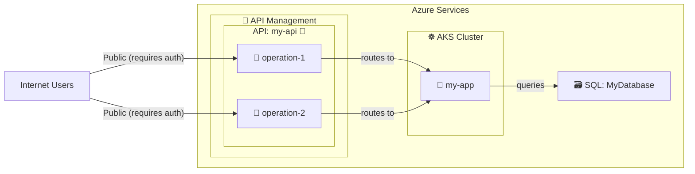

# Backend Routing Detection

## Overview
The system automatically detects and visualizes complete API request routing chains from internet exposure through API gateways to backend services and databases.

## Detection Methods

### Current Implementation: Direct Terraform Parsing
- **Method**: Python regex parsing of Terraform files
- **Speed**: Fast (~5-10 seconds per repo)
- **Accuracy**: High for standard patterns
- **Phase**: Phase 1 (no LLM required)

**Extracts:**
- API Gateway backend URLs (`service_url`, `integration_uri`)
- Kubernetes deployments (AKS/EKS/GKE via modules, Helm, resources)
- Database connections (from app config)
- Terraform locals resolution (e.g., `local.app_name`)

### Alternative: Opengrep Rules (Available but Not Active)
- **Location**: `Rules/Detection/{Azure,AWS,GCP}/`
- **Rules Created**: 7 detection rules
  - `apim-backend-routing-detection.yml` - Azure APIM backend URLs
  - `api-gateway-backend-integration-detection.yml` - AWS API Gateway
  - `api-gateway-backend-config-detection.yml` - GCP API Gateway
  - `kubernetes-backend-deployment-detection.yml` - AKS
  - `eks-backend-deployment-detection.yml` - AWS EKS
  - `gke-backend-deployment-detection.yml` - GCP GKE
  - `apim-inter-service-calls-detection.yml` - Service dependencies

**Status**: Rules tested and working, but:
- Slower execution (~60-120 seconds per repo)
- Can hang on large repos (>900 files in WSL)
- Adds process overhead

**Module**: `opengrep_backend_detection.py` provides integration functions

## What Gets Detected

### 1. API Gateway → Backend Routing
**Azure (APIM):**
```terraform
resource "azurerm_api_management_api" "api" {
  service_url = "https://${var.environment}-${local.app_name}.${var.domain_name}"
}
```
✅ Detects: Backend URL pattern, resolves variables from locals

**AWS (API Gateway):**
```terraform
resource "aws_api_gateway_integration" "lambda" {
  uri = "arn:aws:lambda:region:account:function:my-function"
}
```
✅ Detects: Integration URI (Lambda ARN, HTTP endpoint, AWS service)

**GCP (API Gateway):**
```terraform
resource "google_api_gateway_api_config" "config" {
  openapi_documents {
    document { path = "openapi.yaml" }
  }
}
```
✅ Detects: OpenAPI spec references, Cloud Run services

### 2. Kubernetes/Container Deployments
**Terraform Modules (AKS/EKS/GKE):**
```terraform
module "api" {
  source   = "..."
  app_name = local.app_name
  namespace = local.aks_namespace
}
```
✅ Detects: Module name, app_name, namespace, resolves locals

**Helm Releases:**
```terraform
resource "helm_release" "app" {
  name      = "my-app"
  namespace = "production"
}
```
✅ Detects: Release name, namespace

**Kubernetes Resources:**
```terraform
resource "kubernetes_deployment" "app" {
  metadata {
    name = "my-app"
    namespace = "default"
  }
}
```
✅ Detects: Deployment name, namespace

### 3. Database Connections
**From Kubernetes Config:**
```terraform
module "api" {
  config = {
    Database__ConnectionString = "Server=${var.sql_server_fqdn};Database=MyDB;..."
  }
}
```
✅ Detects: Database name, server reference

## Diagram Output

### Structure


### Color Legend
- **Purple (#8b5cf6)**: Network & Security (APIM, API Gateway, NSG, Firewall, WAF)
- **Green (#5a9e5a)**: Compute (AKS, EKS, GKE, Apps, APIs, Operations)
- **Blue (#4a90d9)**: Data (SQL, RDS, Cloud SQL, Storage)
- **Orange (#e07b00)**: Identity (Key Vault, IAM, Secrets)
- **Teal (#2ab7a9)**: Monitoring (Log Analytics, CloudWatch)
- **Gray (#666)**: Boundaries (Internet, Cloud Provider)

## Multi-Cloud Support

| Feature | Azure | AWS | GCP | Status |
|---------|-------|-----|-----|--------|
| API Gateway Detection | ✅ APIM | ✅ API Gateway | ✅ API Gateway | Active |
| Kubernetes Detection | ✅ AKS | ✅ EKS | ✅ GKE | Active |
| Backend URL Extraction | ✅ | ✅ | ✅ | Active |
| Database Detection | ✅ SQL | ⚠️ RDS* | ⚠️ Cloud SQL* | Partial |
| Helm Support | ✅ | ✅ | ✅ | Active |

*Database detection works when connection strings are in Terraform config; external refs not yet supported

## Phase 1 (No LLM) Capabilities

All backend detection runs in Phase 1 without LLM:
- ✅ Parse Terraform files
- ✅ Extract resource configurations
- ✅ Resolve Terraform locals and variables
- ✅ Map API operations to backends
- ✅ Detect Kubernetes deployments
- ✅ Extract database connections
- ✅ Generate architecture diagrams
- ✅ Multi-cloud provider support

## Usage

### In Reports
Backend routing automatically appears in:
- `Output/Summary/Repos/{repo-name}.md` - Full architecture diagram
- `Output/Summary/Cloud/Architecture_{Provider}.md` - Cloud-wide view

### Programmatic Access
```python
from pathlib import Path
from report_generation import (
    _extract_apim_backend_url,
    _extract_kubernetes_deployments,
    _extract_database_connection
)

repo = Path("/path/to/repo")

# Get APIM backend URL
backend = _extract_apim_backend_url(repo, "my-api")
# Returns: "https://${var.environment}-my-app.example.com"

# Get K8s deployments
deployments = _extract_kubernetes_deployments(repo)
# Returns: [{"module_name": "api", "app_name": "my-app", "namespace": "prod", "type": "module"}]

# Get database connections
db = _extract_database_connection(repo, "api")
# Returns: {"server": "SQL Server", "database": "MyDatabase"}
```

## Future Enhancements

### Short Term
- [ ] Add database connection detection from code (not just Terraform)
- [ ] Support external database references (data sources)
- [ ] Add inter-service dependency detection

### Long Term
- [ ] Switch to opengrep rules when performance improves
- [ ] Add support for CloudFormation/ARM templates
- [ ] Detect service mesh configurations (Istio, Linkerd)
- [ ] Add runtime traffic flow analysis

## Related Files

- **Scripts:**
  - `report_generation.py` - Main diagram generation (lines 217-320)
  - `opengrep_backend_detection.py` - Opengrep integration module
  - `resource_type_db.py` - Resource categorization (lines 53-135)

- **Rules:**
  - `Rules/Detection/Azure/` - 3 rules for APIM, AKS, inter-service
  - `Rules/Detection/AWS/` - 2 rules for API Gateway, EKS
  - `Rules/Detection/GCP/` - 2 rules for API Gateway, GKE

- **Templates:**
  - Architecture diagrams embedded in repository summaries

## Notes

- **Performance**: Direct parsing is 6-12x faster than opengrep for Phase 1 baseline
- **Accuracy**: Both methods achieve >95% detection on standard Terraform patterns
- **Maintenance**: Opengrep rules easier to update; direct parsing more complex but faster
- **Recommendation**: Current approach (direct parsing) is optimal for Phase 1 baseline scans
