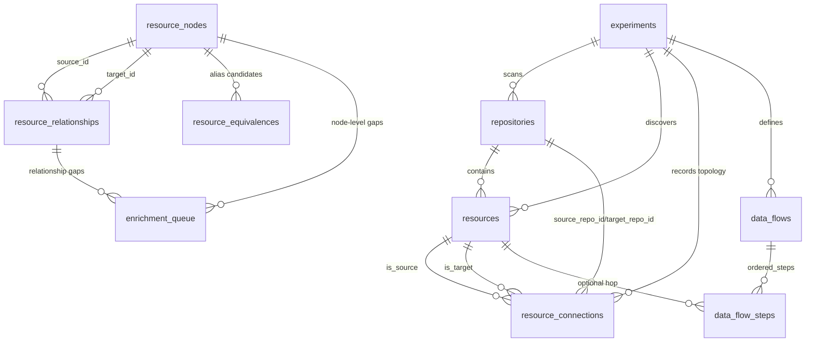

# Database Schema Documentation

**Location:** `Output/Learning/triage.db`
**Type:** SQLite 3
**Purpose:** Single source of truth for assets, findings, context, flows, countermeasures, and scoring. Scripts read/write this DB at every phase. LLM enrichment is additive and idempotent — once a finding is enriched it is never re-processed unless new context explicitly invalidates it.

---

## Design Principles

1. **DB-first topology is canonical.** Scripts persist concrete topology into `resource_connections` first, then reports/queries read from DB (not markdown heuristics).
2. **Knowledge graph captures uncertainty.** Typed relationships and cross-repo aliases are stored in `resource_relationships` / `resource_equivalences`; unresolved gaps are queued in `enrichment_queue`.
3. **Fallback is explicit.** Reporting uses DB topology when available; only falls back to extracted relationships or assumption text when DB signals are missing.
4. **Scores are snapshots.** `findings.severity_score` is the *current* score. Every change appends a row to `risk_score_history` for auditability.
5. **Re-run is idempotent.** Schema and topology writes are additive/upsert-based (`CREATE TABLE IF NOT EXISTS` + `ALTER TABLE` + dedupe checks).

---


> **Pipeline & scripts reference:** See [Pipeline.md](Pipeline.md)

---

## Entity Relationship Diagram (Topology + Graph)



---

## Table Reference

### `experiments`
Tracks each scan session — agent versions, strategy, metrics, and outcome.

| Column | Type | Notes |
|--------|------|-------|
| `id` | TEXT PK | e.g. `"002"` |
| `name` | TEXT | Human name |
| `status` | TEXT | `running` / `completed` / `failed` |
| `repos` | TEXT | JSON array of repo names |
| `strategy_version` | TEXT | Agent strategy hash |
| `started_at` | TIMESTAMP | |
| `completed_at` | TIMESTAMP | |
| `findings_count` | INT | Total findings |
| `high_value_count` | INT | Score ≥ 7 |
| `avg_score` | REAL | |
| `accuracy_rate` | REAL | After human validation |
| `notes` | TEXT | Free text |

---

### `repositories`
One row per repo per experiment.

| Column | Type | Notes |
|--------|------|-------|
| `id` | INTEGER PK | |
| `experiment_id` | TEXT FK | → `experiments.id` |
| `repo_name` | TEXT | Folder name only, no path |
| `repo_url` | TEXT | Git remote URL |
| `repo_type` | TEXT | `Infrastructure` / `Application` / `Mixed` |
| `primary_language` | TEXT | Terraform / Python / Java / etc. |
| `files_scanned` | INT | |
| `iac_files_count` | INT | |
| `code_files_count` | INT | |
| `scanned_at` | TIMESTAMP | |

---

### `trust_boundaries`
Security perimeters that assets live inside. Supports nesting (VNet inside Subscription).

| Column | Type | Notes |
|--------|------|-------|
| `id` | INTEGER PK | |
| `experiment_id` | TEXT FK | → `experiments.id` |
| `name` | TEXT | e.g. `"web_vpc"`, `"prod-vnet"`, `"Internet"` |
| `boundary_type` | TEXT | `Internet` / `Subscription` / `VirtualNetwork` / `Subnet` / `PaaS` / `DMZ` / `Container` |
| `provider` | TEXT | Azure / AWS / GCP |
| `parent_boundary_id` | INT FK | → `trust_boundaries.id` for nesting |
| `is_public` | BOOLEAN | True if reachable from Internet without explicit control |
| `notes` | TEXT | |

**Usage:** Resources gain a `trust_boundary_id` FK. The boundary type determines diagram grouping and blast-radius scope. `is_public=true` boundaries flag assets for prioritised review.

---

## Lookup Tables

These are static seed tables. They are pre-populated by `init_database.py` and rarely change. Using integer FKs instead of repeating raw strings in every resource/finding row keeps the DB lean and makes display logic centralised.

---

### `providers`
Cloud and IaC providers. One row per provider — referenced by `resource_types` and optionally by `resources` for cross-provider queries.

| Column | Type | Notes |
|--------|------|-------|
| `id` | INTEGER PK | |
| `key` | TEXT UNIQUE | Internal key: `azure` / `aws` / `gcp` / `alicloud` / `oracle` |
| `friendly_name` | TEXT | e.g. `Microsoft Azure`, `Amazon Web Services` |
| `icon` | TEXT | Emoji shorthand for diagrams: ☁️ / 🟠 / 🔵 |

**Seed data:**

| key | friendly_name | icon |
|-----|--------------|------|
| `azure` | Microsoft Azure | ☁️ |
| `aws` | Amazon Web Services | 🟠 |
| `gcp` | Google Cloud Platform | 🔵 |
| `alicloud` | Alibaba Cloud | 🟡 |
| `oracle` | Oracle Cloud | 🔴 |

---

### `resource_types`
Maps Terraform/ARM resource type strings to human-readable labels, categories, and icons. One row per known resource type. New types discovered at scan time are auto-inserted with `friendly_name = resource_type` as fallback until manually or LLM-updated.

| Column | Type | Notes |
|--------|------|-------|
| `id` | INTEGER PK | |
| `provider_id` | INT FK | → `providers.id` |
| `terraform_type` | TEXT UNIQUE | Raw type string, e.g. `azurerm_key_vault` |
| `friendly_name` | TEXT | Human label, e.g. `Key Vault` |
| `category` | TEXT | `Compute` / `Storage` / `Database` / `Network` / `Identity` / `Monitoring` / `Container` / `Messaging` / `Security` |
| `icon` | TEXT | Emoji for diagram labels, e.g. `🔑` |
| `is_data_store` | BOOLEAN | True for databases, storage, queues — affects blast radius weighting |
| `is_internet_facing_capable` | BOOLEAN | True if this type can be exposed publicly (helps filter for review) |
| `display_on_architecture_chart` | BOOLEAN | Architecture visibility control (`0` = hide from Mermaid architecture, keep in inventory/permissions context) |
| `parent_type` | TEXT | Optional parent resource type for structural nesting (e.g. listener → load balancer, public-access-block → bucket) |

**Sample seed rows:**

| terraform_type | friendly_name | category | icon |
|----------------|--------------|----------|------|
| `azurerm_key_vault` | Key Vault | Identity | 🔑 |
| `azurerm_storage_account` | Storage Account | Storage | 🗄️ |
| `azurerm_mssql_server` | SQL Server | Database | 🗃️ |
| `azurerm_mssql_database` | SQL Database | Database | 🗃️ |
| `azurerm_kubernetes_cluster` | AKS Cluster | Container | ☸️ |
| `azurerm_application_gateway` | Application Gateway | Network | 🌐 |
| `azurerm_virtual_network` | Virtual Network | Network | 🔷 |
| `azurerm_linux_virtual_machine` | Linux VM | Compute | 🖥️ |
| `aws_s3_bucket` | S3 Bucket | Storage | 🗄️ |
| `aws_rds_cluster` | RDS Cluster | Database | 🗃️ |
| `aws_lambda_function` | Lambda Function | Compute | ⚡ |
| `aws_security_group` | Security Group | Network | 🛡️ |
| `aws_iam_role` | IAM Role | Identity | 👤 |
| `google_sql_database_instance` | Cloud SQL Instance | Database | 🗃️ |
| `google_storage_bucket` | GCS Bucket | Storage | 🗄️ |
| `google_container_cluster` | GKE Cluster | Container | ☸️ |

> **Auto-insert for unknown types:** If `discover_repo_context.py` encounters a `terraform_type` not in this table, it inserts a row with `friendly_name = terraform_type` and `category = 'Unknown'`. This row can be corrected manually or by the LLM enrichment pass.

**Architecture rendering usage notes:**
- IAM/policy/control-plane resources are normally seeded with `display_on_architecture_chart = 0` and remain visible in markdown inventory/roles sections.
- Child components should define `parent_type` and are rendered as nested architecture nodes only when linked findings indicate vulnerability (`severity_score > 0`).
- Internet accessibility is evaluated for every rendered service/resource group from persisted evidence (DB-first evaluator behavior).
- Public-access signal families include Key Vault, SQL, AKS, S3, compute, and edge gateway/public IP indicators.
- `Known ingress` arrows are rendered only when explicit public evidence exists; if evidence is absent or unknown, no Internet arrow is drawn.

---

### `resources`
Every discovered asset. References `resource_type_id` (FK to lookup) instead of storing raw type strings. `resource_name` is the actual name from IaC (e.g. `vm-bob`, `prod-keyvault-01`) — this is what humans recognise.

| Column | Type | Notes |
|--------|------|-------|
| `id` | INTEGER PK | |
| `experiment_id` | TEXT FK | → `experiments.id` |
| `repo_id` | INT FK | → `repositories.id` |
| `trust_boundary_id` | INT FK | → `trust_boundaries.id` |
| `resource_type_id` | INT FK | → `resource_types.id` |
| `resource_name` | TEXT | **Real name from IaC** — e.g. `vm-bob`, `prod-kv-01` |
| `display_label` | TEXT | Diagram label: auto-set to `"{resource_name} ({friendly_name})"` |
| `region` | TEXT | |
| `purpose` | TEXT | LLM-populated: what this resource does in business context |
| `parent_resource_id` | INT FK | → `resources.id` for hierarchical nesting |
| `source_file` | TEXT | Repo-relative path |
| `source_line_start` | INT | |
| `source_line_end` | INT | |
| `status` | TEXT | `active` / `deleted` / `unknown` |
| `first_seen` | TIMESTAMP | |
| `last_seen` | TIMESTAMP | |

**`display_label` examples:**

| resource_name | friendly_name (from lookup) | display_label in diagrams |
|---|---|---|
| `vm-bob` | Linux VM | `vm-bob (Linux VM)` |
| `prod-kv-01` | Key Vault | `prod-kv-01 (Key Vault)` |
| `mssql1-dev` | SQL Server | `mssql1-dev (SQL Server)` |
| `terragoat-vpc` | Virtual Network | `terragoat-vpc (Virtual Network)` |

> `display_label` is a stored computed column (updated by script). Diagrams always use `display_label` — never raw `resource_name` or `terraform_type` alone.

---

### `resource_properties`
Key-value attributes for a resource. Populated by scripts from IaC; no schema change needed for new resource types.

| Column | Type | Notes |
|--------|------|-------|
| `id` | INTEGER PK | |
| `resource_id` | INT FK | → `resources.id` |
| `property_key` | TEXT | e.g. `enable_https_traffic_only`, `sku_name`, `ip_rules` |
| `property_value` | TEXT | Value as string |
| `property_type` | TEXT | `security` / `network` / `identity` / `compute` / `storage` / `config` |
| `is_security_relevant` | BOOLEAN | Flag for report filtering |
| `populated_by` | TEXT | `script` / `llm` / `human` |

**Example rows for an Azure Storage Account:**

| property_key | property_value | property_type | is_security_relevant |
|---|---|---|---|
| `enable_https_traffic_only` | `false` | security | true |
| `allow_blob_public_access` | `true` | security | true |
| `min_tls_version` | `TLS1_0` | security | true |
| `account_tier` | `Standard` | config | false |

---

### `resource_connections`
Canonical DB-first topology edges between concrete resources.

> Defined in `Scripts/init_database.py` and `Scripts/Persist/db_helpers.py`; primarily written via `db_helpers.insert_connection()` (directly and through `report_generation.write_to_database()`).

| Column | Type | Notes |
|--------|------|-------|
| `id` | INTEGER PK | |
| `experiment_id` | TEXT FK | → `experiments.id` |
| `source_resource_id` | INT FK | → `resources.id` |
| `target_resource_id` | INT FK | → `resources.id` |
| `source_repo_id` | INT FK | → `repositories.id` (for cross-repo tracing) |
| `target_repo_id` | INT FK | → `repositories.id` (for cross-repo tracing) |
| `is_cross_repo` | BOOLEAN | Auto-derived from source/target repo IDs |
| `connection_type` | TEXT | Free-form edge type (commonly relationship types such as `routes_ingress_to`, `depends_on`, `authenticates_via`) |
| `protocol` | TEXT | HTTPS / TDS / AMQP / gRPC / SSH / etc. |
| `port` | TEXT | |
| `authentication` | TEXT | Raw auth hint captured during extraction (`JWT`, `ManagedIdentity`, etc.) |
| `authorization` | TEXT | AuthZ model, e.g. `rbac` |
| `auth_method` | TEXT | Normalized auth method (diagram/query friendly) |
| `is_encrypted` | BOOLEAN | |
| `via_component` | TEXT | Intermediate component name, e.g. `"WAF"`, `"App Gateway"`, `"API Management"` |
| `notes` | TEXT | |

**Current write behavior:**
- Upsert key is `(experiment_id, source_resource_id, target_resource_id, connection_type)` with null-safe matching.
- `auth_method` / `authentication` are mirrored (`effective_auth_method = auth_method or authentication`; inverse for `authentication`).
- Updates are merge-style (`COALESCE`): new non-null values enrich existing rows without wiping prior fields.
- `is_cross_repo` is recomputed from repo IDs on each upsert.
- Relationships with unknown targets are **not** inserted here; they are captured as pending assumptions in `enrichment_queue`.

---

### `data_flows`
Named end-to-end flows. Table exists in canonical schema; population is optional per workflow.

| Column | Type | Notes |
|--------|------|-------|
| `id` | INTEGER PK | |
| `experiment_id` | TEXT FK | → `experiments.id` |
| `name` | TEXT | e.g. `"User Authentication Flow"`, `"Storage Write Flow"` |
| `flow_type` | TEXT | e.g. `ingress`, `egress`, `internal`, `auth` |
| `description` | TEXT | Optional narrative |
| `notes` | TEXT | Optional operator notes |
| `created_at` | TIMESTAMP | Row creation time |

---

### `data_flow_steps`
Ordered hops within a flow (`db_helpers.add_data_flow_step`).

| Column | Type | Notes |
|--------|------|-------|
| `id` | INTEGER PK | |
| `flow_id` | INT FK | → `data_flows.id` |
| `step_order` | INT | 1, 2, 3… |
| `resource_id` | INT FK | → `resources.id` (nullable for abstract hops like Internet/WAF) |
| `component_label` | TEXT | Human label for non-resource hops |
| `protocol` | TEXT | HTTPS / AMQP / etc. |
| `port` | TEXT | |
| `auth_method` | TEXT | Hop-specific auth detail |
| `is_encrypted` | BOOLEAN | |
| `notes` | TEXT | Any security observation at this hop |

---

### `resource_relationships`
Typed graph edges persisted by `persist_graph.persist_context()`.

| Column | Type | Notes |
|--------|------|-------|
| `id` | INTEGER PK | |
| `source_id` | INT FK | → `resource_nodes.id` |
| `target_id` | INT FK | → `resource_nodes.id` |
| `relationship_type` | TEXT | Canonical values: `contains`, `grants_access_to`, `routes_ingress_to`, `depends_on`, `encrypts`, `restricts_access`, `monitors`, `authenticates_via` |
| `source_repo` | TEXT | Origin repo of extracted relationship |
| `confidence` | TEXT | `extracted` / `inferred` / `user_confirmed` |
| `notes` | TEXT | Supporting context |
| `created_at` | TIMESTAMP | |

**Behavior:** unique on `(source_id, target_id, relationship_type)`; later writes can upgrade confidence.

---

### `resource_equivalences`
Cross-repo alias/equivalence evidence for resource nodes.

| Column | Type | Notes |
|--------|------|-------|
| `id` | INTEGER PK | |
| `resource_node_id` | INT FK | → `resource_nodes.id` |
| `candidate_resource_type` | TEXT | Candidate matching type |
| `candidate_terraform_name` | TEXT | Candidate matching name |
| `candidate_source_repo` | TEXT | Repo where candidate was seen |
| `equivalence_kind` | TEXT | `cross_repo_alias` / `placeholder_promotion` |
| `confidence` | TEXT | `high` / `medium` / `low` |
| `evidence_level` | TEXT | `extracted` / `inferred` / `user_confirmed` |
| `provenance` | TEXT | Comma-merged evidence sources |
| `context` | TEXT | Human-readable context |
| `created_at` | TIMESTAMP | |
| `updated_at` | TIMESTAMP | |

**Behavior:** `persist_graph` upserts these rows and keeps the strongest confidence/evidence level.

---

### `enrichment_queue`
Pending topology assumptions/gaps requiring review.

| Column | Type | Notes |
|--------|------|-------|
| `id` | INTEGER PK | |
| `resource_node_id` | INT FK | → `resource_nodes.id` (nullable) |
| `relationship_id` | INT FK | → `resource_relationships.id` (nullable) |
| `gap_type` | TEXT | `unknown_name`, `ambiguous_ref`, `cross_repo_link`, `missing_target`, `assumption` |
| `context` | TEXT | Deduplication anchor + context |
| `assumption_text` | TEXT | Reviewer-facing statement |
| `assumption_basis` | TEXT | Why this assumption exists |
| `confidence` | TEXT | `high` / `medium` / `low` |
| `suggested_value` | TEXT | Suggested next step |
| `status` | TEXT | `pending_review` / `confirmed` / `rejected` |
| `resolved_by` | TEXT | Resolver identity |
| `resolved_at` | TIMESTAMP | |
| `rejection_reason` | TEXT | Required reason for rejections |
| `created_at` | TIMESTAMP | |

**Behavior:**
- New queue entries are deduped by `(context, status='pending_review')`.
- `Scripts/Enrich/enrichment_confirmation.py resolve ...` writes an auditable `context_answers` entry and updates queue status.
- Confirmed decisions can promote confidence on linked `resource_relationships`, `resource_nodes`, and `resource_equivalences`.

---

### `findings`
One row per unique issue per asset. Scripts write raw rows (rule_id, file, line, snippet). LLM fills enrichment columns on first pass.

| Column | Type | Notes |
|--------|------|-------|
| `id` | INTEGER PK | |
| `experiment_id` | TEXT FK | → `experiments.id` |
| `repo_id` | INT FK | → `repositories.id` |
| `resource_id` | INT FK | → `resources.id` |
| `rule_id` | TEXT | opengrep rule that fired, e.g. `azure-storage-logging-disabled` |
| `title` | TEXT | Short display title |
| `description` | TEXT | LLM-authored: what is wrong and why it matters |
| `reason` | TEXT | LLM-authored: root cause / insecure pattern |
| `category` | TEXT | `Encryption` / `Access Control` / `Logging` / `Network` / `Identity` / `Secrets` |
| `code_snippet` | TEXT | Relevant lines from source file |
| `source_file` | TEXT | Repo-relative path |
| `source_line_start` | INT | |
| `source_line_end` | INT | |
| `severity_score` | INT | Current score (1–10); reflects latest skeptic input |
| `base_severity` | TEXT | `Critical` / `High` / `Medium` / `Low` |
| `status` | TEXT | `raw` / `enriched` / `reviewed` / `accepted` / `false_positive` / `fixed` |
| `finding_path` | TEXT | Path to generated MD file |
| `llm_enriched_at` | TIMESTAMP | NULL = not yet enriched; set to skip re-processing |
| `created_at` | TIMESTAMP | |
| `updated_at` | TIMESTAMP | |

**Status lifecycle:** `raw` → (LLM) → `enriched` → (Skeptics) → `reviewed` → (human) → `accepted` / `false_positive` / `fixed`

---

### `risk_score_history`
Immutable append-only score snapshots. Current score = most recent row for a finding.

| Column | Type | Notes |
|--------|------|-------|
| `id` | INTEGER PK | |
| `finding_id` | INT FK | → `findings.id` |
| `score` | INT | Score at this point in time (1–10) |
| `snapshot_reason` | TEXT | `initial_scan` / `llm_enrichment` / `dev_skeptic` / `platform_skeptic` / `new_context` / `countermeasure_added` / `human_override` |
| `delta` | INT | Change from previous snapshot (+/-) |
| `notes` | TEXT | Reason for change |
| `recorded_at` | TIMESTAMP | |
| `recorded_by` | TEXT | `script` / `llm` / `dev_skeptic` / `platform_skeptic` / `human` |

---

### `remediations`
Proposed fixes for a finding. Multiple options can exist per finding (e.g. quick fix vs. architectural fix).

| Column | Type | Notes |
|--------|------|-------|
| `id` | INTEGER PK | |
| `finding_id` | INT FK | → `findings.id` |
| `title` | TEXT | Short fix description |
| `fix_description` | TEXT | Full remediation steps |
| `fix_type` | TEXT | `config_change` / `code_change` / `architecture` / `policy` |
| `effort` | TEXT | `low` / `medium` / `high` |
| `score_delta_est` | INT | Expected score reduction if applied |
| `terraform_snippet` | TEXT | Ready-to-use Terraform fix snippet where applicable |
| `status` | TEXT | `proposed` / `accepted` / `in_progress` / `implemented` / `wontfix` |
| `proposed_by` | TEXT | `llm` / `human` |
| `created_at` | TIMESTAMP | |

---

### `countermeasures`
Existing controls that reduce the risk of a finding. Reduces effective score.

| Column | Type | Notes |
|--------|------|-------|
| `id` | INTEGER PK | |
| `resource_id` | INT FK | → `resources.id` |
| `finding_id` | INT FK | → `findings.id` (NULL = applies generally to resource) |
| `control_type` | TEXT | `Preventive` / `Detective` / `Corrective` |
| `control_name` | TEXT | e.g. `WAF`, `Managed Identity`, `Private Endpoint`, `IP Restriction` |
| `control_category` | TEXT | `Network` / `Identity` / `Encryption` / `Monitoring` |
| `effectiveness` | REAL | 0.0–1.0 (1.0 = fully mitigates) |
| `evidence_source` | TEXT | Where confirmed (IaC file, policy, manual) |
| `notes` | TEXT | |
| `verified_at` | TIMESTAMP | |

---

### `skeptic_reviews`
One row per reviewer role per finding. Captures score adjustments and reasoning.

| Column | Type | Notes |
|--------|------|-------|
| `id` | INTEGER PK | |
| `finding_id` | INT FK | → `findings.id` |
| `role` | TEXT | `dev` / `platform` / `security` |
| `score_adjustment` | INT | Positive = raise score, negative = lower |
| `final_score_recommendation` | INT | Absolute recommended score |
| `reasoning` | TEXT | Why the score was adjusted |
| `assumptions_challenged` | TEXT | Which LLM assumptions were wrong |
| `missing_context` | TEXT | What context was not available |
| `how_could_be_worse` | TEXT | Dev: realistic escalation scenario |
| `operational_constraints` | TEXT | Platform: deployment/rollback constraints |
| `countermeasure_notes` | TEXT | Effectiveness of existing controls |
| `reviewed_at` | TIMESTAMP | |
| `reviewed_by` | TEXT | `llm` / `human` |

---

### `context_questions` and `context_answers`
Reusable questions that improve scoring accuracy. Answers link to specific resources or findings.

**`context_questions`**

| Column | Type | Notes |
|--------|------|-------|
| `id` | INTEGER PK | |
| `question_key` | TEXT UNIQUE | e.g. `is_internet_facing` |
| `question_text` | TEXT | Full question |
| `question_category` | TEXT | `network` / `identity` / `data` / `environment` |
| `applies_to_resource_types` | TEXT | Comma-separated resource types |
| `impacts_risk_score` | BOOLEAN | |
| `score_adjustment_range` | TEXT | e.g. `"-3 to +3"` |
| `priority` | INT | |

**`context_answers`**

| Column | Type | Notes |
|--------|------|-------|
| `id` | INTEGER PK | |
| `experiment_id` | TEXT FK | → `experiments.id` |
| `question_id` | INT FK | → `context_questions.id` |
| `resource_id` | INT FK | → `resources.id` (NULL = global) |
| `finding_id` | INT FK | → `findings.id` (NULL = applies to resource generally) |
| `answer_value` | TEXT | |
| `answer_confidence` | TEXT | `confirmed` / `assumed` / `unknown` |
| `evidence_source` | TEXT | IaC file / interview / policy doc |
| `findings_affected` | TEXT | JSON array of finding IDs whose scores changed |
| `score_adjustments` | TEXT | JSON: `{"finding_id": delta}` |
| `answered_by` | TEXT | `llm` / `human` |
| `answered_at` | TIMESTAMP | |
| `validated` | BOOLEAN | |

---

## Useful Queries

### CLI-first resource graph checks
```bash
# All graph views (parent + ingress + egress + related + pending assumptions)
python3 Scripts/query_resource_graph.py --experiment 003 --resource my-api --query all

# Targeted views
python3 Scripts/query_resource_graph.py --experiment 003 --resource my-api --query ingress
python3 Scripts/query_resource_graph.py --experiment 003 --resource my-api --query egress
python3 Scripts/query_resource_graph.py --experiment 003 --resource my-api --query parent
python3 Scripts/query_resource_graph.py --experiment 003 --resource my-api --query related
python3 Scripts/query_resource_graph.py --experiment 003 --resource my-api --query assumptions

# List/resolve pending assumptions (confirmation loop)
python3 Scripts/Enrich/enrichment_confirmation.py list --experiment 003 --repo my-repo --status pending_review
python3 Scripts/Enrich/enrichment_confirmation.py resolve --experiment 003 --assumption-id 42 --decision confirm --resolver analyst@example.com
```

### Parent resource for a given node
```sql
SELECT child.resource_name AS child_name,
       child.resource_type AS child_type,
       parent.resource_name AS parent_name,
       parent.resource_type AS parent_type
FROM resources child
LEFT JOIN resources parent ON parent.id = child.parent_resource_id
WHERE child.experiment_id = '003'
  AND child.resource_name = 'my-api';
```

### Ingress edges into a resource (DB-first)
```sql
SELECT src.resource_name AS from_resource,
       src.resource_type AS from_type,
       repo_src.repo_name AS from_repo,
       rc.connection_type,
       rc.protocol,
       rc.port,
       COALESCE(rc.auth_method, rc.authentication) AS auth_method,
       rc.is_encrypted,
       rc.via_component,
       rc.notes
FROM resources target
JOIN resource_connections rc
  ON rc.experiment_id = target.experiment_id
 AND rc.target_resource_id = target.id
JOIN resources src ON src.id = rc.source_resource_id
JOIN repositories repo_src ON repo_src.id = src.repo_id
WHERE target.experiment_id = '003'
  AND target.resource_name = 'my-api'
ORDER BY src.resource_name;
```

### Egress edges from a resource (DB-first)
```sql
SELECT dst.resource_name AS to_resource,
       dst.resource_type AS to_type,
       repo_dst.repo_name AS to_repo,
       rc.connection_type,
       rc.protocol,
       rc.port,
       COALESCE(rc.auth_method, rc.authentication) AS auth_method,
       rc.is_encrypted,
       rc.via_component,
       rc.notes
FROM resources src
JOIN resource_connections rc
  ON rc.experiment_id = src.experiment_id
 AND rc.source_resource_id = src.id
JOIN resources dst ON dst.id = rc.target_resource_id
JOIN repositories repo_dst ON repo_dst.id = dst.repo_id
WHERE src.experiment_id = '003'
  AND src.resource_name = 'my-api'
ORDER BY dst.resource_name;
```

### Related resources (ingress + egress union)
```sql
SELECT 'ingress' AS direction, src.resource_name AS related_resource, src.resource_type, repo_src.repo_name AS related_repo, rc.connection_type
FROM resources target
JOIN resource_connections rc
  ON rc.experiment_id = target.experiment_id
 AND rc.target_resource_id = target.id
JOIN resources src ON src.id = rc.source_resource_id
JOIN repositories repo_src ON repo_src.id = src.repo_id
WHERE target.experiment_id = '003' AND target.resource_name = 'my-api'
UNION ALL
SELECT 'egress' AS direction, dst.resource_name AS related_resource, dst.resource_type, repo_dst.repo_name AS related_repo, rc.connection_type
FROM resources src
JOIN resource_connections rc
  ON rc.experiment_id = src.experiment_id
 AND rc.source_resource_id = src.id
JOIN resources dst ON dst.id = rc.target_resource_id
JOIN repositories repo_dst ON repo_dst.id = dst.repo_id
WHERE src.experiment_id = '003' AND src.resource_name = 'my-api'
ORDER BY direction, related_resource;
```

### Pending assumptions scoped to a resource/repo
```sql
SELECT eq.id,
       eq.gap_type,
       eq.confidence,
       eq.assumption_text,
       eq.suggested_value,
       rn.resource_type,
       rn.terraform_name,
       rn.source_repo
FROM enrichment_queue eq
JOIN resource_nodes rn ON rn.id = eq.resource_node_id
WHERE eq.status = 'pending_review'
  AND rn.terraform_name IN ('my-api', '__inferred__my-api')
  AND (rn.source_repo = 'my-repo' OR rn.aliases LIKE '%"my-repo"%')
ORDER BY CASE eq.confidence WHEN 'high' THEN 3 WHEN 'medium' THEN 2 WHEN 'low' THEN 1 ELSE 0 END DESC,
         eq.created_at ASC;
```

---

## Maintenance

```bash
# Initialise or migrate schema (safe on existing DB)
python3 Scripts/init_database.py
# Includes additive/idempotent legacy backfills for topology fields:
# - resource_connections repo IDs when derivable + auth_method/authentication parity
# - findings.repo_id when derivable from resource_id
# - resource_equivalences / enrichment_queue default normalization

# Backup before migrations
cp Output/Learning/triage.db Output/Learning/triage_backup_$(date +%Y%m%d).db
```
