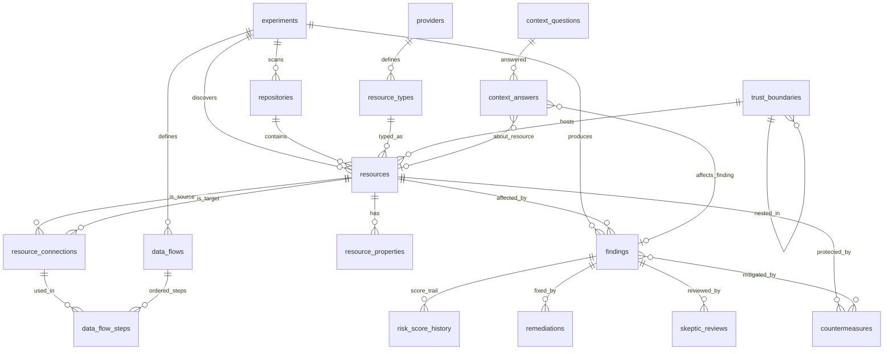

# Database Schema Documentation

**Location:** `Output/Learning/triage.db`
**Type:** SQLite 3
**Purpose:** Single source of truth for assets, findings, context, flows, countermeasures, and scoring. Scripts read/write this DB at every phase. LLM enrichment is additive and idempotent — once a finding is enriched it is never re-processed unless new context explicitly invalidates it.

---

## Design Principles

1. **Scripts first, LLM second.** opengrep and discovery scripts populate the DB without any LLM calls. A useful (if plain) report can always be generated from scan data alone.
2. **LLM enriches once.** The LLM reads raw DB rows, adds description, reasoning, severity, flows and remediations, and writes back. Subsequent report renders read the DB — no LLM needed.
3. **Scores are snapshots.** `findings.severity_score` is the *current* score. Every change (initial scan, Dev Skeptic, Platform Skeptic, new context) appends a row to `risk_score_history` so the full audit trail is preserved.
4. **Context is structured.** Auth method, encryption, trust boundary membership, and data flows are first-class columns/rows — not free text buried in markdown.
5. **Re-run is cheap.** Before calling the LLM, scripts check `findings.llm_enriched_at IS NOT NULL`. If already enriched and no invalidating context has changed, skip.

---


> **Pipeline & scripts reference:** See [Pipeline.md](Pipeline.md)

---

## Entity Relationship Diagram



---

## Table Reference

### `experiments`
Tracks each scan session — agent versions, strategy, metrics, and outcome.

| Column | Type | Notes |
|--------|------|-------|
| `id` | TEXT PK | e.g. `"002"` |
| `name` | TEXT | Human name |
| `status` | TEXT | `running` / `completed` / `failed` |
| `repos` | TEXT | JSON array of repo names |
| `strategy_version` | TEXT | Agent strategy hash |
| `started_at` | TIMESTAMP | |
| `completed_at` | TIMESTAMP | |
| `findings_count` | INT | Total findings |
| `high_value_count` | INT | Score ≥ 7 |
| `avg_score` | REAL | |
| `accuracy_rate` | REAL | After human validation |
| `notes` | TEXT | Free text |

---

### `repositories`
One row per repo per experiment.

| Column | Type | Notes |
|--------|------|-------|
| `id` | INTEGER PK | |
| `experiment_id` | TEXT FK | → `experiments.id` |
| `repo_name` | TEXT | Folder name only, no path |
| `repo_url` | TEXT | Git remote URL |
| `repo_type` | TEXT | `Infrastructure` / `Application` / `Mixed` |
| `primary_language` | TEXT | Terraform / Python / Java / etc. |
| `files_scanned` | INT | |
| `iac_files_count` | INT | |
| `code_files_count` | INT | |
| `scanned_at` | TIMESTAMP | |

---

### `trust_boundaries`
Security perimeters that assets live inside. Supports nesting (VNet inside Subscription).

| Column | Type | Notes |
|--------|------|-------|
| `id` | INTEGER PK | |
| `experiment_id` | TEXT FK | → `experiments.id` |
| `name` | TEXT | e.g. `"web_vpc"`, `"prod-vnet"`, `"Internet"` |
| `boundary_type` | TEXT | `Internet` / `Subscription` / `VirtualNetwork` / `Subnet` / `PaaS` / `DMZ` / `Container` |
| `provider` | TEXT | Azure / AWS / GCP |
| `parent_boundary_id` | INT FK | → `trust_boundaries.id` for nesting |
| `is_public` | BOOLEAN | True if reachable from Internet without explicit control |
| `notes` | TEXT | |

**Usage:** Resources gain a `trust_boundary_id` FK. The boundary type determines diagram grouping and blast-radius scope. `is_public=true` boundaries flag assets for prioritised review.

---

## Lookup Tables

These are static seed tables. They are pre-populated by `init_database.py` and rarely change. Using integer FKs instead of repeating raw strings in every resource/finding row keeps the DB lean and makes display logic centralised.

---

### `providers`
Cloud and IaC providers. One row per provider — referenced by `resource_types` and optionally by `resources` for cross-provider queries.

| Column | Type | Notes |
|--------|------|-------|
| `id` | INTEGER PK | |
| `key` | TEXT UNIQUE | Internal key: `azure` / `aws` / `gcp` / `alicloud` / `oracle` |
| `friendly_name` | TEXT | e.g. `Microsoft Azure`, `Amazon Web Services` |
| `icon` | TEXT | Emoji shorthand for diagrams: ☁️ / 🟠 / 🔵 |

**Seed data:**

| key | friendly_name | icon |
|-----|--------------|------|
| `azure` | Microsoft Azure | ☁️ |
| `aws` | Amazon Web Services | 🟠 |
| `gcp` | Google Cloud Platform | 🔵 |
| `alicloud` | Alibaba Cloud | 🟡 |
| `oracle` | Oracle Cloud | 🔴 |

---

### `resource_types`
Maps Terraform/ARM resource type strings to human-readable labels, categories, and icons. One row per known resource type. New types discovered at scan time are auto-inserted with `friendly_name = resource_type` as fallback until manually or LLM-updated.

| Column | Type | Notes |
|--------|------|-------|
| `id` | INTEGER PK | |
| `provider_id` | INT FK | → `providers.id` |
| `terraform_type` | TEXT UNIQUE | Raw type string, e.g. `azurerm_key_vault` |
| `friendly_name` | TEXT | Human label, e.g. `Key Vault` |
| `category` | TEXT | `Compute` / `Storage` / `Database` / `Network` / `Identity` / `Monitoring` / `Container` / `Messaging` / `Security` |
| `icon` | TEXT | Emoji for diagram labels, e.g. `🔑` |
| `is_data_store` | BOOLEAN | True for databases, storage, queues — affects blast radius weighting |
| `is_internet_facing_capable` | BOOLEAN | True if this type can be exposed publicly (helps filter for review) |

**Sample seed rows:**

| terraform_type | friendly_name | category | icon |
|----------------|--------------|----------|------|
| `azurerm_key_vault` | Key Vault | Identity | 🔑 |
| `azurerm_storage_account` | Storage Account | Storage | 🗄️ |
| `azurerm_mssql_server` | SQL Server | Database | 🗃️ |
| `azurerm_mssql_database` | SQL Database | Database | 🗃️ |
| `azurerm_kubernetes_cluster` | AKS Cluster | Container | ☸️ |
| `azurerm_application_gateway` | Application Gateway | Network | 🌐 |
| `azurerm_virtual_network` | Virtual Network | Network | 🔷 |
| `azurerm_linux_virtual_machine` | Linux VM | Compute | 🖥️ |
| `aws_s3_bucket` | S3 Bucket | Storage | 🗄️ |
| `aws_rds_cluster` | RDS Cluster | Database | 🗃️ |
| `aws_lambda_function` | Lambda Function | Compute | ⚡ |
| `aws_security_group` | Security Group | Network | 🛡️ |
| `aws_iam_role` | IAM Role | Identity | 👤 |
| `google_sql_database_instance` | Cloud SQL Instance | Database | 🗃️ |
| `google_storage_bucket` | GCS Bucket | Storage | 🗄️ |
| `google_container_cluster` | GKE Cluster | Container | ☸️ |

> **Auto-insert for unknown types:** If `discover_repo_context.py` encounters a `terraform_type` not in this table, it inserts a row with `friendly_name = terraform_type` and `category = 'Unknown'`. This row can be corrected manually or by the LLM enrichment pass.

---

### `resources`
Every discovered asset. References `resource_type_id` (FK to lookup) instead of storing raw type strings. `resource_name` is the actual name from IaC (e.g. `vm-bob`, `prod-keyvault-01`) — this is what humans recognise.

| Column | Type | Notes |
|--------|------|-------|
| `id` | INTEGER PK | |
| `experiment_id` | TEXT FK | → `experiments.id` |
| `repo_id` | INT FK | → `repositories.id` |
| `trust_boundary_id` | INT FK | → `trust_boundaries.id` |
| `resource_type_id` | INT FK | → `resource_types.id` |
| `resource_name` | TEXT | **Real name from IaC** — e.g. `vm-bob`, `prod-kv-01` |
| `display_label` | TEXT | Diagram label: auto-set to `"{resource_name} ({friendly_name})"` |
| `region` | TEXT | |
| `purpose` | TEXT | LLM-populated: what this resource does in business context |
| `parent_resource_id` | INT FK | → `resources.id` for hierarchical nesting |
| `source_file` | TEXT | Repo-relative path |
| `source_line_start` | INT | |
| `source_line_end` | INT | |
| `status` | TEXT | `active` / `deleted` / `unknown` |
| `first_seen` | TIMESTAMP | |
| `last_seen` | TIMESTAMP | |

**`display_label` examples:**

| resource_name | friendly_name (from lookup) | display_label in diagrams |
|---|---|---|
| `vm-bob` | Linux VM | `vm-bob (Linux VM)` |
| `prod-kv-01` | Key Vault | `prod-kv-01 (Key Vault)` |
| `mssql1-dev` | SQL Server | `mssql1-dev (SQL Server)` |
| `terragoat-vpc` | Virtual Network | `terragoat-vpc (Virtual Network)` |

> `display_label` is a stored computed column (updated by script). Diagrams always use `display_label` — never raw `resource_name` or `terraform_type` alone.

---

### `resource_properties`
Key-value attributes for a resource. Populated by scripts from IaC; no schema change needed for new resource types.

| Column | Type | Notes |
|--------|------|-------|
| `id` | INTEGER PK | |
| `resource_id` | INT FK | → `resources.id` |
| `property_key` | TEXT | e.g. `enable_https_traffic_only`, `sku_name`, `ip_rules` |
| `property_value` | TEXT | Value as string |
| `property_type` | TEXT | `security` / `network` / `identity` / `compute` / `storage` / `config` |
| `is_security_relevant` | BOOLEAN | Flag for report filtering |
| `populated_by` | TEXT | `script` / `llm` / `human` |

**Example rows for an Azure Storage Account:**

| property_key | property_value | property_type | is_security_relevant |
|---|---|---|---|
| `enable_https_traffic_only` | `false` | security | true |
| `allow_blob_public_access` | `true` | security | true |
| `min_tls_version` | `TLS1_0` | security | true |
| `account_tier` | `Standard` | config | false |

---

### `resource_connections`
Topology links between assets — network paths, data access, management relationships.

| Column | Type | Notes |
|--------|------|-------|
| `id` | INTEGER PK | |
| `experiment_id` | TEXT FK | → `experiments.id` |
| `source_resource_id` | INT FK | → `resources.id` |
| `target_resource_id` | INT FK | → `resources.id` |
| `connection_type` | TEXT | `accesses` / `routes_to` / `manages` / `reads_from` / `writes_to` / `authenticates_via` |
| `protocol` | TEXT | HTTPS / TDS / AMQP / gRPC / SSH / etc. |
| `port` | TEXT | |
| `auth_method` | TEXT | `ManagedIdentity` / `JWT` / `SASToken` / `APIKey` / `SQLAuth` / `None` |
| `is_encrypted` | BOOLEAN | |
| `ip_restricted` | BOOLEAN | True if access list / private endpoint enforced |
| `via_component` | TEXT | Intermediate component name, e.g. `"WAF"`, `"App Gateway"`, `"API Management"` |
| `is_cross_repo` | BOOLEAN | |
| `notes` | TEXT | |

**Example — request path to an API:**
```
Internet → (via_component=WAF) → App Gateway → API App Service
  connection_type: routes_to
  auth_method: JWT
  is_encrypted: true
  ip_restricted: false
```

---

### `data_flows`
Named end-to-end flows describing how data or requests move through the system.

| Column | Type | Notes |
|--------|------|-------|
| `id` | INTEGER PK | |
| `experiment_id` | TEXT FK | → `experiments.id` |
| `name` | TEXT | e.g. `"User Authentication Flow"`, `"Storage Write Flow"` |
| `flow_type` | TEXT | `auth` / `data` / `admin` / `ingress` / `egress` |
| `description` | TEXT | LLM-authored plain-English description |
| `populated_by` | TEXT | `script` / `llm` |

---

### `data_flow_steps`
Ordered hops within a data flow. Each step references a `resource_connection`.

| Column | Type | Notes |
|--------|------|-------|
| `id` | INTEGER PK | |
| `flow_id` | INT FK | → `data_flows.id` |
| `step_order` | INT | 1, 2, 3… |
| `connection_id` | INT FK | → `resource_connections.id` |
| `step_label` | TEXT | Human label, e.g. `"TLS termination at WAF"` |
| `security_note` | TEXT | Any security observation at this hop |

---

### `findings`
One row per unique issue per asset. Scripts write raw rows (rule_id, file, line, snippet). LLM fills enrichment columns on first pass.

| Column | Type | Notes |
|--------|------|-------|
| `id` | INTEGER PK | |
| `experiment_id` | TEXT FK | → `experiments.id` |
| `repo_id` | INT FK | → `repositories.id` |
| `resource_id` | INT FK | → `resources.id` |
| `rule_id` | TEXT | opengrep rule that fired, e.g. `azure-storage-logging-disabled` |
| `title` | TEXT | Short display title |
| `description` | TEXT | LLM-authored: what is wrong and why it matters |
| `reason` | TEXT | LLM-authored: root cause / insecure pattern |
| `category` | TEXT | `Encryption` / `Access Control` / `Logging` / `Network` / `Identity` / `Secrets` |
| `code_snippet` | TEXT | Relevant lines from source file |
| `source_file` | TEXT | Repo-relative path |
| `source_line_start` | INT | |
| `source_line_end` | INT | |
| `severity_score` | INT | Current score (1–10); reflects latest skeptic input |
| `base_severity` | TEXT | `Critical` / `High` / `Medium` / `Low` |
| `status` | TEXT | `raw` / `enriched` / `reviewed` / `accepted` / `false_positive` / `fixed` |
| `finding_path` | TEXT | Path to generated MD file |
| `llm_enriched_at` | TIMESTAMP | NULL = not yet enriched; set to skip re-processing |
| `created_at` | TIMESTAMP | |
| `updated_at` | TIMESTAMP | |

**Status lifecycle:** `raw` → (LLM) → `enriched` → (Skeptics) → `reviewed` → (human) → `accepted` / `false_positive` / `fixed`

---

### `risk_score_history`
Immutable append-only score snapshots. Current score = most recent row for a finding.

| Column | Type | Notes |
|--------|------|-------|
| `id` | INTEGER PK | |
| `finding_id` | INT FK | → `findings.id` |
| `score` | INT | Score at this point in time (1–10) |
| `snapshot_reason` | TEXT | `initial_scan` / `llm_enrichment` / `dev_skeptic` / `platform_skeptic` / `new_context` / `countermeasure_added` / `human_override` |
| `delta` | INT | Change from previous snapshot (+/-) |
| `notes` | TEXT | Reason for change |
| `recorded_at` | TIMESTAMP | |
| `recorded_by` | TEXT | `script` / `llm` / `dev_skeptic` / `platform_skeptic` / `human` |

---

### `remediations`
Proposed fixes for a finding. Multiple options can exist per finding (e.g. quick fix vs. architectural fix).

| Column | Type | Notes |
|--------|------|-------|
| `id` | INTEGER PK | |
| `finding_id` | INT FK | → `findings.id` |
| `title` | TEXT | Short fix description |
| `fix_description` | TEXT | Full remediation steps |
| `fix_type` | TEXT | `config_change` / `code_change` / `architecture` / `policy` |
| `effort` | TEXT | `low` / `medium` / `high` |
| `score_delta_est` | INT | Expected score reduction if applied |
| `terraform_snippet` | TEXT | Ready-to-use Terraform fix snippet where applicable |
| `status` | TEXT | `proposed` / `accepted` / `in_progress` / `implemented` / `wontfix` |
| `proposed_by` | TEXT | `llm` / `human` |
| `created_at` | TIMESTAMP | |

---

### `countermeasures`
Existing controls that reduce the risk of a finding. Reduces effective score.

| Column | Type | Notes |
|--------|------|-------|
| `id` | INTEGER PK | |
| `resource_id` | INT FK | → `resources.id` |
| `finding_id` | INT FK | → `findings.id` (NULL = applies generally to resource) |
| `control_type` | TEXT | `Preventive` / `Detective` / `Corrective` |
| `control_name` | TEXT | e.g. `WAF`, `Managed Identity`, `Private Endpoint`, `IP Restriction` |
| `control_category` | TEXT | `Network` / `Identity` / `Encryption` / `Monitoring` |
| `effectiveness` | REAL | 0.0–1.0 (1.0 = fully mitigates) |
| `evidence_source` | TEXT | Where confirmed (IaC file, policy, manual) |
| `notes` | TEXT | |
| `verified_at` | TIMESTAMP | |

---

### `skeptic_reviews`
One row per reviewer role per finding. Captures score adjustments and reasoning.

| Column | Type | Notes |
|--------|------|-------|
| `id` | INTEGER PK | |
| `finding_id` | INT FK | → `findings.id` |
| `role` | TEXT | `dev` / `platform` / `security` |
| `score_adjustment` | INT | Positive = raise score, negative = lower |
| `final_score_recommendation` | INT | Absolute recommended score |
| `reasoning` | TEXT | Why the score was adjusted |
| `assumptions_challenged` | TEXT | Which LLM assumptions were wrong |
| `missing_context` | TEXT | What context was not available |
| `how_could_be_worse` | TEXT | Dev: realistic escalation scenario |
| `operational_constraints` | TEXT | Platform: deployment/rollback constraints |
| `countermeasure_notes` | TEXT | Effectiveness of existing controls |
| `reviewed_at` | TIMESTAMP | |
| `reviewed_by` | TEXT | `llm` / `human` |

---

### `context_questions` and `context_answers`
Reusable questions that improve scoring accuracy. Answers link to specific resources or findings.

**`context_questions`**

| Column | Type | Notes |
|--------|------|-------|
| `id` | INTEGER PK | |
| `question_key` | TEXT UNIQUE | e.g. `is_internet_facing` |
| `question_text` | TEXT | Full question |
| `question_category` | TEXT | `network` / `identity` / `data` / `environment` |
| `applies_to_resource_types` | TEXT | Comma-separated resource types |
| `impacts_risk_score` | BOOLEAN | |
| `score_adjustment_range` | TEXT | e.g. `"-3 to +3"` |
| `priority` | INT | |

**`context_answers`**

| Column | Type | Notes |
|--------|------|-------|
| `id` | INTEGER PK | |
| `experiment_id` | TEXT FK | → `experiments.id` |
| `question_id` | INT FK | → `context_questions.id` |
| `resource_id` | INT FK | → `resources.id` (NULL = global) |
| `finding_id` | INT FK | → `findings.id` (NULL = applies to resource generally) |
| `answer_value` | TEXT | |
| `answer_confidence` | TEXT | `confirmed` / `assumed` / `unknown` |
| `evidence_source` | TEXT | IaC file / interview / policy doc |
| `findings_affected` | TEXT | JSON array of finding IDs whose scores changed |
| `score_adjustments` | TEXT | JSON: `{"finding_id": delta}` |
| `answered_by` | TEXT | `llm` / `human` |
| `answered_at` | TIMESTAMP | |
| `validated` | BOOLEAN | |

---

## Useful Queries

### Current risk score for all findings
```sql
SELECT f.title, r.display_label, rt.friendly_name AS asset_type,
       h.score, h.snapshot_reason, h.recorded_at
FROM findings f
JOIN resources r ON f.resource_id = r.id
JOIN resource_types rt ON r.resource_type_id = rt.id
JOIN risk_score_history h ON h.finding_id = f.id
WHERE h.id IN (
  SELECT MAX(id) FROM risk_score_history GROUP BY finding_id
)
ORDER BY h.score DESC;
```

### Findings not yet LLM-enriched (ready to process)
```sql
SELECT f.id, f.rule_id, f.source_file, f.source_line_start, r.resource_name
FROM findings f
JOIN resources r ON f.resource_id = r.id
WHERE f.llm_enriched_at IS NULL
ORDER BY f.created_at;
```

### Findings needing skeptic review
```sql
SELECT f.id, f.title, f.severity_score, f.status
FROM findings f
WHERE f.status = 'enriched'
  AND NOT EXISTS (
    SELECT 1 FROM skeptic_reviews s WHERE s.finding_id = f.id AND s.role = 'dev'
  );
```

### Full request path for a service (data flow trace)
```sql
SELECT df.name, dfs.step_order, dfs.step_label,
       src.resource_name AS from_resource,
       tgt.resource_name AS to_resource,
       rc.auth_method, rc.is_encrypted, rc.via_component
FROM data_flows df
JOIN data_flow_steps dfs ON dfs.flow_id = df.id
JOIN resource_connections rc ON rc.id = dfs.connection_id
JOIN resources src ON rc.source_resource_id = src.id
JOIN resources tgt ON rc.target_resource_id = tgt.id
WHERE df.name = 'User Authentication Flow'
ORDER BY dfs.step_order;
```

### Assets in a trust boundary with open findings
```sql
SELECT tb.name AS boundary, tb.boundary_type,
       r.display_label, rt.friendly_name AS asset_type, rt.icon,
       COUNT(f.id) AS open_findings,
       MAX(f.severity_score) AS highest_score
FROM trust_boundaries tb
JOIN resources r ON r.trust_boundary_id = tb.id
JOIN resource_types rt ON r.resource_type_id = rt.id
LEFT JOIN findings f ON f.resource_id = r.id AND f.status NOT IN ('fixed','false_positive')
GROUP BY tb.id, r.id
ORDER BY highest_score DESC NULLS LAST;
```

### Score change history for a finding
```sql
SELECT h.recorded_at, h.score, h.delta, h.snapshot_reason, h.recorded_by, h.notes
FROM risk_score_history h
WHERE h.finding_id = ?
ORDER BY h.recorded_at;
```

### Countermeasure coverage — which findings have mitigating controls
```sql
SELECT f.title, f.severity_score,
       GROUP_CONCAT(c.control_name, ', ') AS controls,
       AVG(c.effectiveness) AS avg_effectiveness
FROM findings f
LEFT JOIN countermeasures c ON c.finding_id = f.id
GROUP BY f.id
ORDER BY f.severity_score DESC;
```

### Blast radius from a compromised resource
```sql
WITH RECURSIVE blast(resource_id, depth) AS (
  SELECT id, 0 FROM resources WHERE resource_name = 'my-api'
  UNION
  SELECT rc.target_resource_id, b.depth + 1
  FROM resource_connections rc
  JOIN blast b ON rc.source_resource_id = b.resource_id
  WHERE b.depth < 5
)
SELECT DISTINCT r.resource_name, r.resource_type, b.depth,
       COUNT(f.id) AS findings
FROM blast b
JOIN resources r ON r.id = b.resource_id
LEFT JOIN findings f ON f.resource_id = r.id
GROUP BY r.id

---

## Maintenance

```bash
# Initialise or migrate schema (safe on existing DB)
python3 Scripts/init_database.py

# Backup before migrations
cp Output/Learning/triage.db Output/Learning/triage_backup_$(date +%Y%m%d).db
```
