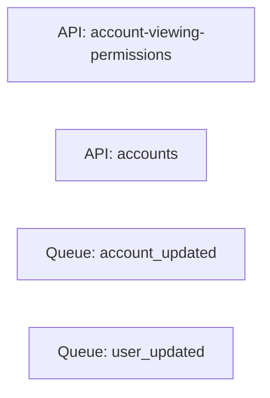
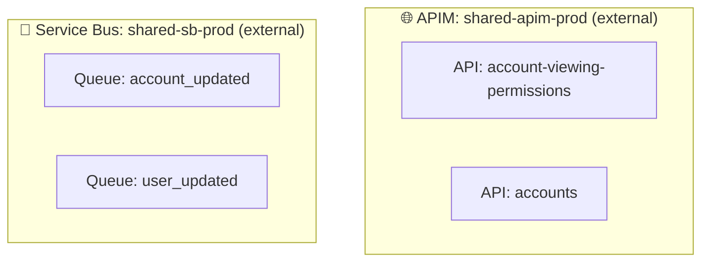

# External Resource Hierarchy Detection - Multi-Cloud

## Problem
Microservice repos reference shared infrastructure resources via variables or data sources, but detection scripts don't recognize these as parent-child relationships. This results in flat architecture diagrams instead of hierarchical views.

## Examples Across Cloud Providers

### Azure
```terraform
resource "azurerm_api_management_api" "my_api" {
  api_management_name = var.apim_name  # Parent: APIM instance
}

resource "azurerm_servicebus_queue" "my_queue" {
  namespace_id = data.azurerm_servicebus_namespace.shared.id  # Parent: Namespace
}

resource "azurerm_mssql_database" "my_db" {
  server_id = var.sql_server_id  # Parent: SQL Server
}
```

### AWS
```terraform
resource "aws_api_gateway_resource" "my_resource" {
  rest_api_id = var.api_gateway_id  # Parent: API Gateway
}

resource "aws_sqs_queue" "my_queue" {
  name = "my-queue"
  # Parent: AWS account (implicit)
}

resource "aws_db_instance_replica" "my_replica" {
  replicate_source_db = var.primary_rds_id  # Parent: RDS instance
}
```

### GCP
```terraform
resource "google_cloud_run_service" "my_service" {
  project = var.project_id  # Parent: GCP Project
}

resource "google_pubsub_subscription" "my_sub" {
  topic = google_pubsub_topic.shared.id  # Parent: Pub/Sub Topic
}

resource "google_sql_database" "my_db" {
  instance = var.cloud_sql_instance  # Parent: Cloud SQL instance
}
```

## Common Patterns

### Pattern 1: Variable References (Most Common)
```terraform
resource "child_resource" "name" {
  parent_reference = var.parent_name
}
```

### Pattern 2: Data Source References
```terraform
data "parent_resource" "shared" {
  name = "shared-parent"
}

resource "child_resource" "name" {
  parent_reference = data.parent_resource.shared.id
}
```

### Pattern 3: Cross-Module References
```terraform
module "shared" {
  source = "../shared-infra"
}

resource "child_resource" "name" {
  parent_reference = module.shared.parent_id
}
```

## Parent-Child Mappings (Multi-Cloud)

### Azure
| Child Resource | Parent Field | Parent Resource Type |
|---|---|---|
| `azurerm_api_management_api` | `api_management_name` | `azurerm_api_management` |
| `azurerm_api_management_api_operation` | (via API) | `azurerm_api_management_api` |
| `azurerm_api_management_api_policy` | (via API) | `azurerm_api_management_api` |
| `azurerm_servicebus_queue` | `namespace_id` | `azurerm_servicebus_namespace` |
| `azurerm_servicebus_subscription` | `topic_id` | `azurerm_servicebus_topic` |
| `azurerm_mssql_database` | `server_id` | `azurerm_mssql_server` |
| `azurerm_storage_container` | `storage_account_name` | `azurerm_storage_account` |
| `azurerm_storage_blob` | (via container) | `azurerm_storage_container` |
| `azurerm_kubernetes_namespace` | (via cluster) | `azurerm_kubernetes_cluster` |
| `azurerm_subnet` | `virtual_network_name` | `azurerm_virtual_network` |
| `azurerm_network_security_rule` | `network_security_group_name` | `azurerm_network_security_group` |

### AWS
| Child Resource | Parent Field | Parent Resource Type |
|---|---|---|
| `aws_api_gateway_resource` | `rest_api_id` | `aws_api_gateway_rest_api` |
| `aws_api_gateway_method` | (via resource) | `aws_api_gateway_resource` |
| `aws_sqs_queue` | (implicit) | AWS Account |
| `aws_lambda_function` | (implicit) | AWS Account |
| `aws_db_instance_replica` | `replicate_source_db` | `aws_db_instance` |
| `aws_ecs_service` | `cluster` | `aws_ecs_cluster` |
| `aws_ecs_task_definition` | (via service) | `aws_ecs_service` |
| `aws_s3_bucket_object` | `bucket` | `aws_s3_bucket` |
| `aws_subnet` | `vpc_id` | `aws_vpc` |
| `aws_security_group_rule` | `security_group_id` | `aws_security_group` |

### GCP
| Child Resource | Parent Field | Parent Resource Type |
|---|---|---|
| `google_cloud_run_service` | `project` | GCP Project |
| `google_pubsub_subscription` | `topic` | `google_pubsub_topic` |
| `google_sql_database` | `instance` | `google_sql_database_instance` |
| `google_compute_instance` | `network` | `google_compute_network` |
| `google_compute_subnetwork` | `network` | `google_compute_network` |
| `google_container_node_pool` | `cluster` | `google_container_cluster` (GKE) |
| `google_storage_bucket_object` | `bucket` | `google_storage_bucket` |

## Detection Algorithm

```python
# 1. Parse child resource
resource = parse_terraform_resource(block)

# 2. Lookup parent field from mapping
parent_field = PARENT_CHILD_MAP.get(resource.type)

# 3. Extract parent reference
parent_ref = resource.attributes.get(parent_field)

# 4. Determine if external (var/data/module)
if parent_ref.startswith("var."):
    # External via variable
    parent_name = resolve_variable(parent_ref)
    parent = create_or_find_external_resource(parent_type, parent_name)
    
elif parent_ref.startswith("data."):
    # External via data source
    parent = parse_data_source(parent_ref)
    
elif parent_ref.startswith("module."):
    # External via module output
    parent = resolve_module_output(parent_ref)
    
else:
    # Local resource reference
    parent = find_local_resource(parent_ref)

# 5. Link child to parent
resource.parent_resource_id = parent.id
```

## Implementation Files

### New: `Scripts/Context/external_resource_hierarchy.py`
- Multi-cloud parent-child mappings
- Variable/data source resolution
- External resource placeholder creation

### Update: `Scripts/Context/discover_repo_context.py`
- Import hierarchy detection module
- Apply parent-child linking after resource discovery
- Create external resource nodes

### Update: `Scripts/Generate/generate_diagram.py`
- Generate hierarchical diagrams with subgraphs
- Style external resources differently (dashed border)
- Group children under parent containers

## Diagram Output Examples

### Before (Flat)


### After (Hierarchical)


## Configuration File Format

```yaml
# Scripts/Context/resource_hierarchy_config.yml
azure:
  azurerm_api_management:
    children:
      - resource_type: azurerm_api_management_api
        parent_field: api_management_name
      - resource_type: azurerm_api_management_product
        parent_field: api_management_name
        
  azurerm_servicebus_namespace:
    children:
      - resource_type: azurerm_servicebus_queue
        parent_field: namespace_id
      - resource_type: azurerm_servicebus_topic
        parent_field: namespace_id

aws:
  aws_api_gateway_rest_api:
    children:
      - resource_type: aws_api_gateway_resource
        parent_field: rest_api_id
        
  aws_ecs_cluster:
    children:
      - resource_type: aws_ecs_service
        parent_field: cluster

gcp:
  google_pubsub_topic:
    children:
      - resource_type: google_pubsub_subscription
        parent_field: topic
```

## Benefits

1. **Accurate architecture diagrams** - Show true resource relationships
2. **Cross-cloud consistency** - Same logic for Azure/AWS/GCP
3. **Better blast radius analysis** - "If APIM instance compromised, which APIs affected?"
4. **Improved context** - Security reviews understand resource scope
5. **Maintainable** - YAML config file, not hardcoded logic

## Next Steps

1. Create `external_resource_hierarchy.py` with multi-cloud mappings
2. Create `resource_hierarchy_config.yml` with parent-child relationships
3. Update `discover_repo_context.py` to detect and link hierarchies
4. Update `generate_diagram.py` to render subgraphs
5. Test on account-viewing-permissions (should show APIM → API → Operations hierarchy)
