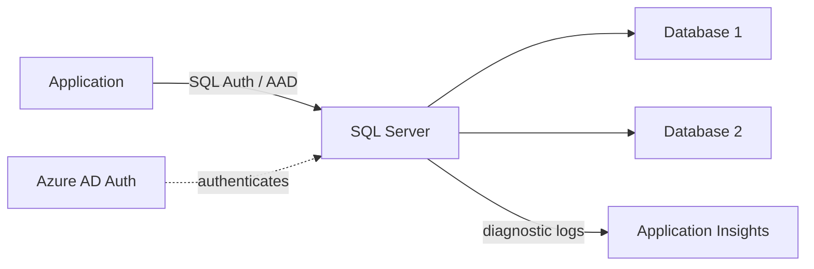
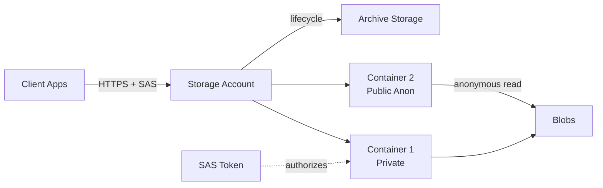
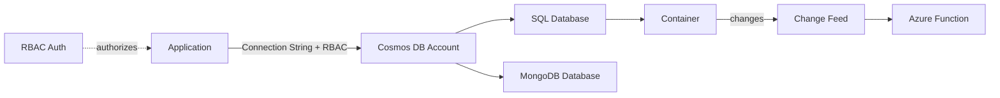
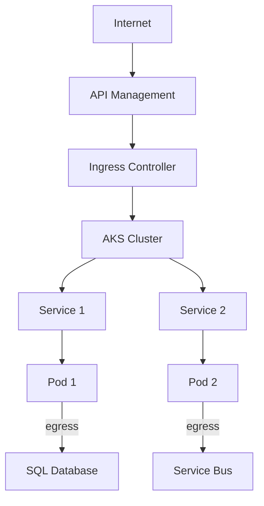
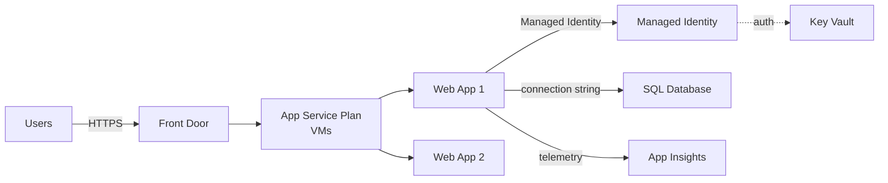
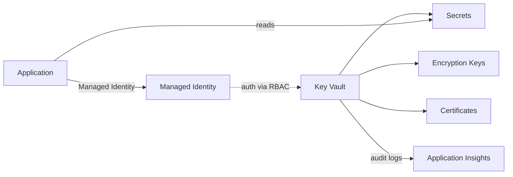
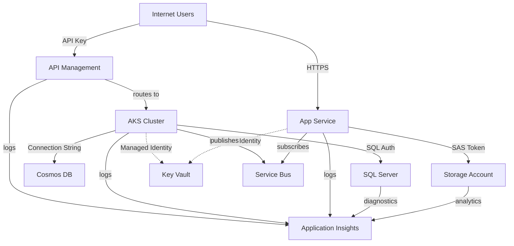

# Service Pattern Theory - Real-World Examples

This document demonstrates how the service pattern system handles complex, real-world scenarios.

## Pattern Theory Validation

### ✅ SQL Server Pattern
**Theory:** Server → Databases → Users/Auth → Logging

**Reality:**
```
azurerm_mssql_server (parent)
├── azurerm_mssql_database (children)
├── azurerm_sql_active_directory_administrator (auth)
├── azurerm_mssql_firewall_rule (ingress control)
└── azurerm_monitor_diagnostic_setting (egress to logs)
```

**Ingress:** Applications → SQL Server (port 1433)  
**Auth:** SQL Auth, Azure AD, IAM, SSL Certificates  
**Egress:** Logs → Application Insights / Log Analytics  

**Architecture Flow:**


---

### ✅ Storage Account Pattern
**Theory:** Account → Containers → Blobs (with anon access option)

**Reality:**
```
azurerm_storage_account (parent)
├── azurerm_storage_container (children with access control)
│   └── azurerm_storage_blob (objects)
├── azurerm_storage_queue (messaging)
├── azurerm_storage_table (NoSQL)
├── azurerm_storage_account_sas (auth - SAS tokens)
└── azurerm_storage_account_network_rules (ingress control)
```

**Ingress:** Client → Containers (HTTPS)  
**Auth:** SAS Tokens, Access Keys, Azure AD, Anonymous (configurable)  
**Egress:** Lifecycle → Archive tier, Replication → Secondary region  

**Architecture Flow:**


---

### ✅ Cosmos DB Pattern
**Theory:** Account → Databases → Containers (auth required, no anon)

**Reality:**
```
azurerm_cosmosdb_account (parent)
├── azurerm_cosmosdb_sql_database (children - SQL API)
│   └── azurerm_cosmosdb_sql_container (with partition key)
├── azurerm_cosmosdb_mongo_database (MongoDB API)
│   └── azurerm_cosmosdb_mongo_collection
├── azurerm_cosmosdb_sql_role_assignment (auth - RBAC)
└── azurerm_cosmosdb_sql_role_definition (custom roles)
```

**Ingress:** Application → Cosmos DB (HTTPS, port 443 or 10255)  
**Auth:** Connection String, RBAC, Resource Tokens (NO anonymous access)  
**Egress:** Change Feed → Functions, Replication → Secondary regions  

**Architecture Flow:**


---

### ✅ AKS Cluster Pattern
**Theory:** Cluster (API access) → Services (ingress) → Pods (egress)

**Reality:**
```
azurerm_kubernetes_cluster (parent - has API endpoint)
├── azurerm_kubernetes_cluster_node_pool (compute nodes)
├── kubernetes_deployment (workloads)
├── kubernetes_service (internal routing)
├── kubernetes_ingress (external access)
├── kubernetes_config_map (config)
├── kubernetes_secret (sensitive data)
└── kubernetes_network_policy (egress control)
```

**Ingress:**  
- Cluster API → kubectl/CI-CD (Azure AD / certificate auth)  
- Ingress Controller → Services → Pods (HTTP/HTTPS)  

**Egress:**  
- Pods → External APIs, Databases, Storage  
- Pods → Service Bus, Event Hub  

**Architecture Flow:**


---

### ✅ App Service Pattern
**Theory:** App Service Plan (VM) → App Services

**Reality:**
```
azurerm_service_plan (parent - hosted on VMs)
├── azurerm_linux_web_app (app 1)
├── azurerm_windows_web_app (app 2)
├── azurerm_linux_function_app (serverless)
├── azurerm_web_app_deployment_slot (staging)
└── azurerm_app_service_virtual_network_swift_connection (VNet integration)
```

**Ingress:** HTTPS → App Service (port 443/80)  
**Auth:** Managed Identity, App Settings, Connection Strings  
**Egress:**  
- App → SQL Database (via VNet or public endpoint)  
- App → Storage Account  
- App → Service Bus  
- Logs → Application Insights  

**Architecture Flow:**


---

### ✅ Key Vault + Logging Pattern
**Theory:** Vault → Secrets/Keys → Logs to App Insights

**Reality:**
```
azurerm_key_vault (parent)
├── azurerm_key_vault_secret (sensitive strings)
├── azurerm_key_vault_key (encryption keys)
├── azurerm_key_vault_certificate (TLS certs)
├── azurerm_key_vault_access_policy (auth)
└── azurerm_monitor_diagnostic_setting (egress to logs)
```

**Ingress:** Applications → Key Vault (HTTPS)  
**Auth:** Access Policies, RBAC, Managed Identity  
**Egress:** Audit Logs → Application Insights / Log Analytics  

**Architecture Flow:**


---

## Cross-Service Integration Example

**Scenario:** Complete web application stack



---

## Pattern Coverage Matrix

| Pattern | Parent | Children | Ingress | Auth | Egress | Azure | AWS | GCP |
|---------|--------|----------|---------|------|--------|-------|-----|-----|
| **API Gateway** | APIM/Gateway | Operations | Internet/Client | API Key, OAuth, JWT | Backends | ✅ | ✅ | ✅ |
| **Storage** | Account/Bucket | Containers, Blobs | Client | SAS, IAM, Anon | Lifecycle, Replication | ✅ | ✅ | ✅ |
| **Messaging** | Namespace | Topics, Queues | Apps | Connection String | Subscriptions | ✅ | ✅ | ✅ |
| **Database** | Server | Databases | Apps | SQL, AAD, SSL | Logs, Replicas | ✅ | ✅ | ✅ |
| **Cosmos DB** | Account | Databases, Containers | Apps | RBAC, Tokens | Change Feed | ✅ | ✅ | ✅ |
| **Kubernetes** | Cluster | Pods, Services | Ingress | RBAC, Tokens | External APIs | ✅ | ✅ | ✅ |
| **App Service** | Plan | Web Apps, Functions | HTTPS | Managed Identity | DB, Storage | ✅ | ✅ | ✅ |
| **Key Vault** | Vault | Secrets, Keys | Apps | RBAC, Access Policy | Audit Logs | ✅ | ✅ | ✅ |
| **Monitoring** | Workspace | Metrics, Logs | Telemetry | N/A | Alerts, Actions | ✅ | ✅ | ✅ |
| **Serverless** | Function App | Functions, Triggers | Events | Function Keys | Output Bindings | ✅ | ✅ | ✅ |

---

## Benefits Demonstrated

✅ **Consistent structure** across all cloud providers  
✅ **Automatic grouping** of parent → child hierarchies  
✅ **Ingress detection** for all service types  
✅ **Auth mechanism** identification  
✅ **Egress patterns** for logging, replication, backends  
✅ **Cross-service** integration mapping  
✅ **Scalable** - new services fit existing patterns  

## Pattern Usage in Diagrams

All these patterns are automatically rendered in architecture diagrams with:
- Proper nesting (parent → children)
- Ingress arrows with auth labels
- Egress arrows to databases/storage/messaging
- Consistent icons and colors per service type

The pattern system makes it easy to understand complex architectures at a glance! 🎯
