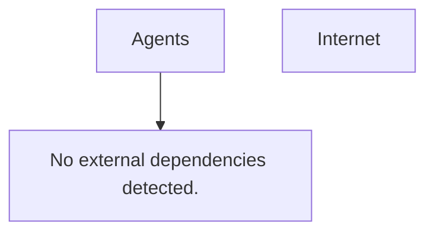

# Repository Summary: Agents

## 🏗️ Architecture

### Legend

Border colors indicate resource categories:
- 🟢 **Green** - Compute/Application (AKS, App Services, Functions)
- 🔵 **Blue** - Data Services (SQL, Storage, Service Bus, Queues)
- 🟣 **Purple** - Network/Security (API Management, Firewall, NSG, Gateway)
- 🟡 **Yellow** - Monitoring (Application Insights, Log Analytics, Alerts)
- 🟠 **Orange** - Identity/Secrets (Key Vault, Managed Identity)

## 📊 TL;DR

| Aspect | Value |
|--------|-------|
| **Languages** | Unknown |
| **Hosting** | Unknown |
| **CI/CD** | Unknown |  
| **Findings tab** | Findings only (risks captured per-finding) |
| **Cloud Providers** | Unknown |
| **Security Status** | 🔍 Phase 1 discovery - security review pending |

**Top Risks:** PHASE 2 TODO - Run security scan to identify risks

## 🗂️ Resource Inventory

- No cloud resources detected.

## ⚠️ Auto-Detected Findings

- No misconfigurations detected by opengrep scan.

## 🔍 Assumptions & Unresolved References

- Knowledge graph not yet populated for this repo.

## 🧭 Overview

### 🔐 Authentication & Identity

- No explicit identity resources detected in Phase 1 extraction.

### 🛡️ Roles & Permission Assignments

- No role assignments detected.

### 🔐 Permissions mapping

- No permissions mapping detected (no 'grants_access_to' relationships captured).

### 🌐 Network Topology

- No explicit network segmentation resources detected.

## 🔌 Ingress Paths

- Fallback: no DB-backed ingress topology signals detected.

## 🔌 Egress Paths  

- Fallback: no DB-backed egress topology signals detected.

## 🔗 External Dependencies

- No external dependencies detected.

## 💡 Key Evidence

- No resources extracted.

## 🔧 Terraform modules

- None detected.

## 📝 Notes

Repository path: `/mnt/c/Repos/Triage-Saurus/Agents`

Extracted resources: 0

Generated from Phase 1 local heuristics.

## 🏷️ Meta Data

- 🗓️ **Generated:** 20/04/2026 11:23
- 🏷️ **Source:** Auto-generated by discover_repo_context.py
- 🦖 **Mode:** Phase 1-2 context discovery only (no LLM, opengrep skipped)
- 📊 **Cloud Providers:** Unknown
- 📂 **Repo Path:** Agents

