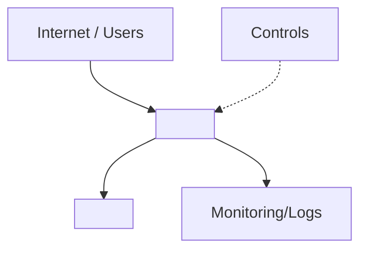

# 🟣 Cloud Finding Template
This document defines the layout for cloud security findings. For formatting
rules, follow `Settings/Styling.md`. For behavioural rules, follow
`Agents/Instructions.md`.

## Workflow Overview
1. **SecurityAgent** runs first, analyses the target, and outputs findings to
   a new file: `Findings/Cloud/Unprotected_Storage_Account.md`.
2. **SecurityAgent** updates `Knowledge/` with any new inferred/confirmed facts
   discovered while writing the finding (inferred facts must be marked as
   **assumptions** and user-verified).
3. **SecurityAgent** generates/updates the relevant architecture diagram under
   `Summary/Cloud/` based on the updated `Knowledge/` (assumptions = dotted border).
4. **Dev** and **Platform** review the findings, each appending their own
   sections under `## 🤔 Skeptic`.
5. **SecurityAgent** reconciles feedback, updates the final score, and appends
   the collaboration summary and metadata.

## Filename Conventions
- **Location:** All findings are stored in `Findings/Cloud/`.
- **Format:** `Findings/Cloud/Unprotected_Storage_Account.md` (use a
  short, Titlecase identifier).
- **Finding title:** Use a short, Titlecase identifier from the finding source
  (e.g., `Unprotected_Storage_Account`).

## File Template
```md
# 🟣 <finding-title>

## 🗺️ Architecture Diagram


- **Description:** <short description>
- **Overall Score:** <severity emoji + label> <score>/10

## 📊 TL;DR - Executive Summary
*(Add this section after Collaboration is complete for quick reference)*

| Aspect | Value |
|--------|-------|
| **Final Score** | <emoji> **X/10** (Risk Level) |
| **Initial Score** | Security Review: X/10 |
| **Adjustments** | Dev: <✅/⬆️/⬇️> → Platform: <✅/⬆️/⬇️> |
| **Key Takeaway** | <one sentence summary of outcome> |

**Top 3 Actions:**
1. <Priority 1 with effort estimate>
2. <Priority 2 with effort estimate>
3. <Priority 3 with effort estimate>

**Material Risks:** <2-3 sentence summary>

**Why Score Changed:** <explain if Dev/Platform adjusted score>

---

## ❓ Validation Required
*(Include this section if there are critical assumptions that need user confirmation)*

**⚠️ <Assumption Topic> (UNCONFIRMED):**
<Description of what was assumed and why it matters>

- Evidence found: <what supports the assumption>
- Evidence NOT found: <what's missing>
- Impact on score: <how confirmation/rejection would change assessment>

**Please confirm:** <specific question for human reviewer>

---

## 🛡️ Security Review
### 🧾 Summary
<brief business impact summary: what it means to the business if this isn’t fixed>

### ✅ Applicability
- **Status:** Yes / No / Don’t know
- **Evidence:** <what makes this true/false>

### ⚠️ Assumptions
- <assumption that could change score/applicability> (mark as Confirmed/Unconfirmed)

### 🔎 Key Evidence
- <evidence bullets with `path:line` references>

### 🎯 Exploitability
<exploitability>

**For encryption/TLS findings, include Data Protection Matrix:**

| Check | Expected | Actual | Result |
|-------|----------|--------|--------|
| Minimum TLS version | 1.2+ | [actual] | ✅/❌ |
| HTTPS-only enforced | Yes | [actual] | ✅/❌ |
| Encryption at rest | Enabled | [actual] | ✅/❌ |
| Customer-managed key | [Required/Optional based on data tier] | [Platform/Customer/None] | ✅/❌ |
| Key rotation policy | [Required period] | [actual] | ✅/❌ |

**Data Classification Context:**
- **Primary Data Type:** [TIER X: Description] - Source: [Schema/API analysis]
- **Compliance Scope:** [PCI-DSS Req 3/4, GDPR Art 32, HIPAA §164.312]
- **Severity Multiplier:** TIER 1 + missing encryption = auto-escalate to CRITICAL

**Common TLS Attack Scenarios (if legacy TLS allowed):**
- BEAST, POODLE, CRIME attacks via downgrade
- Weak cipher suite exploitation (RC4, 3DES)
- MitM via network positioning

**Key Management Risks (if platform-managed keys for regulated data):**
- No customer control over key lifecycle
- Cannot prove exclusive key access (compliance issue)
- No break-glass capability

### ✅ Recommendations
- [ ] <recommendation> — ⬇️ <score>➡️<reduced-score> (est.)

### 🧰 Considered Countermeasures
- 🔴 <countermeasure> — <effectiveness note>
- 🟡 <countermeasure> — <effectiveness note>
- 🟢 <countermeasure> — <effectiveness note>

### 📐 Rationale
<rationale>

## 🧪 Proof of Concept
**[Include this section for demonstrable cloud misconfigurations]**

**Prerequisites:**
- [Azure CLI / AWS CLI / gcloud installed]
- [Access level needed]

### Demonstrate the Risk

```bash
#!/bin/bash
# [What this demonstrates]

# CONFIGURE YOUR ENVIRONMENT
RESOURCE_NAME="[change-this]"
RESOURCE_GROUP="[change-this]"  # Azure
BUCKET_NAME="[change-this]"     # AWS
PROJECT_ID="[change-this]"      # GCP

# [Provider-specific commands from scan]
echo "=== Testing public access ==="
# Azure: az storage blob list --account-name ...
# AWS:   aws s3 ls s3://bucket-name --no-sign-request
# GCP:   curl https://storage.googleapis.com/bucket-name/

echo "Expected: [What you can access that shouldn't be public]"
```

**For TLS verification (encryption findings):**
```bash
# Test legacy TLS (should fail after fix)
openssl s_client -connect <endpoint>:443 -tls1    # Azure/AWS/GCP
openssl s_client -connect <endpoint>:443 -tls1_2  # Should succeed
```

### Verify Impact
[What data/resources can be accessed]

### Test the Fix
```bash
# After applying recommended IaC changes
[Same commands - should now be denied]
```

**Expected after fix:** [Access denied/403/404]

## 🤔 Skeptic
> Purpose: review the **Security Review** above, then add what a security engineer would miss on a first pass.

### 🛠️ Dev
- **What’s missing/wrong vs Security Review:** <call out gaps, incorrect assumptions, or missing context>
- **Score recommendation:** ✅ Keep / ⬆️ Up / ⬇️ Down — *explicitly state why vs the Security Review score*.
- **How it could be worse:** <concrete escalation path, e.g., public endpoint + weak auth, lateral movement, data exfil>
- **Countermeasure effectiveness:** <which recommendation actually removes risk vs just reduces it; why>
- **Assumptions to validate:** <which assumptions would change applicability/score>

### 🏗️ Platform
- **What’s missing/wrong vs Security Review:** <call out gaps, incorrect assumptions, or missing context>
- **Service constraints checked:** <service doc/SKU/downtime/cost notes; include links if available>
- **Score recommendation:** ✅ Keep / ⬆️ Up / ⬇️ Down — *explicitly state why vs the Security Review score*.
- **Operational constraints:** <SKU/tier, network design, downtime, rollout sequencing>
- **Countermeasure effectiveness:** <coverage/drift risks; how to enforce/monitor at scale>
- **Assumptions to validate:** <which assumptions would change applicability/score>

## 🤝 Collaboration
- **Outcome:** <outcome>
- **Next step:** <next step>

## Compounding Findings
- **Compounds with:** <finding list or None identified>
  (use clickable markdown links with relative paths, e.g., `[Foo.md](../Cloud/Foo.md)` or `[Bar.md](../Code/Bar.md)`)

## Meta Data
<!-- Meta Data must remain the final section in the file. -->
- **Provider:** <Azure/AWS/GCP>
- **Resource Type:** <Key Vault/Storage Account/etc>
- **Source:** <Defender/Advisor/Scanner name>
- 🗓️ **Last updated:** DD/MM/YYYY HH:MM
```

## Required Sections
- 🛡️ Security Review
- 🤔 Skeptic
- 🤝 Collaboration
- Compounding Findings
- Meta Data

## Cross-Checks
- Always check existing findings to see if they compound the new issue.
- If they compound, state that clearly, review both issues, and add clickable links
  (e.g., `[Related_Finding.md](../Cloud/Related_Finding.md)`) in both `## Compounding Findings` sections.

## Testing
- Use the `sample/` directory for test runs and mock findings.
