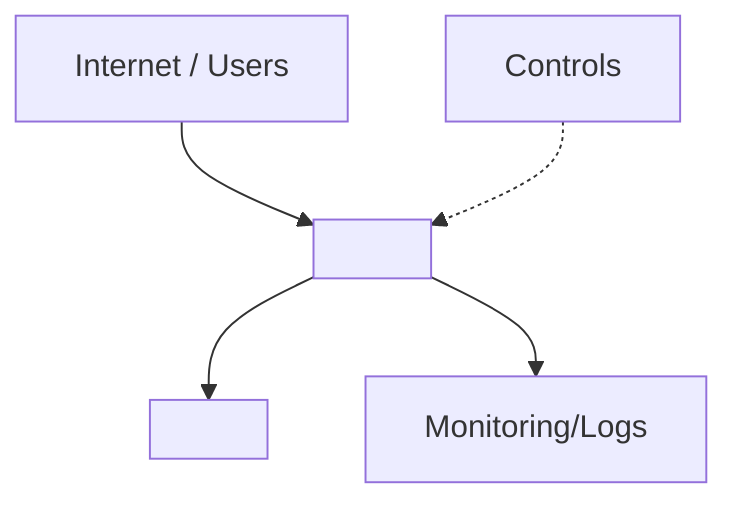

# 🟣 Cloud Finding Template
This document defines the layout for cloud security findings. For formatting
rules, follow `Settings/Styling.md`. For behavioural rules, follow
`Agents/Instructions.md`.

## Workflow Overview
1. **SecurityAgent** runs first, analyses the target, and outputs findings to
   a new file: `Findings/Cloud/Unprotected_Storage_Account.md`.
2. **SecurityAgent** updates `Knowledge/` with any new inferred/confirmed facts
   discovered while writing the finding (inferred facts must be marked as
   **assumptions** and user-verified).
3. **SecurityAgent** generates/updates the relevant architecture diagram under
   `Summary/Cloud/` based on the updated `Knowledge/` (assumptions = dotted border).
4. **Dev** and **Platform** review the findings, each appending their own
   sections under `## 🤔 Skeptic`.
5. **SecurityAgent** reconciles feedback, updates the final score, and appends
   the collaboration summary and metadata.

## Filename Conventions
- **Location:** All findings are stored in `Findings/Cloud/`.
- **Format:** `Findings/Cloud/Unprotected_Storage_Account.md` (use a
  short, Titlecase identifier).
- **Finding title:** Use a short, Titlecase identifier from the finding source
  (e.g., `Unprotected_Storage_Account`).

## File Template
```md
# 🟣 <finding-title>

## 🗺️ Architecture Diagram


- **Description:** <short description>
- **Overall Score:** <severity emoji + label> <score>/10

## 🛡️ Security Review
### 🧾 Summary
<brief business impact summary: what it means to the business if this isn’t fixed>

### ✅ Applicability
- **Status:** Yes / No / Don’t know
- **Evidence:** <what makes this true/false>

### ⚠️ Assumptions
- <assumption that could change score/applicability> (mark as Confirmed/Unconfirmed)

### 🔎 Key Evidence
- <evidence bullets with `path:line` references>

### 🎯 Exploitability
<exploitability>

### ✅ Recommendations
- [ ] <recommendation> — ⬇️ <score>➡️<reduced-score> (est.)

### 🧰 Considered Countermeasures
- 🔴 <countermeasure> — <effectiveness note>
- 🟡 <countermeasure> — <effectiveness note>
- 🟢 <countermeasure> — <effectiveness note>

### 📐 Rationale
<rationale>

## 🤔 Skeptic
> Purpose: review the **Security Review** above, then add what a security engineer would miss on a first pass.

### 🛠️ Dev
- **What’s missing/wrong vs Security Review:** <call out gaps, incorrect assumptions, or missing context>
- **Score recommendation:** ➡️ Keep/⬆️ Up/⬇️ Down — *explicitly state why vs the Security Review score*.
- **How it could be worse:** <concrete escalation path, e.g., public endpoint + weak auth, lateral movement, data exfil>
- **Countermeasure effectiveness:** <which recommendation actually removes risk vs just reduces it; why>
- **Assumptions to validate:** <which assumptions would change applicability/score>

### 🏗️ Platform
- **What’s missing/wrong vs Security Review:** <call out gaps, incorrect assumptions, or missing context>
- **Service constraints checked:** <service doc/SKU/downtime/cost notes; include links if available>
- **Score recommendation:** ➡️ Keep/⬆️ Up/⬇️ Down — *explicitly state why vs the Security Review score*.
- **Operational constraints:** <SKU/tier, network design, downtime, rollout sequencing>
- **Countermeasure effectiveness:** <coverage/drift risks; how to enforce/monitor at scale>
- **Assumptions to validate:** <which assumptions would change applicability/score>

## 🤝 Collaboration
- **Outcome:** <outcome>
- **Next step:** <next step>

## Compounding Findings
- **Compounds with:** <finding list or None identified>
  (use Markdown backlinks, e.g., `Findings/Cloud/Foo.md`)

## Meta Data
<!-- Meta Data must remain the final section in the file. -->
- 🗓️ **Last updated:** DD/MM/YYYY HH:MM
```

## Required Sections
- 🛡️ Security Review
- 🤔 Skeptic
- 🤝 Collaboration
- Compounding Findings
- Meta Data

## Cross-Checks
- Always check existing findings to see if they compound the new issue.
- If they compound, state that clearly, review both issues, and add backlinks
  between them.

## Testing
- Use the `sample/` directory for test runs and mock findings.
