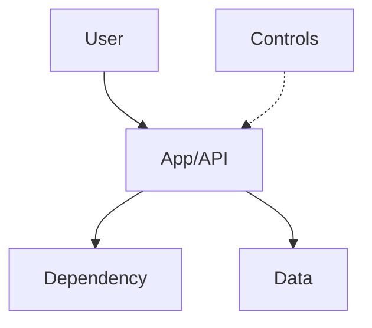

# 🟣 Code Finding Template
This document defines the layout for code security findings. For formatting
rules, follow `Settings/Styling.md`. For behavioural rules, follow
`Agents/Instructions.md`.

## Workflow Overview
1. **SecurityAgent** runs first, analyses the target, and outputs findings to
   a new file: `Findings/Code/A01_Broken_Access_Control.md`.
2. **SecurityAgent** updates `Knowledge/` with any new inferred/confirmed facts
   discovered while writing the finding (inferred facts must be marked as
   **assumptions** and user-verified).
3. **Dev** and **Platform** review the findings, each appending their own
   sections under `## 🤔 Skeptic`.
4. **SecurityAgent** reconciles feedback, updates the final score, and appends
   the collaboration summary and metadata.

## Filename Conventions
- **Location:** All findings are stored in `Findings/Code/`.
- **Format:** `Findings/Code/A01_Broken_Access_Control.md` (use a short,
  Titlecase identifier).
- **Finding title:** Use a short, Titlecase identifier from the finding source
  (e.g., `A01_Broken_Access_Control`).

## File Template
```md
# 🟣 <finding-title>

## 🗺️ Architecture Diagram


**CRITICAL: Never use `style fill:<color>` in Mermaid diagrams** - breaks dark themes (Settings/Styling.md lines 79-85). Use emojis instead: ✅ ❌ ⚠️ 🔴 🟡 🟢

- **Description:** <short description>
- **Overall Score:** <severity emoji + label> <score>/10 — *Final after skeptic review: Security X/10 → Dev [✅/⬇️/⬆️]Y/10 → Platform [✅/⬇️/⬆️]Z/10*
  - Note: Show score progression through skeptic reviews. Use ✅ if no change, ⬇️ if downgraded, ⬆️ if upgraded.
  - Example: `🟡 **6/10** (HIGH - Moderate) — *Final: Security 8/10 → Dev ⬇️6/10 → Platform ✅6/10*`

## 📊 TL;DR - Executive Summary
*(Add this section after Collaboration is complete for quick reference)*

| Aspect | Value |
|--------|-------|
| **Final Score** | <emoji> **X/10** (Risk Level) |
| **Initial Score** | Security Review: X/10 |
| **Adjustments** | Dev: <✅/⬆️/⬇️> → Platform: <✅/⬆️/⬇️> |
| **Key Takeaway** | <one sentence summary of outcome> |

**Top 3 Actions:**
1. <Priority 1 with effort estimate>
2. <Priority 2 with effort estimate>
3. <Priority 3 with effort estimate>

**Material Risks:** <2-3 sentence summary>

**Why Score Changed:** <explain if Dev/Platform adjusted score>

---

## ❓ Validation Required
*(Include this section if there are critical assumptions that need user confirmation)*

**⚠️ <Assumption Topic> (UNCONFIRMED):**
<Description of what was assumed and why it matters>

- Evidence found: <what supports the assumption>
- Evidence NOT found: <what's missing>
- Impact on score: <how confirmation/rejection would change assessment>

**Please confirm:** <specific question for human reviewer>

---

## 🛡️ Security Review
### 🧾 Summary
<brief business impact summary: what it means to the business if this isn’t fixed>

### ✅ Applicability
- **Status:** Yes / No / Don’t know
- **Evidence:** <what makes this true/false>

### 🔎 Key Evidence
- <evidence bullets with `path:line` references>

### 🎯 Exploitability
<exploitability>

### ✅ Recommendations
- [ ] <recommendation> — ⬇️ <score>➡️<reduced-score> (est.)

### 🧰 Considered Countermeasures
- 🔴 <countermeasure> — <effectiveness note>
- 🟡 <countermeasure> — <effectiveness note>
- 🟢 <countermeasure> — <effectiveness note>

### 📐 Rationale
<rationale>

## 🤔 Skeptic
### 🛠️ Dev
- **Score recommendation:** ✅ Keep / ⬆️ Up / ⬇️ Down (explain why).
- **Mitigation note:** <note>

### 🏗️ Platform
- **Score recommendation:** ✅ Keep / ⬆️ Up / ⬇️ Down (explain why).
- **Mitigation note:** <note>

## 🤝 Collaboration
- **Outcome:** <outcome>
- **Next step:** <next step>

## Compounding Findings
- **Compounds with:** <finding list or None identified>
  (use clickable markdown links with relative paths, e.g., `[Foo.md](../Code/Foo.md)` or `[Bar.md](../Cloud/Bar.md)`)

## Meta Data
<!-- Meta Data must remain the final section in the file. -->
- **Category:** <OWASP/CWE category>
- **Languages:** <affected languages>
- **Source:** <SAST tool/manual review/etc>
- 🗓️ **Last updated:** DD/MM/YYYY HH:MM
```

## Required Sections
- 🛡️ Security Review
- 🤔 Skeptic
- 🤝 Collaboration
- Compounding Findings
- Meta Data

## Testing
- Use the `sample/` directory for test runs and mock findings.
