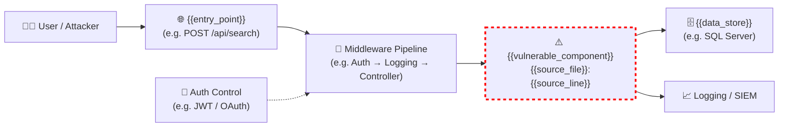

# 🟣 Code Finding Template
This document defines the layout for code/repository security findings. For
formatting rules, follow `Settings/Styling.md`. For behavioural rules, follow
`Agents/Instructions.md`.

## Workflow Overview
1. **SecurityAgent** runs first, analyses the repository, and outputs findings to
   a new file: `Findings/Code/Sql_Injection_User_Search.md`.
2. **SecurityAgent** updates `Knowledge/` with any new inferred/confirmed facts
   discovered while writing the finding (inferred facts must be marked as
   **assumptions** and user-verified).
3. **SecurityAgent** generates/updates the relevant architecture diagram under
   `Summary/Repos/` based on the updated `Knowledge/` (assumptions = dotted border).
4. **Dev** and **Platform** review the findings, each appending their own
   sections under `## 🤔 Skeptic`.
5. **SecurityAgent** reconciles feedback, updates the final score, and appends
   the collaboration summary and metadata.

## Filename Conventions
- **Location:** All findings are stored in `Findings/Code/`.
- **Format:** `Findings/Code/Sql_Injection_User_Search.md` (use a
  short, Titlecase identifier that includes the vulnerability type and affected component).
- **Finding title:** Use a short, Titlecase identifier describing the issue
  (e.g., `Sql_Injection_User_Search`, `Jwt_Missing_Signature_Validation`).

## File Template
~~~md
# 🟣 {{title}}

## 🗺️ Architecture Diagram

```mermaid
flowchart LR
  User["🧑‍💻 User / Attacker"] --> Entry["🌐 {{entry_point}}\n(e.g. POST /api/search)"]
  Entry --> MW["🚦 Middleware Pipeline\n(e.g. Auth → Logging → Controller)"]
  MW --> Vuln["⚠️ {{vulnerable_component}}\n{{source_file}}:{{source_line}}"]
  Vuln --> Data["🗄️ {{data_store}}\n(e.g. SQL Server)"]
  Vuln --> Logs["📈 Logging / SIEM"]
  Auth["🔐 Auth Control\n(e.g. JWT / OAuth)"] -.-> MW
  style Vuln stroke:#ff0000,stroke-width:3px,stroke-dasharray: 5 5
```

**CRITICAL: Never use `style fill:<color>` in Mermaid diagrams** — breaks dark themes
(Settings/Styling.md). Use `stroke-dasharray` / `stroke-width` and standard emoji instead.

- **Description:** {{description}}
- **Overall Score:** {{overall_score_emoji}} **{{overall_score}}/10** ({{overall_score_severity}}) — *Final after skeptic review: Security {{overall_score}}/10 → Dev [✅/⬇️/⬆️]Y/10 → Platform [✅/⬇️/⬆️]Z/10*
  - Note: Show score progression through skeptic reviews. Use ✅ if no change, ⬇️ if downgraded, ⬆️ if upgraded.
  - Example: `🟠 **7/10** (HIGH) — *Final: Security 9/10 → Dev ⬇️7/10 → Platform ✅7/10*`

## 🚦 Traffic Flow

Describe how a request reaches the vulnerable code:

```
[Origin]
  ↓ HTTPS
[Entry Point / Route]  — {{source_file}}:{{route_line}}
  ↓ [middleware chain]
[Auth / Validation Layer]  — {{auth_file}}:{{auth_line}}
  ↓ [passes through / bypassed]
[Vulnerable Function]  — {{source_file}}:{{source_line}}  ⚠️
  ↓ [unsanitised input]
[Data Store / External System]
```

## 📊 TL;DR - Executive Summary
*(Add this section after Collaboration is complete for quick reference)*

| Aspect | Value |
|--------|-------|
| **Final Score** | <emoji> **X/10** (Risk Level) |
| **Initial Score** | Security Review: {{overall_score}}/10 |
| **Adjustments** | Dev: <✅/⬆️/⬇️> → Platform: <✅/⬆️/⬇️> |
| **Key Takeaway** | {{security_review_summary}} |
| **Affected File** | `{{source_file}}:{{source_line}}` |
| **CWE** | [CWE-XXX — Description](https://cwe.mitre.org/data/definitions/XXX.html) |

**Top 3 Actions:**
1. <Priority 1 with effort estimate>
2. <Priority 2 with effort estimate>
3. <Priority 3 with effort estimate>

**Material Risks:** <2-3 sentence summary>

**Why Score Changed:** <explain if Dev/Platform adjusted score>

---

## ❓ Validation Required
*(Include this section if there are critical assumptions that need user confirmation)*

**⚠️ <Assumption Topic> (UNCONFIRMED):**
<Description of what was assumed and why it matters>

- Evidence found: <what supports the assumption>
- Evidence NOT found: <what's missing>
- Impact on score: <how confirmation/rejection would change assessment>

**Please confirm:** <specific question for human reviewer>

---

## 🛡️ Security Review

### 🔍 Detection
- **Detected by:** `rule-id` or `manual`
- **Rule file:** `Rules/Misconfigurations/<path>/rule-name.yml`
- **Detection method:** automated scan / manual review
- **Source file:** `{{source_file}}`
- **Line:** {{source_line}}

**Vulnerable code:**
```{{language}}
{{code_snippet}}
```

### �� Summary
{{security_review_summary}}

### ✅ Applicability
- **Status:** Yes / No / Don't know
- **Evidence:** {{applicability_evidence}}

### ⚠️ Assumptions
- {{assumptions_bullets}}

### 🚩 Risks
- 🔴 <primary risk — what an attacker can do>
- 🟠 <secondary risk — blast radius / lateral movement>
- 🟡 <tertiary risk — data exposure / compliance>

### 🔎 Key Evidence (deep dive)
- ✅ <positive control or guardrail that limits the risk>
- ✅ <another mitigating factor found in code/config>
- ❌ <weakness — missing validation, absent control, etc.>
- ❌ <another weakness>

### 🎯 Exploitability
{{exploitability}}

- **Attack complexity:** Low / Medium / High
- **Auth required:** None / User / Admin
- **User interaction:** None / Required
- **Scope:** Local / Network

### ✅ Recommendations
- [ ] <primary fix — e.g. use parameterised queries> — ⬇️ <score>➡️<reduced-score> (est.)
- [ ] <secondary fix — e.g. add input validation layer> — ⬇️ <score>➡️<reduced-score> (est.)
- [ ] <tertiary fix — e.g. enforce least privilege on DB account> — ⬇️ <score>➡️<reduced-score> (est.)

### 🧰 Considered Countermeasures
- 🔴 <countermeasure> — <effectiveness note>
- 🟡 <countermeasure> — <effectiveness note>
- 🟢 <countermeasure> — <effectiveness note>

### 📐 Rationale
{{rationale}}

## 🧪 Proof of Concept
**[Include this section for exploitable vulnerabilities]**

**Prerequisites:**
- [Tools needed — e.g. curl, sqlmap, Burp Suite]
- [Access level — e.g. unauthenticated / valid user token]

### Demonstrate the Vulnerability

```bash
#!/bin/bash
# [What this demonstrates — e.g. SQL injection via search endpoint]

ENDPOINT="https://[change-this]/api/[route]"
TOKEN="[bearer-token-if-needed]"

curl -s -X POST "$ENDPOINT" \
  -H "Authorization: Bearer $TOKEN" \
  -H "Content-Type: application/json" \
  -d '{"query": "[payload — e.g. '"'"' OR 1=1 --]"}'

echo "Expected: [data leak / auth bypass / error revealing stack trace]"
```

### Verify Impact
[What you can see/access that proves exploitation — e.g. all user records returned,
error reveals DB schema, admin access granted]

### Secure Code Fix
```{{language}}
// Before (vulnerable)
{{vulnerable_snippet}}

// After (fixed)
{{fixed_snippet}}
```

### Test the Fix
```bash
# Same payload after fix — should now be rejected
[same curl command]
```

**Expected after fix:** 400 Bad Request / sanitised error / no data leak

## 🤔 Skeptic
> Purpose: review the **Security Review** above, then add what a security engineer
> would miss on a first pass.

### 🛠️ Dev
- **What's missing/wrong vs Security Review:** <gaps, incorrect assumptions, missing context>
- **Score recommendation:** ✅ Keep / ⬆️ Up / ⬇️ Down — *explicitly state why vs the Security Review score*
- **How it could be worse:** <concrete escalation path — e.g. chained with auth bypass, leads to RCE>
- **Existing mitigations in codebase:** <WAF rules, input validators, ORM usage that limits scope>
- **Countermeasure effectiveness:** <which recommendation actually removes risk vs just reduces it>
- **Assumptions to validate:** <which assumptions would change applicability/score>

### 🏗️ Platform
- **What's missing/wrong vs Security Review:** <gaps, incorrect assumptions, missing context>
- **Score recommendation:** ✅ Keep / ⬆️ Up / ⬇️ Down — *explicitly state why vs the Security Review score*
- **Deployment context:** <WAF, network controls, DB firewall rules that affect exploitability>
- **Operational constraints:** <deploy process, test coverage, rollout risk for the fix>
- **Countermeasure effectiveness:** <can this be enforced at infra layer? drift risk?>
- **Assumptions to validate:** <which assumptions would change applicability/score>

## 🤝 Collaboration
- **Outcome:** <outcome>
- **Next step:** <next step>

## Compounding Findings
- **Compounds with:** <finding list or None identified>
  (use clickable markdown links with relative paths, e.g., `[Foo.md](../Cloud/Foo.md)` or `[Bar.md](../Code/Bar.md)`)

## Meta Data
<!-- Meta Data must remain the final section in the file. -->
- **Theme:** <TBD>
- **Repository:** {{repo_name}}
- **Language / Framework:** {{language}} / {{framework}}
- **Source file:** `{{source_file}}`
- **Line:** {{source_line}}
- **Rule ID:** `{{rule_id}}`
- **CWE:** CWE-XXX
- **OWASP:** A0X:2021 — <category>
- **Source:** opengrep / manual review
- 🗓️ **Last updated:** {{last_updated}}
~~~

## Required Sections
- 🗺️ Architecture Diagram (first, immediately after title)
- 🚦 Traffic Flow
- 🛡️ Security Review (must include code snippet in Detection subsection)
- 🤔 Skeptic
- 🤝 Collaboration
- Compounding Findings
- Meta Data (must be final section)

## Key Differences from Cloud Findings
| Aspect | Code Finding | Cloud Finding |
|--------|-------------|---------------|
| Diagram | Request/middleware flow | Infrastructure topology |
| Traffic Flow | ✅ Required | ❌ Not used |
| Code snippet | ✅ Required in Detection | ❌ Not applicable |
| Risks section | `### 🚩 Risks` | Not present (use Exploitability) |
| Key Evidence | ✅/❌ prefix bullets (deep dive) | Plain bullets |
| PoC | HTTP request / code exploit | Cloud CLI / API call |
| Meta Data | Repo, Language, File, Line, CWE, OWASP | Provider, Resource Type, Source |

## Cross-Checks
- Always check existing findings to see if they compound the new issue.
- If they compound, state that clearly, review both issues, and add clickable links
  (e.g., `[Related_Finding.md](../Cloud/Related_Finding.md)`) in both `## Compounding Findings` sections.
- Check whether the vulnerability is reachable — an unexposed endpoint lowers the score.

## Testing
- Use the `sample/` directory for test runs and mock findings.
