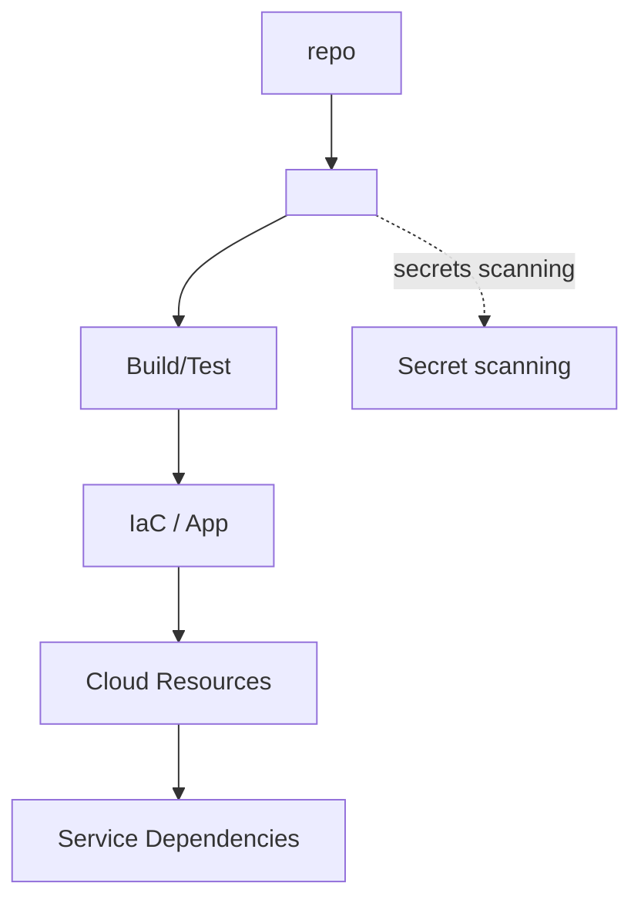

# 🟣 Repo Scan Template

Use this template for **one file per scanned repo** under `Findings/Repo/`.

## File Template
```md
# 🟣 Repo <repo-name>

## 🗺️ Architecture Diagram


- **Overall Score:** <severity emoji + label> <score>/10

## 🧭 Overview
<short overview of the repository purpose and key findings>

## 🛡️ Security Review
### Languages & Frameworks (extracted)
- <language/framework> — evidence: `<path>`

### 🧾 Summary
<short summary of material risks>

### ✅ Applicability
- **Status:** Yes / No / Don’t know
- **Evidence:** <what was observed>

### ⚠️ Assumptions
- <assumption that could change score/applicability> (mark as Confirmed/Unconfirmed)

### 🎯 Exploitability
<how an attacker would realistically leverage issues>

### 🚩 Risks
- <bullet list of notable risks/issues; link to related cloud/code findings if they exist>

### 🔎 Key Evidence (deep dive)
Mark each deep-dive evidence item:
- 💡 = notable signal / observed component / in-use indicator (neutral)
- ✅ = observed guardrail / good practice / risk reducer (positive)
- ❌ = observed weakness / insecure default / risk increaser (negative)

For secret-like signals (password, token, etc):
- If used inside a module: check module code before flagging as ❌ (may be securely handled)
- If output is consumed by secure storage (e.g., Key Vault): flag as 💡 or ✅ depending on context
- Only flag as ❌ if cleartext exposure or insecure handling is confirmed

Examples:
- 💡 Terraform module in use — evidence: `modules/azure/resource.tf:42:module "firewall_rules" {`
- ✅ Secret stored via Key Vault module — evidence: `main.tf:15:module.key_vault.store_secret`
- ❌ Cleartext secret in pipeline variable — evidence: `pipeline.yml:20:ARM_CLIENT_SECRET=$plaintext`

### Follow-up tasks for repo owners (optional)
- [ ] <what to verify> — evidence/source to check: `<path>`

### Cloud Environment Implications
Capture any **reusable** cloud context inferred from the repo (IaC + app config).
Promote reusable facts into `Knowledge/` as **Confirmed**/**Assumptions**.

- **Provider(s) referenced:** <Azure/AWS/GCP>
- **Cloud resources/services deployed or referenced:** <Key Vault, Storage, AKS, ACR, SQL, ...>
- **Network posture patterns:** <public endpoints, private endpoints, etc>
- **Identity patterns:** <managed identity/workload identity/roles>
- **Guardrails:** <policy-as-code, module standards, CI checks>

### Service Dependencies (from config / connection strings)
Extract downstream dependencies indicated by configuration, e.g.:
- DBs: Postgres/MySQL/MSSQL/Cosmos
- Queues/streams: Service Bus/Event Hub/Kafka
- Logs/telemetry: App Insights/Log Analytics/Datadog/Splunk
- APIs: internal/external base URLs

- **Datastores:** <...>
- **Messaging:** <...>
- **Logging/Monitoring:** <...>
- **External APIs:** <...>

### Containers / Kubernetes (inferred)
- If `skaffold.yaml`, Helm charts, or Kubernetes manifests are present: assume **Kubernetes** deploy.
- If `Dockerfile`(s) are present: assume a **container registry** is in use.
- If multiple Dockerfiles/Helm charts exist: identify base images (`FROM ...`) and note supply-chain risks.

- **Kubernetes tooling found:** <skaffold/helm/kustomize/manifests>
- **Container build artifacts:** <Dockerfile paths>
- **Base images:** <list of FROM images>

### ✅ Recommendations
- [ ] <recommendation> — ⬇️ <score>➡️<reduced-score> (est.)

### 📐 Rationale
<why the score is what it is>

## 🤔 Skeptic
> Purpose: review the **Security Review** above, then add what a security engineer would miss on a first pass.

### 🛠️ Dev
- **What’s missing/wrong vs Security Review:** <call out gaps, incorrect assumptions, or missing context>
- **Score recommendation:** ➡️ Keep/⬆️ Up/⬇️ Down — *explicitly state why vs the Security Review score*.
- **How it could be worse:** <realistic attacker path leveraging repo/app/IaC>
- **Countermeasure effectiveness:** <which recommendations measurably reduce risk; which are hygiene>
- **Assumptions to validate:** <which assumptions would change applicability/score>

### 🏗️ Platform
- **What’s missing/wrong vs Security Review:** <call out gaps, incorrect assumptions, or missing context>
- **Score recommendation:** ➡️ Keep/⬆️ Up/⬇️ Down — *explicitly state why vs the Security Review score*.
- **Operational constraints:** <pipelines, auth to cloud, network reachability, rollout sequencing>
- **Countermeasure effectiveness:** <guardrail coverage, drift prevention, enforceability>
- **Assumptions to validate:** <which assumptions would change applicability/score>

## 🤝 Collaboration
- **Outcome:** <outcome>
- **Next step:** <next step>

## Compounding Findings
- **Compounds with:** <finding list or None identified>
  (use Markdown backlinks, e.g., `Findings/Cloud/Foo.md`)

## Meta Data
<!-- Meta Data must remain the final section in the file. -->
- **Repo Name:** <repo-name>
- **Repo Path:** <absolute local path>
- **Repo URL:** <url or N/A>
- **Repo Type:** <Terraform/Go/Node.js/etc + purpose>
- **Languages/Frameworks:** <comma-separated list>
- **CI/CD:** <Azure Pipelines/GitHub Actions/etc or N/A>
- **Scan Scope:** <SAST / dependency (SCA) / secrets / IaC / All>
- **Scanner:** <tool name>
- 🗓️ **Last updated:** DD/MM/YYYY HH:MM
```
