# 🟣 Repo Scan Template

Use this template for **one file per scanned repo** under `Findings/Repo/`.

## File Template
```md
# 🟣 Repo <repo-name>

## 🗺️ Architecture Diagram

```mermaid
flowchart TB
  Dev[🧑‍💻 <repo-name> repo] --> CI[⚙️ <CI/CD system>]
  CI --> Build[🧩 Build/Test]

  Build --> IaC[🧩 IaC / App]
  IaC --> Cloud[☁️ Cloud Resources]
  Cloud --> Deps[🔗 Service Dependencies]

  CI -. secrets scanning .-> Secrets[🛡️ Secret scanning]
```


- **Description:** Security scan/triage summary for this repository.
- **Overall Score:** <severity emoji + label> <score>/10

## 🧭 Overview
- **Repo path:** <absolute local path>
- **Repo URL (if applicable):** <url or N/A>
- **Scan scope:** SAST / dependency (SCA) / secrets / IaC / All
- **Languages/frameworks detected:** <e.g., Terraform, Go, Node.js (Express), Python (Django), .NET, Java (Spring), etc>
- **Evidence for detection:** <key files e.g., go.mod, package.json, pom.xml, requirements.txt, *.tf>
- **CI/CD:** <Azure Pipelines/GitHub Actions/etc>

## 🛡️ Security Review
### Languages & Frameworks (extracted)
- <language/framework> — evidence: `<path>`

### 🧾 Summary
<short summary of material risks>

### ✅ Applicability
- **Status:** Yes / No / Don’t know
- **Evidence:** <what was observed>

### 🎯 Exploitability
<how an attacker would realistically leverage issues>

### 🚩 Risks
- <bullet list of notable risks/issues; link to related cloud/code findings if they exist>

### 🔎 Key Evidence (deep dive)
Mark each deep-dive evidence item as positive/negative:
- ✅ = observed guardrail / good practice / risk reducer
- ❌ = observed weakness / insecure default / risk increaser

- ✅ <positive observation> — evidence: `<path:line>`
- ❌ <negative observation> — evidence: `<path:line>`

### Follow-up tasks for repo owners (optional)
- [ ] <what to verify> — evidence/source to check: `<path>`

### Cloud Environment Implications
Capture any **reusable** cloud context inferred from the repo (IaC + app config).
Promote reusable facts into `Knowledge/` as **Confirmed**/**Assumptions**.

- **Provider(s) referenced:** <Azure/AWS/GCP>
- **Cloud resources/services deployed or referenced:** <Key Vault, Storage, AKS, ACR, SQL, ...>
- **Network posture patterns:** <public endpoints, private endpoints, etc>
- **Identity patterns:** <managed identity/workload identity/roles>
- **Guardrails:** <policy-as-code, module standards, CI checks>

### Service Dependencies (from config / connection strings)
Extract downstream dependencies indicated by configuration, e.g.:
- DBs: Postgres/MySQL/MSSQL/Cosmos
- Queues/streams: Service Bus/Event Hub/Kafka
- Logs/telemetry: App Insights/Log Analytics/Datadog/Splunk
- APIs: internal/external base URLs

- **Datastores:** <...>
- **Messaging:** <...>
- **Logging/Monitoring:** <...>
- **External APIs:** <...>

### Containers / Kubernetes (inferred)
- If `skaffold.yaml`, Helm charts, or Kubernetes manifests are present: assume **Kubernetes** deploy.
- If `Dockerfile`(s) are present: assume a **container registry** is in use.
- If multiple Dockerfiles/Helm charts exist: identify base images (`FROM ...`) and note supply-chain risks.

- **Kubernetes tooling found:** <skaffold/helm/kustomize/manifests>
- **Container build artifacts:** <Dockerfile paths>
- **Base images:** <list of FROM images>

### ✅ Recommendations
- [ ] <recommendation> — ⬇️ <score>➡️<reduced-score> (est.)

### 📐 Rationale
<why the score is what it is>

## 🤔 Skeptic
### 🛠️ Dev
- **Score recommendation:** ➡️ Keep/⬆️ Up/⬇️ Down (explain why).
- **Mitigation note:** <note>

### 🏗️ Platform
- **Score recommendation:** ➡️ Keep/⬆️ Up/⬇️ Down (explain why).
- **Mitigation note:** <note>

## 🤝 Collaboration
- **Outcome:** <outcome>
- **Next step:** <next step>

## Compounding Findings
- **Compounds with:** <finding list or None identified>
  (use Markdown backlinks, e.g., `Findings/Cloud/Foo.md`)

## Meta Data
<!-- Meta Data must remain the final section in the file. -->
- 🗓️ **Last updated:** DD/MM/YYYY HH:MM
```
