# 🟣 Repo Scan Template

Use this template for **one file per scanned repo** under `Findings/Repo/` and **repo summaries** under `Summary/Repos/`.

## CRITICAL: Architecture Diagrams in Repo Summaries

**MANDATORY:** Every repo summary (`Summary/Repos/<RepoName>.md`) MUST include its own `## 🗺️ Architecture Diagram` as the FIRST section immediately under the document title.

**What to include:**
- **Request flow** as Mermaid diagram (not text) - show how requests traverse the application
- **Middleware/pipeline components** in execution order
- **Authentication/authorization flows**
- **Service dependencies** (databases, APIs, message queues)
- **Monitoring/logging integrations**
- **Internal application architecture** (not infrastructure - that's in Cloud/ diagrams)

**Style requirements:**
- Use `flowchart TB` (top-down) for request flows
- NO `style fill:<color>` directives (breaks dark themes - see Settings/Styling.md)
- Use standard emoji from Settings/Styling.md for visual clarity:
  - 🛡️ Security boundary/control, 🔐 Identity/auth, 🔒 Internal/private
  - 🌐 Internet/public, 🚦 Traffic flow/routing, 📡 API Gateway
  - 🗄️ Data store, 📈 Monitoring, ⚙️ Automation, 🧑‍💻 User
- Use dotted lines `-.->` for async/logging flows
- Use subgraphs for logical groupings (e.g., middleware pipeline)

## File Template
```md
# 🟣 Repo <repo-name>

## 🗺️ Architecture Diagram

```mermaid
flowchart TB
  client[👤 Client]
  
  subgraph app[" Application "]
    middleware1[Step 1]
    middleware2[Step 2]
    middleware3[Step 3]
  end
  
  backend[🗄️ Backend Service]
  logs[📊 Logging]
  
  client --> middleware1
  middleware1 --> middleware2
  middleware2 --> middleware3
  middleware3 --> backend
  middleware2 -.->|Async| logs
```


**CRITICAL: Never use `style fill:<color>` in Mermaid diagrams** - breaks dark themes (Settings/Styling.md). Use standard emoji from Settings/Styling.md instead: 🛡️ 🔐 🔒 🌐 🚦 📡 🗄️ 📈 ✅ ❌ ⚠️ ⛔

- **Overall Score:** <severity emoji + label> <score>/10 — *Final after skeptic review: Security X/10 → Dev [✅/⬇️/⬆️]Y/10 → Platform [✅/⬇️/⬆️]Z/10*
  - Note: Show score progression through skeptic reviews. Use ✅ if no change, ⬇️ if downgraded, ⬆️ if upgraded.
  - Example: `🟠 **6/10** (HIGH - Moderate) — *Final: Security 7/10 → Dev ✅7/10 → Platform ⬇️6/10*`

## 📊 TL;DR - Executive Summary

| Aspect | Value |
|--------|-------|
| **Final Score** | <emoji> **X/10** (Risk Level) |
| **Initial Score** | Security Review: X/10 |
| **Adjustments** | Dev: [X/10 with ✅/⬆️/⬇️ + brief reason] → Platform: [Y/10 with ✅/⬆️/⬇️ + brief reason] |
| **Key Takeaway** | <one sentence summary of security posture and main concerns> |

**Top 3 Actions:**
1. <Priority 1 with effort estimate> — <impact on score if completed>
2. <Priority 2 with effort estimate> — <impact on score if completed>
3. <Priority 3 with effort estimate> — <impact on score if completed>

**Material Risks:** 
<2-3 sentence summary of key security risks, attack vectors, and blast radius>

**Why Score Changed/Stayed:** 
<Explain Dev and Platform skeptic reasoning. If they disagreed, explain which view prevailed and why>

---

## 🛡️ Security Observations

### ✅ Confirmed Security Controls
1. **[Control Name]** <emoji> - Description (source/evidence)
2. **[Control Name]** <emoji> - Description (source/evidence)
3. **[Control Name]** <emoji> - Description (source/evidence)

### ⚠️ Areas for Security Review
1. **[Issue/Gap]** ⚠️ - Description (where found/not found)
2. **[Issue/Gap]** ⚠️ - Description (where found/not found)
3. **[Issue/Gap]** ⚠️ - Description (where found/not found)

---

## 🧭 Overview
<short overview of the repository purpose and key findings>

## 🚦 Traffic Flow

**Purpose:** Document how requests traverse the application/service from entry point to backend, showing middleware, authentication, and routing layers.

### Request Path Summary
<One sentence describing the complete flow using arrows (→), e.g., "Financial institution clients send HTTPS requests with JWT tokens → Azure App Gateway terminates TLS → Kestrel web server processes through authentication middleware pipeline → validates JWT with FI Auth Service via APIM → enriches headers → routes to APIM based on path mapping → APIM forwards to appropriate backend service.">

### Components

**Entry Point:**
- **[Load Balancer/Gateway/Public IP]:** 🛡️ Brief description (TLS termination, WAF, public-facing)
  - **Evidence:** <Code snippet or config showing this component>
    Source: `/path/to/file`

**Service Layer:**
- **[Web Server/Runtime]:** 🔒 Port, protocol, brief description
  - **Evidence:** <Code snippet or config>
    Source: `/path/to/file`
- **[Middleware Pipeline/Processing Steps]:** 🔐 Sequential processing components:
  1. **[Component 1]** - Purpose (e.g., extracts JWT from header)
     - **Evidence:** Source: `/path/to/file`
  2. **[Component 2]** - Purpose (e.g., validates JWT structure)
     - **Evidence:** Source: `/path/to/file`
  3. **[Component 3]** - Purpose (e.g., calls auth service for validation)
     - **Evidence:** Source: `/path/to/file`
  4. **[Component N]** - Purpose
     - **Evidence:** Source: `/path/to/file`
- **[Route Mapping]:** 🗺️ How routing is configured
  - **Evidence:** Source: `/path/to/config/file`

**Backend Gateway:** (if applicable)
- **[API Gateway/Service Mesh]:** 📡 Central gateway description

**Backend Services:** 🎯 Final destinations
- 💰 **[Service 1]** - Purpose
- 📊 **[Service 2]** - Purpose
- 💳 **[Service 3]** - Purpose
<Use standard emoji from Settings/Styling.md for service types>

### Key Characteristics

**Port(s):**
- **[Port number] ([Protocol]):** Component that listens (public-facing/internal context)
- **[Port number] ([Protocol]):** Component that listens
- **No direct internet exposure** - (if VNet-integrated or behind gateway)

**Protocols:**
- **[Protocol]:** Source → Destination
- **[Protocol]:** Source → Destination

**Authentication:**
- **[Auth Method]** - Required on all requests / Specific endpoints
- **Validation Point:** Where auth is enforced
- **Resilience:** Circuit breakers, retries, timeouts (if applicable)
- **Custom details:** Any non-standard auth patterns

**Routing Logic:**
- **[Routing method]** from `[config file or code location]`
  - **Evidence:** <Code snippet showing routing config>
    ```json
    // Source: /path/to/routing/config
    {
      "/v1/path/*": "backend-destination",
      ...
    }
    ```
- **Stateless/Stateful** - session affinity requirements
- **Header enrichment/transformation** before forwarding:
  - `Header-Name: value` (purpose)
  - `Header-Name: value` (purpose)
  - **Evidence:** <Code snippet showing header manipulation>
    ```<language>
    // Source: /path/to/file
    // Brief code excerpt
    ```

**State:**
- **Stateless/Stateful** - sessions, caching details
- **Request/response model** - synchronous/asynchronous
- **Persistence** - any local storage or pure routing

### Route Mappings

| Incoming Path | Backend Destination | Purpose |
|---------------|---------------------|---------|
| `/v1/accounts/*` | `accounts-api` | Account queries and management |
| `/v2/accounts/*` | `ledger-external` | Ledger operations (v2 API) |
| `/health` | Internal | Health check probe |
<Include all significant routes, especially versioned APIs>

### External Dependencies

**[Dependency Service Name] (via [how accessed]):**
- **Purpose:** What this dependency provides
- **Protocol:** How it's accessed (HTTPS/gRPC/etc)
- **Endpoint:** `/path/to/endpoint`
- **Resilience:** Circuit breakers, retries, timeouts configured

---

## 🛡️ Security Review
### Languages & Frameworks (extracted)
- <language/framework> — evidence: `<path>`

### 🧾 Summary
<short summary of material risks>

### ✅ Applicability
- **Status:** Yes / No / Don’t know
- **Evidence:** <what was observed>

### ⚠️ Assumptions
- <assumption that could change score/applicability> (mark as Confirmed/Unconfirmed)

### 🎯 Exploitability
<how an attacker would realistically leverage issues>

### 🚩 Risks
- <bullet list of notable risks/issues; link to related findings if they exist using clickable markdown links, e.g., `[Finding.md](../Cloud/Finding.md)`>

### 🔎 Key Evidence (deep dive)
Mark each deep-dive evidence item:
- 💡 = notable signal / observed component / in-use indicator (neutral)
- ✅ = observed guardrail / good practice / risk reducer (positive)
- ❌ = observed weakness / insecure default / risk increaser (negative)

For secret-like signals (password, token, etc):
- If used inside a module: check module code before flagging as ❌ (may be securely handled)
- If output is consumed by secure storage (e.g., Key Vault): flag as 💡 or ✅ depending on context
- Only flag as ❌ if cleartext exposure or insecure handling is confirmed

Examples:
- 💡 Terraform module in use — evidence: `modules/azure/resource.tf:42:module "firewall_rules" {`
- ✅ Secret stored via Key Vault module — evidence: `main.tf:15:module.key_vault.store_secret`
- ❌ Cleartext secret in pipeline variable — evidence: `pipeline.yml:20:ARM_CLIENT_SECRET=$plaintext`

### Follow-up tasks for repo owners (optional)
- [ ] <what to verify> — evidence/source to check: `<path>`

### Cloud Environment Implications
Capture any **reusable** cloud context inferred from the repo (IaC + app config).
Promote reusable facts into `Knowledge/` as **Confirmed**/**Assumptions**.

- **Provider(s) referenced:** <Azure/AWS/GCP>
- **Cloud resources/services deployed or referenced:** <Key Vault, Storage, AKS, ACR, SQL, ...>
- **Network posture patterns:** <public endpoints, private endpoints, etc>
- **Identity patterns:** <managed identity/workload identity/roles>
- **Guardrails:** <policy-as-code, module standards, CI checks>

### Service Dependencies (from config / connection strings)
Extract downstream dependencies indicated by configuration, e.g.:
- DBs: Postgres/MySQL/MSSQL/Cosmos
- Queues/streams: Service Bus/Event Hub/Kafka
- Logs/telemetry: App Insights/Log Analytics/Datadog/Splunk
- APIs: internal/external base URLs

- **Datastores:** <...>
- **Messaging:** <...>
- **Logging/Monitoring:** <...>
- **External APIs:** <...>

### Containers / Kubernetes (inferred)
- If `skaffold.yaml`, Helm charts, or Kubernetes manifests are present: assume **Kubernetes** deploy.
- If `Dockerfile`(s) are present: assume a **container registry** is in use.
- If multiple Dockerfiles/Helm charts exist: identify base images (`FROM ...`) and note supply-chain risks.

- **Kubernetes tooling found:** <skaffold/helm/kustomize/manifests>
- **Container build artifacts:** <Dockerfile paths>
- **Base images:** <list of FROM images>

### ✅ Recommendations
- [ ] <recommendation> — ⬇️ <score>➡️<reduced-score> (est.)

### 📐 Rationale
<why the score is what it is>


## 🤔 Skeptic

**CRITICAL: Skeptics ALWAYS review based on current information gathered, even if deeper scans (IaC/SCA/SAST/Secrets) have not been performed yet.**

### 🛠️ Dev

**What's missing/wrong vs Security Review:**
<Dev perspective challenging Security Review assumptions. Consider:>
- Are organizational/industry context (financial services, healthcare, etc.) being ignored?
- Are standard enterprise controls (Key Vault, WAF, etc.) likely to be in place but not yet validated?
- Is the Security Review overstating or understating risks based on incomplete evidence?
- Are design patterns (stateless, circuit breakers, VNet integration) being undervalued?
- Are attack paths realistic given the actual architecture and controls?

**Score recommendation:** <✅ Keep / ⬇️ Down to / ⬆️ Up to> **X/10**

**Rationale:**
<Explain why score should stay/change based on dev understanding of:>
- Application architecture strengths/weaknesses
- Common mitigation patterns in this type of service
- Realistic exploit scenarios vs theoretical concerns
- Developer practices evident in the code

**How it could be worse:**
<Specific realistic attack scenarios that would increase severity>

**Countermeasure effectiveness:**
- <✅/🔵> **<Recommendation>** — <High/Medium/Low> impact (<rationale>)

**Assumptions to validate:**
- [ ] **<Assumption>** — <Why it matters and how to validate>

---

### 🏗️ Platform

**What's missing/wrong vs Security Review:**
<Platform perspective challenging Security Review assumptions. Consider:>
- What infrastructure controls are platform-managed vs app-team-managed?
- Are Security Review recommendations actionable by the app team or require platform team?
- What organizational guardrails exist that limit risk (policies, centralized WAF, network segmentation)?
- What operational constraints affect remediation (change control, shared resources, platform policies)?
- Is the risk assessment considering platform architecture realities?

**Score recommendation:** <✅ Keep / ⬇️ Down to / ⬆️ Up to> **X/10**

**Rationale:**
<Explain why score should stay/change based on platform understanding of:>
- Platform-managed vs application-managed controls
- Organizational guardrails and policies
- Shared infrastructure dependencies
- Operational constraints on remediation

**Operational constraints:**
<List what app team CANNOT control (requires platform/security team):>
- App team **cannot** modify <X> (<platform team manages>)
- App team **cannot** <Y> without <platform approval/coordination>

**Countermeasure effectiveness:**
- <✅/🔵> **<Recommendation>** — <Action for app team / No action for app team / Platform team action>

**Assumptions to validate:**
- [ ] **<Assumption>** — <Why it matters and who should validate (app team vs platform team)>

**Platform-level recommendations for org:**
<Recommendations for centralized/platform improvements that benefit multiple apps>

---

## 🤝 Collaboration
- **Outcome:** <✅ Completed / ⏳ Pending validation / 🔄 In progress>
- **Next step:** 
  1. <Immediate next action>
  2. <Follow-up action>
  3. <Final score determination based on findings>

---

## 📚 Assumptions

**CRITICAL: List ALL assumptions made during discovery, with evidence found/not found and impact on score.**

### Security & Infrastructure
<Numbered list of security-related assumptions>

### Architecture & Configuration  
<Numbered list of architecture-related assumptions>

### Scan Limitations
<What scans were NOT performed and what's unknown as a result>

**Format for each assumption:**
X. **[Assumption statement]** (<✅ Confirmed / ❌ Assumption>)
   - **Evidence found:** <What supports this assumption, with code snippets + file paths>
   - **Evidence NOT found:** <What's missing>
   - **Impact if wrong:** <How score/risk assessment changes>
   - **Confidence:** High/Medium/Low
   - **How to validate:** <Specific action to confirm/reject>

---

## Compounding Findings
- **Compounds with:** <finding list or None identified>
  (use clickable markdown links with relative paths from Summary/Repos/, e.g., `[Foo.md](../../Findings/Cloud/Foo.md)`)

## Meta Data
<!-- Meta Data must remain the final section in the file. -->
- **Repo Name:** <repo-name>
- **Repo Path:** <absolute local path>
- **Repo URL:** <url or N/A>
- **Repo Type:** <Terraform/Go/Node.js/etc + purpose>
- **Languages/Frameworks:** <comma-separated list>
- **CI/CD:** <Azure Pipelines/GitHub Actions/etc or N/A>
- **Scan Scope:** <SAST / dependency (SCA) / secrets / IaC / All>
- **Scanner:** <tool name>
- 🗓️ **Last updated:** DD/MM/YYYY HH:MM
```
